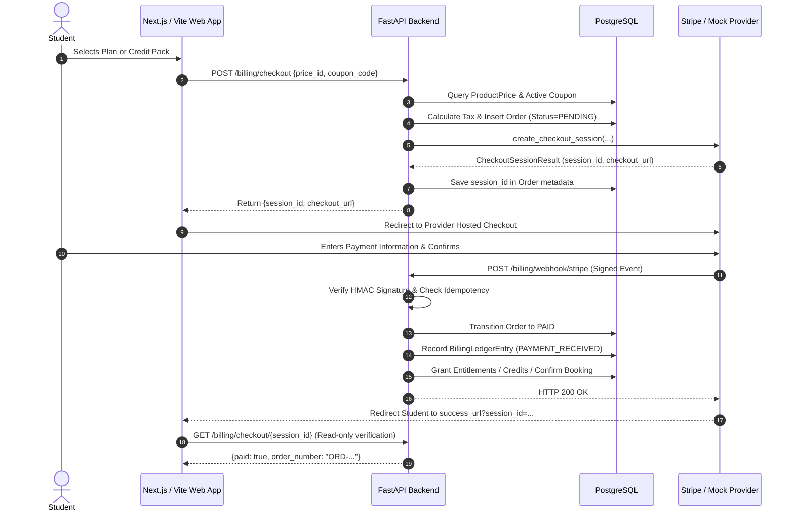
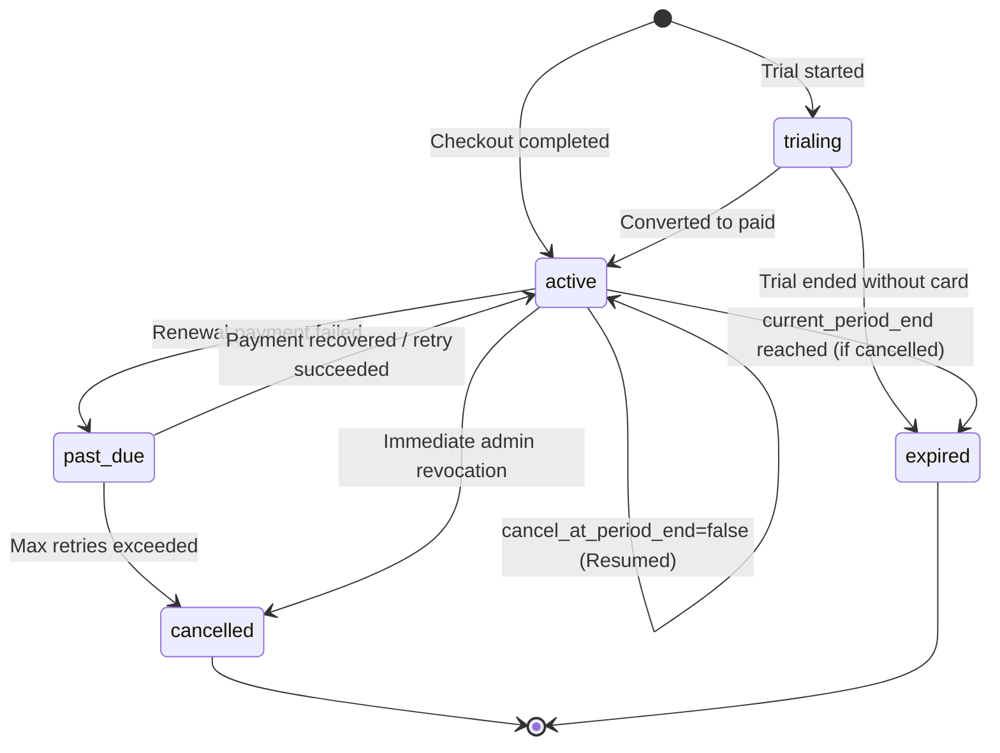

# Billing & Monetization Architecture

This document describes the architectural principles, provider abstractions, checkout pipeline, and lifecycle management for the TEF Platform's Billing and Monetization System.

---

## 1. Core Principles

### Authoritative Boundaries
- **Payment Provider (Stripe)** is authoritative for **payment processing state** (card capture, 3D Secure / SCA challenges, bank debits, dispute chargebacks).
- **PostgreSQL** is the authoritative system of record for:
  - Feature entitlements & user access rights.
  - Immutable double-entry financial ledger (`BillingLedgerEntry`).
  - Orders, line items, and invoice metadata.
  - Credit accounts, FIFO grant tranches, and usage consumptions.
  - Teacher earnings, platform commissions (20%), and held slot reservations.
  - Refund tracking and ledger reversals.

### Zero Trust for Browser Financial State
The client browser is completely untrusted for financial transitions:
- A user redirect back to `/checkout/success` **never** marks an order paid or grants entitlements.
- All fulfillments occur exclusively through cryptographically signed server-to-server webhooks or authoritative provider API session lookups.
- Prices, credits, currencies, and plans are resolved on the server from the database catalog by UUID.

### Zero Card Data Exposure
- The platform **never** accepts, processes, logs, or stores raw credit card numbers, CVVs, or bank account credentials.
- All checkout flows utilize provider-hosted Checkout Sessions (Stripe Checkout) or client-side Elements tokenization directly to the provider.

### Integer Minor Units
- All monetary arithmetic uses integer minor units (`amount_cents`), completely eliminating floating-point rounding errors and financial drift.
- Standard ISO 4217 currencies (default `EUR`).

---

## 2. Architecture & Provider Abstractions

Domain code never imports vendor SDKs directly. All external communication is routed through abstract interfaces defined in `app/integrations/payments/base.py`:

```
┌────────────────────────────────────────────────────────┐
│                   Domain Services                      │
│ (BillingService, CreditsService, TeacherBillingService)│
└───────────────────────────┬────────────────────────────┘
                            │
              depends on interface (DIP)
                            │
                            ▼
┌────────────────────────────────────────────────────────┐
│             PaymentProvider (Protocol)                 │
│  - create_checkout_session(params)                     │
│  - get_checkout_session(session_id)                    │
│  - get_subscription(subscription_id)                   │
│  - cancel_subscription(subscription_id, at_period_end) │
│  - create_refund(params)                               │
│  - verify_webhook_signature(payload, sig, secret)     │
└───────────▲────────────────────────────────┬───────────┘
            │                                │
  implements│                      implements│
            │                                │
┌───────────┴─────────────┐      ┌───────────┴─────────────┐
│  StripePaymentProvider  │      │   MockPaymentProvider   │
│ (Hosted Checkout,       │      │ (In-memory deterministic│
│  Webhooks HMAC,         │      │  HMAC, 100% offline     │
│  Customer Portal)       │      │  test execution)        │
└─────────────────────────┘      └─────────────────────────┘
```

Factory instantiation (`app/integrations/payments/factory.py`):
```python
def get_payment_provider() -> PaymentProvider:
    if settings.STRIPE_SECRET_KEY:
        return StripePaymentProvider(...)
    return MockPaymentProvider(...)
```

---

## 3. Checkout Pipeline



---

## 4. Webhook Ingestion & Idempotency Pipeline

Webhooks are processed through a strictly ordered pipeline:

1. **Raw Payload Preservation**: The request body is extracted as raw bytes (`request.body()`) before any JSON parsing to allow exact cryptographic HMAC signature verification.
2. **Signature Verification**: `provider.verify_webhook_signature(raw_payload, signature_header, webhook_secret)`. Invalid signatures return HTTP 400 immediately.
3. **Replay & Idempotency Protection**:
   - Query `payment_webhook_events` table for `(provider, provider_event_id)`.
   - If found with status `PROCESSED`, immediately return HTTP 200 with `{status: "already_processed"}` without re-executing domain side-effects.
   - If new, create record with status `PENDING` within an atomic transaction.
4. **Domain Event Dispatch**:
   - `checkout.session.completed` / `payment_intent.succeeded` -> Fulfill order, grant credits or active subscription, or finalize teacher booking.
   - `invoice.payment_succeeded` -> Renew subscription period, record recurring ledger entry.
   - `customer.subscription.deleted` -> Transition subscription to `CANCELLED` or `EXPIRED`.
   - `charge.refunded` -> Update order status to `REFUNDED` or `PARTIALLY_REFUNDED`, record debit reversal in ledger.
5. **Post-Processing Status**:
   - On success: Event status is set to `PROCESSED`, `processed_at = utcnow()`.
   - On failure: Event status is set to `FAILED`, exception trace logged in `processing_error`.

---

## 5. Subscription Lifecycle



### Cancellation at Period End
When a student requests cancellation via `/billing/subscription/cancel`:
- `cancel_at_period_end` is set to `True` both in Stripe and PostgreSQL.
- The subscription status remains `ACTIVE` until `current_period_end`.
- The user retains all premium capabilities, AI evaluations, and simulations until the paid period ends.
- The student can resume the subscription anytime before `current_period_end` via `/billing/subscription/resume`.
