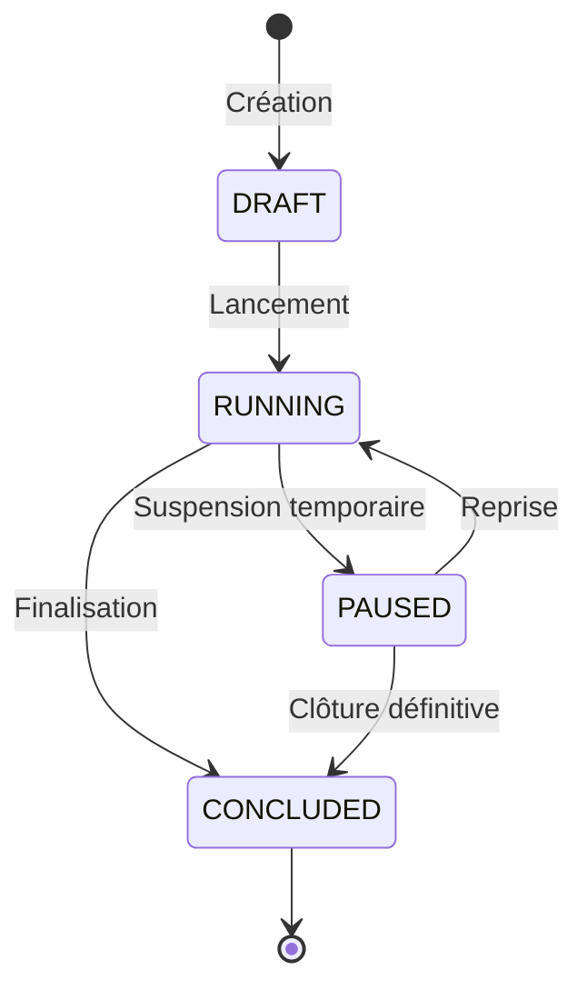

# Guide des Expérimentations Produit & Tests A/B (TEF Canada)

La plateforme TEF Canada intègre un moteur d'expérimentation déterministe, sécurisé et respectueux de l'intégrité pédagogique des apprenants.

---

## 1. Algorithme d'Assignation Déterministe

Afin d'éviter tout effet de scintillement (flickering), toute instabilité d'expérience utilisateur lors des rechargements de page ou tout stockage superflu de sessions :

### Algorithme SHA-256 avec Partitionnement Modulaire
Pour un utilisateur $U$ d'identifiant opaque `user_id` et une expérimentation $E$ de clé unique `experiment_key` :

$$\text{Seed} = \text{"}user\_id:experiment\_key\text{"}$$
$$\text{Bucket} = \operatorname{SHA256}(\text{Seed}) \pmod{100} \in [0, 99]$$

### Détermination de la Variante
Les variantes sont ordonnées et se voient attribuer des plages cumulatives selon leurs pondérations respectives (`weight`, dont la somme équivaut à 100) :
- Variante A (Contrôle, 50%) : bucket $\in [0, 49]$
- Variante B (Test, 50%) : bucket $\in [50, 99]$

```python
# Implémentation dans ExperimentsService
hash_input = f"{user_id}:{experiment.key}".encode()
bucket = int(hashlib.sha256(hash_input).hexdigest(), 16) % 100

cumulative = 0
for variant in sorted(experiment.variants, key=lambda v: v.key):
    cumulative += variant.weight
    if bucket < cumulative:
        assigned_variant = variant
        break
```

**Propriétés** :
- **Idempotence pure** : Le même utilisateur recevra toujours exactement la même variante pour une expérience donnée, sans appel réseau redondant.
- **Répartition uniforme** : Distribution équilibrée garantie par les propriétés cryptographiques de la fonction de hachage SHA-256.

---

## 2. Invariants de Sécurité Inaliénables (Safety Invariants)

Pour protéger la confiance des candidats au TEF Canada et garantir la conformité légale et financière :

> [!CAUTION]
> **Mots-Clés Strictement Interdits** :
> Aucune expérimentation ne peut être créée ou activée si sa clé contient l'un des termes protégés suivants :
> `["payment", "checkout", "security", "auth", "scoring", "retention"]`

### Justifications Fonctionnelles :
1. **Paiement & Facturation (`payment`, `checkout`)** : Interdiction absolue de pratiquer des tarifications dynamiques ou des discriminations de prix entre candidats.
2. **Authentification & Sécurité (`auth`, `security`)** : Les protocoles de hachage de mots de passe, de validation de sessions et de sécurité 2FA ne doivent jamais faire l'objet de tests partiels.
3. **Notation Pédagogique (`scoring`)** : L'algorithme de calcul des scores NCLC/CLB est certifié conforme aux grilles officielles de la CCI Paris Île-de-France et du Ministère de l'Immigration du Canada (IRCC). Toute altération algorithmique est rigoureusement interdite.

La validation est appliquée à double niveau :
- **Backend** : `validate_experiment_safety(key)` déclenche une erreur HTTP `400 Bad Request` en cas de violation.
- **Frontend** : `AdminExperimentsPage` bloque la validation du formulaire et affiche un avertissement de sécurité rouge en temps réel.

---

## 3. Cycle de Vie d'une Expérience

Une expérimentation traverse les états successifs suivants :



- **DRAFT** : Définition des variantes, paramétrage des configurations JSON, non visible des utilisateurs finaux.
- **RUNNING** : Assignation active et collecte des événements de conversion.
- **PAUSED** : Suspension de l'attribution des nouvelles variantes ; les utilisateurs conservent leur variante assignée sans nouvelles inscriptions.
- **CONCLUDED** : Expérience terminée. Une variante gagnante peut être pérennisée dans le code source de base.

---

## 4. Mesure des Conversions & Significativité

Lorsqu'un utilisateur assigné réalise l'action visée, un événement `experiment_converted` est émis :

```python
# Taux de conversion de la variante v
conversion_rate = unique_conversions / unique_assignments
```

### Seuil de Confiance Statistique
Pour toute comparaison entre une variante de test et le contrôle :
- Taille minimale recommandée : **$N \ge 100$ conversions uniques par variante**.
- En-deçà de ce volume, l'interface administrateur affiche explicitement : *« Échantillon insuffisant pour valider une conclusion statistique (N < 100) »*.
