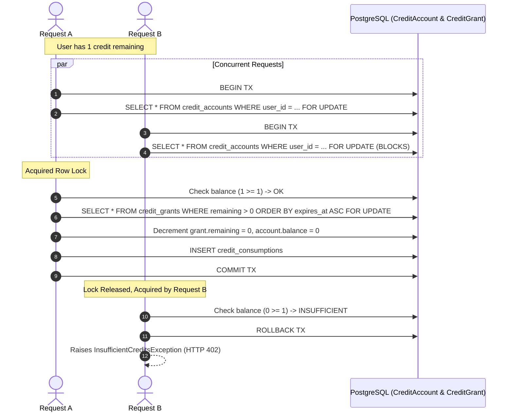

# Financial Integrity & Accounting Architecture

This document details the financial mechanics, concurrency guarantees, audit ledger, and reconciliation safeguards of the TEF Platform.

---

## 1. Zero Floating-Point Precision Rule

To ensure complete financial integrity and avoid rounding drifts across billing cycles, currencies, and tax calculations:
- **All monetary quantities are strictly represented in integer minor units (cents).**
- Example: 29.00 € is stored as `2900`. 0.80 € is stored as `80`.
- Platform commission rates are stored in basis points (`commission_rate_bps`): 20% is stored as `2000` (where `10000 bps = 100%`).
- Standard rounding formula:
  $$\text{fee\_cents} = \left\lfloor \frac{\text{gross\_cents} \times \text{rate\_bps} + 5000}{10000} \right\rfloor$$
- Floating-point types (`float`, `double`, `real`) are strictly prohibited in database schemas and service calculations.

---

## 2. Immutable Double-Entry Ledger (`BillingLedgerEntry`)

Financial state is permanently captured in an append-only ledger:

```python
class BillingLedgerEntry(Base):
    id: UUID
    user_id: UUID
    entry_type: LedgerEntryType  # PAYMENT_RECEIVED, REFUND_ISSUED, TEACHER_EARNING, PLATFORM_FEE, CREDIT_PURCHASE
    amount_cents: int
    currency: str
    reference_type: str          # "order", "teacher_booking", "refund"
    reference_id: UUID
    provider: str
    provider_reference: str
    created_at: datetime
```

### Invariants:
1. **Append-Only**: Ledger rows are never updated or deleted by application code.
2. **Compensating Transactions**: Correcting an error or processing a refund always produces a new compensatory debit/credit record linked to the original reference.

---

## 3. Concurrency Protection & Credit Accounting

Credit consumption operates under strict ACID transaction isolation using **pessimistic row locking**:



### FIFO Soonest-Expiring Consumption
When a user consumes credits, active grants are queried with:
```sql
SELECT * FROM credit_grants
WHERE user_id = :uid AND remaining_credits > 0 AND (expires_at IS NULL OR expires_at > NOW())
ORDER BY expires_at ASC NULLS LAST, created_at ASC
FOR UPDATE;
```
This guarantees that grants nearing expiration are spent first, maximizing value for the student.

---

## 4. Teacher Booking & Slot Protection

To prevent concurrent double-booking of teacher availability windows:

1. **Held Slot Reservation**: When a student clicks "Réserver ce créneau", the system creates a `BookingReservation` with status `HELD` and an `expires_at` set to `now() + 15 minutes`.
2. **Pessimistic Slot Lock**:
   ```sql
   SELECT * FROM booking_reservations
   WHERE teacher_id = :tid 
     AND start_time < :end_time 
     AND end_time > :start_time 
     AND status IN ('HELD', 'CONFIRMED')
     AND (status = 'CONFIRMED' OR expires_at > NOW())
   FOR UPDATE;
   ```
   If any overlapping reservation exists, the request is immediately rejected with HTTP 409 Conflict.
3. **Checkout Binding**: The `reservation_id` is bound to the Stripe Checkout session metadata.
4. **Paid Conversion**: When the payment webhook succeeds:
   - `BookingReservation.status` transitions to `CONFIRMED`.
   - `TeacherBooking` is created with status `CONFIRMED`.
   - `TeacherEarning` is generated with 80% net amount to teacher, 20% platform fee.
5. **Periodic Sweep**: A Celery Beat worker runs every 5 minutes (`cleanup_expired_booking_reservations`) to transition expired `HELD` slots back to `EXPIRED`.

---

## 5. Refunds & Reversals

When an administrator issues a refund via `/admin/billing/refunds`:
- The order row is locked with `FOR UPDATE`.
- The system validates that `amount_cents <= order.total_cents - order.refunded_amount_cents`.
- The provider refund API is invoked (`payment_provider.create_refund(...)`).
- If successful:
  - `order.refunded_amount_cents += amount_cents`.
  - If `refunded_amount_cents == total_cents`: order transitions to `REFUNDED`; otherwise `PARTIALLY_REFUNDED`.
  - A `LedgerEntryType.REFUND_ISSUED` entry is appended to `billing_ledger_entries`.
  - If the order was a teacher booking, the corresponding `TeacherEarning` is transitioned to `REFUNDED` and clawed back from available balances.

---

## 6. Daily Reconciliation Engine (`BillingReconciliationService`)

An automated reconciliation task runs daily via Celery Beat (`reconcile_billing_daily`) or on-demand by admins:

| Audit Check | Discrepancy Condition | Action Taken |
|---|---|---|
| **Stale Pending Orders** | Orders in `PENDING` state older than 24 hours | Marked as `FAILED` or flagged for provider query |
| **Negative Credit Balances** | `CreditAccount.balance < 0` | Flagged as Critical Severity; user account locked |
| **Orphaned Slot Reservations** | `BookingReservation.status = 'HELD'` with `expires_at < NOW()` | Automatically transitioned to `EXPIRED` |
| **Commission Arithmetic** | $\text{gross} \neq \text{net} + \text{platform\_fee}$ in `TeacherEarning` | Flagged as High Severity arithmetic discrepancy |

All findings are persisted and inspectable in the Administrative Billing Console at `/admin/billing`.
