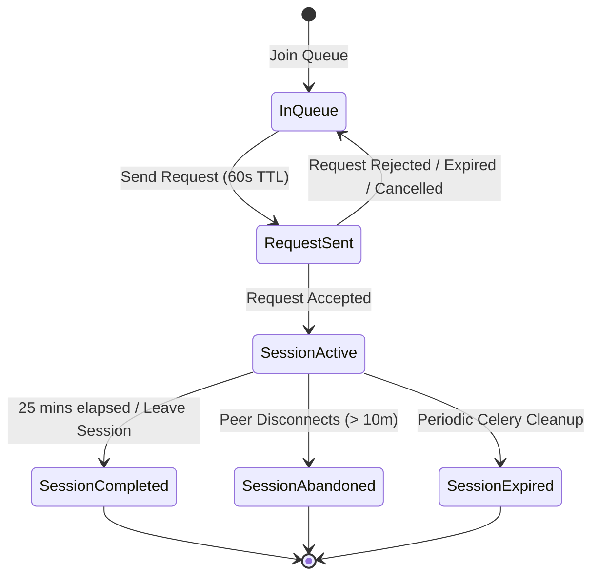

# TEF French Practice Pool Specification & Architecture

## 1. Product Objective

The **Practice Pool** allows two anonymous students preparing for the **TEF Canada** (or other French proficiency exams) to meet for **1-to-1, audio-only French speaking practice**.

### Strict Behavioral & Safety Invariants:
1. **Audio-Only**: No video cameras, no video track requests (`video: false`).
2. **No Text Chat**: Students converse exclusively through spoken French.
3. **Strict Anonymity**: Real names, emails, and database UUIDs are never revealed to peers. Students are identified by generated French aliases (e.g., `Voyageur Boréal #482`).
4. **Authoritative 25-Minute Sessions**: Server controls `starts_at` and `expires_at`. Client countdown clocks are authoritative with the server timestamp.
5. **Deterministic Compatibility & Anti-Repeat Matchmaking**: Proximity-based scoring with a -40 point penalty for peers matched within the last 48 hours.
6. **Safety & Moderation**: Peer reporting (inappropriate behavior, harassment, AFK, contact exchange attempt) and bidirectional blocking.

---

## 2. Matchmaking Algorithm & Scoring

When student $A$ requests compatible peers, the system evaluates all active queue candidates $B$ and ranks them using a deterministic weighted scoring model:

$$\text{Score} = S_{\text{level}} + S_{\text{type}} + S_{\text{wait}} + P_{\text{repeat}}$$

### 1. Level Proximity ($S_{\text{level}}$)
| Level Difference | Points | Description |
| :--- | :--- | :--- |
| Exact Match ($\Delta = 0$) | **+50 pts** | Identical CEFR level (e.g. B2 $\leftrightarrow$ B2) |
| Adjacent Level ($\Delta = 1$) | **+30 pts** | Neighboring level (e.g. B1 $\leftrightarrow$ B2) |
| Two Levels ($\Delta = 2$) | **+10 pts** | Moderate gap (e.g. A2 $\leftrightarrow$ B2) |
| $\Delta \ge 3$ | **Incompatible** | Disqualified (e.g. A1 $\leftrightarrow$ C1) |

### 2. Practice Modality ($S_{\text{type}}$)
- **Same Practice Modality** (e.g., both selected TEF Section A): **+20 pts**
- **One or Both Selected Free Conversation**: **+10 pts**
- **Mismatched Structured Tasks** (e.g., Section A vs Section B): **0 pts**

### 3. Queue Wait Priority FIFO ($S_{\text{wait}}$)
- **+0.5 pts** per minute in queue, capped at **+15 pts** (30 minutes).

### 4. Anti-Repeat Penalty ($P_{\text{repeat}}$)
- If student $A$ and student $B$ completed a practice session within the preceding **48 hours**: **-40 pts** penalty.

---

## 3. Storage Separation: Redis (Ephemeral) vs. PostgreSQL (Authoritative)

### Redis (Ephemeral State & Concurrency)
Redis manages high-frequency ephemeral state with automatic TTLs:

| Key Pattern | Type | TTL | Purpose |
| :--- | :--- | :--- | :--- |
| `practice:presence:{user_id}` | String | 60s | Presence heartbeat token. When lapsed, student is deemed disconnected. |
| `practice:waiting_queue` | Hash | Ephemeral | Active queue cache mapping `user_id` $\to$ serialized JSON metadata. |
| `practice:lock:{user_id}` | String | 10s | Distributed mutex preventing duplicate queue actions for a single user. |
| `practice:match_lock:{min_id}:{max_id}` | String | 10s | Deadlock-free sorted pair lock preventing split matching ($A \leftrightarrow B$ and $A \leftrightarrow C$). |
| `practice:ratelimit:{action}:{user_id}` | List / String | 60s | Token/sliding window rate limiter (e.g. max 5 requests/min). |

### PostgreSQL (System of Record)
PostgreSQL holds all authoritative history and relational constraints:
- `practice_topics`: Seeded roleplays and conversation starters with category and prompts.
- `practice_queue_entries`: Audit trail of queue joins, leaves, and cancellations.
- `practice_requests`: 1-to-1 pending, accepted, rejected, or expired invitations (60s TTL).
- `practice_matches`: Match pairing records linking sender and receiver.
- `practice_sessions`: Authoritative 25-minute room sessions with `starts_at` and `expires_at`.
- `practice_participants`: Per-session participant records tracking connection status and aliases.
- `practice_reports`: Moderation reports with structured reasons and status workflows.
- `practice_blocks`: Bidirectional user blocklist preventing future matchmaking.

---

## 4. Session Lifecycle & Authorization

### Room Access Authorization
1. Connection to `/api/v1/practice/ws/{room_id}` requires Bearer JWT authentication.
2. The server verifies:
   - Does `PracticeSession` exist for `room_id` or `session_id`?
   - Is `user.id == session.student_a_id` OR `user.id == session.student_b_id`?
   - Is `session.status == ACTIVE`?
   - Has `session.expires_at` not lapsed?
3. **If any check fails**: WebSocket connection is immediately closed with `WS_1008_POLICY_VIOLATION` (403 Forbidden).

---

## 5. Background Cleanup Architecture (Celery)

Four automated Celery tasks run periodically via Celery Beat:

1. `tasks.cleanup_expired_practice_requests` (Every 60s):
   - Expire pending requests where `expires_at <= now_utc`.
2. `tasks.cleanup_stale_practice_queue` (Every 60s):
   - Prune queue entries in DB where Redis presence heartbeat has lapsed.
3. `tasks.cleanup_expired_practice_sessions` (Every 60s):
   - Transition active sessions where `expires_at <= now_utc` to `EXPIRED` and release media transport rooms.
4. `tasks.cleanup_abandoned_practice_sessions` (Every 300s):
   - Transition waiting sessions created > 10m ago without peer connection to `ABANDONED`.
