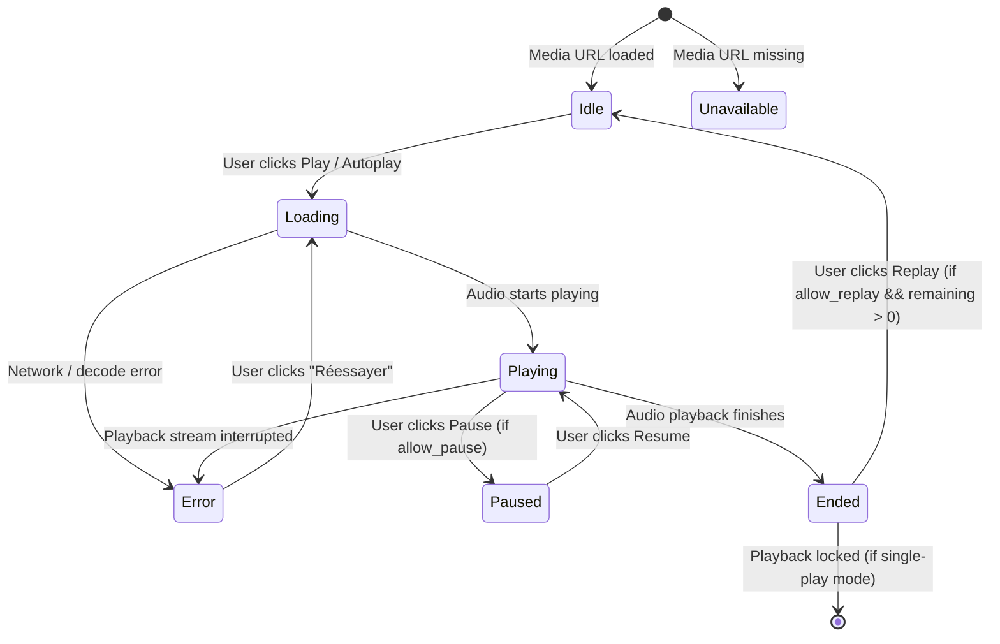

# Student Active Listening Assessment Experience UX Specification & Architecture

## 1. Executive Summary & Product Purpose

The **Student Active Listening Assessment Experience** (`/attempts/:id`) is the dedicated, calm, and highly focused examination environment for candidates taking French language listening evaluations (*Compréhension Orale* for TEF Canada / TEF IRN).

### Core Design Principles
In high-stakes listening tests, candidates experience elevated cognitive load: they must listen intently, retain auditory cues, interpret context, and select answers within strict time constraints. The listening interface is engineered around four core tenets:

1. **Guided First, Distraction-Free Second**: The candidate immediately understands:
   - What audio document they are listening to (*Section A - Annonces publiques*, *Section B - Reportages*).
   - How many times the audio can be played (e.g. *1 seule écoute (règle officielle)* vs *Réécoute autorisée*).
   - Whether seeking is allowed (strictly disabled in official mode to prevent disorientation).
   - The exact playback state (*Prêt à écouter*, *Chargement...*, *Lecture en cours*, *En pause*, *Audio terminé*).
2. **Strict Time Decoupling**:
   - Audio elapsed / total time (`00:22 / 00:45`) is completely separate from the server exam countdown (`01:14:32`).
   - Listening audio never resets, pauses, or extends the official examination timer.
3. **Shared Audio Grouping**:
   - When multiple consecutive questions relate to a single audio clip, the UI presents an explicit grouping indicator (*Enregistrement commun • Questions 12 à 15*).
   - Navigating between questions referencing the same audio does not restart or interrupt audio playback.
4. **Resilience & Safe Recovery**:
   - Immediate audio pause and lock upon exam expiration or submission.
   - Clean, actionable retry mechanism in the event of transient network drops without losing answer state.
   - Zero decorative waveforms or extraneous animations that create anxiety.

---

## 2. Layout Architecture & Component Hierarchy

The Listening Exam UI directly extends the single-engine taking architecture created for Reading at `/attempts/:id`, sharing the `FocusedExamShell`, server clock synchronization, debounced autosave, and question navigation without creating divergent routes:

```
┌────────────────────────────────────────────────────────────────────────┐
│ ExamHeader: Exit Button • Title & Section • Progress • Save Status • Timer │
├──────────────────────────────────────┬─────────────────────────────────┤
│ MAIN LISTENING COLUMN (col-span-8/9) │ STICKY SIDEBAR (col-span-4 / 3) │
│                                      │                                 │
│ 1. ListeningQuestionContext          │ QuestionNavigator               │
│    - Modality badge (Compréhension   │ - Progress bar & metrics        │
│      orale)                          │ - Legend: Répondue, Sans réponse,│
│    - Shared audio range indicator    │   Active, Marquée               │
│    - Official replay policy badge    │ - Numbered question grid        │
│    - Section title & instructions    │                                 │
│                                      │                                 │
│ 2. ListeningPlayer                   │                                 │
│    - Audio title & status badge      │                                 │
│    - Elapsed / Total timestamp bar   │                                 │
│    - Play/Pause toggle (rule-based)  │                                 │
│    - Replay counter (if permitted)   │                                 │
│    - Mute/Unmute toggle              │                                 │
│                                      │                                 │
│ 3. QuestionPanel                     │                                 │
│    - Question X / Y badge & points   │                                 │
│    - Flag for review bookmark        │                                 │
│    - Prompt heading                  │                                 │
│    - AnswerGroup / Radio options     │                                 │
│                                      │                                 │
│ 4. ExamNavigation                    │                                 │
│    - [Question précédente]           │                                 │
│    - [Question suivante] /           │                                 │
│      [Vérifier et soumettre]         │                                 │
└──────────────────────────────────────┴─────────────────────────────────┘
```

---

## 3. Audio Playback State Machine

The audio player implements an explicit, unambiguous state machine with distinct visual and auditory feedback:



### Visual Feedback per State

| State | Badge Style | Label | Accessible Icon |
|:---|:---|:---|:---|
| **`idle`** | Neutral border / muted bg | *Prêt à écouter* | `Headphones` icon |
| **`loading`** | Primary color / pulse | *Chargement de l'audio...* | `RotateCw` animated spinner |
| **`playing`** | Emerald green badge | *Lecture en cours* | `Volume2` animated pulse |
| **`paused`** | Amber badge | *En pause* | `Pause` icon |
| **`ended`** | Muted border / checkmark | *Audio terminé* | `CheckCircle2` primary icon |
| **`error`** | Destructive red badge | *Impossible de lire l'audio* | `AlertCircle` + *"Réessayer"* link |
| **`unavailable`** | Subdued muted badge | *Aucun enregistrement disponible* | `VolumeX` icon |

---

## 4. Policy-Driven Playback Engine (`AudioPlaybackRules`)

Official TEF listening assessments enforce strict candidate constraints to simulate in-person exam center conditions. The player consumes config-driven rules:

```typescript
export interface AudioPlaybackRules {
  allow_pause?: boolean;   // Default: true (or false in strict simulation)
  allow_seek?: boolean;    // Default: false (scrubbing is non-interactive)
  allow_replay?: boolean;  // Default: false (single-play enforcement)
  max_replays?: number;   // Default: 1 (max number of listens)
  autoplay?: boolean;      // Default: false (handles browser autoplay rejection)
}
```

### 1. Single-Play Enforcement
- In official mode (`allow_replay: false`, `max_replays: 1`), once audio finishes:
  - Status permanently transitions to *"Audio terminé"*.
  - Play button is disabled.
  - Replay button is completely omitted.
  - The candidate focuses solely on selecting their answer.

### 2. Seek Control
- When `allow_seek: false` (default):
  - Progress bar is rendered with `<div role="progressbar" aria-valuenow="...">` without interactive scrub handles.
  - Candidates cannot skip forwards or backwards to game question timing.
- When `allow_seek: true` (e.g. formative practice mode):
  - Interactive range input enables scrubbing with precise ARIA slider properties.

### 3. Expiration & Submission Safety
- An active `useEffect` monitors `isExamExpired` and `isExamSubmitted`.
- If either condition turns true, the player executes immediate `audio.pause()`, clears media buffers, and transitions to `"ended"` to prevent audio playback from continuing past the exam window.

---

## 5. Shared Audio Clip Grouping

Certain TEF sections feature longer broadcasts (e.g., radio interviews or panel discussions) followed by 2 to 4 related questions:

1. **Identification**:
   - The engine flattens sections and compares `mediaUrl` across adjacent questions.
2. **Range Calculation**:
   - Computes global question range: `Enregistrement commun • Questions 12 à 15`.
3. **Visual Clarity**:
   - `ListeningQuestionContext` renders an outline badge with `Layers` icon.
4. **Seamless Navigation**:
   - Navigating between question 12 and question 13 maintains the existing audio element instance without restarting playback from zero.

---

## 6. Accessibility & Screen-Reader Support

1. **Live Regions**:
   - An invisible `<span role="status" aria-live="polite" className="sr-only">` delivers live auditory announcements when audio starts, pauses, completes, or fails (*"Lecture de l'enregistrement audio en cours."*, *"Audio mis en pause."*, *"Enregistrement audio terminé."*).
2. **Semantic Buttons & Contrast**:
   - All playback and volume control buttons include explicit, localized `aria-label` attributes reflecting current state.
   - Contrast ratios exceed WCAG AA standards (4.5:1 for standard text, 3:1 for large controls).
3. **Keyboard Navigation**:
   - Full keyboard accessibility (Tab, Enter, Space) across play, pause, retry, mute, and question radio options.
