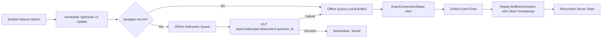

# Student Active Reading Assessment Experience UX Specification & Architecture

## 1. Executive Summary & Product Purpose

The **Student Active Reading Assessment Experience** (`/attempts/:id`) is the dedicated, distraction-free examination workspace for candidates taking high-stakes French language reading evaluations (TEF Canada / TEF IRN).

### Calm, Distraction-Free, Trustworthy Exam Environment
Unlike general dashboard or practice pages, the active exam player is a focused, high-stakes environment where anxiety is heightened. Every design decision is calibrated to establish total certainty:
1. **Never doubt answer persistence**: Candidates receive subtle, instant feedback that their selection is recorded locally and safely synced to the server (`Réponses sécurisées`).
2. **Never doubt time remaining**: Visible countdown is server-synchronized with drift compensation against authoritative `server_time` and `expires_at`.
3. **Never lose track of progress**: Candidates clearly see answered, unanswered, and flagged questions without cognitive friction.
4. **Reading comfort first**: Passages are styled with optimal line length (`max-w-prose`), generous line-height (`leading-relaxed`), comfortable paragraph spacing, and strong contrast.
5. **Safe, confirmation-guided submission**: Clear answered vs. unanswered counts prevent accidental submissions while respecting exam rules.

---

## 2. Layout Architecture & Responsive Strategy

The layout avoids standard dashboard sidebars, marketing links, or unrelated notifications. It provides an asymmetric **2-column grid** on desktop (`lg:grid-cols-12`) and a seamless stacked document flow on mobile:

```
┌────────────────────────────────────────────────────────────────────────┐
│ ExamHeader: Exit Button • Title & Section • Progress • Save Status • Timer │
├──────────────────────────────────────┬─────────────────────────────────┤
│ MAIN EXAM COLUMN (col-span-8 / 9)    │ STICKY SIDEBAR (col-span-4 / 3) │
│                                      │                                 │
│ 1. ReadingPassage (max-w-prose)      │ QuestionNavigator               │
│    - Section title & document badge  │ - Progress bar & metrics        │
│    - Paragraph-spaced text / audio   │ - Legend: Répondue, Sans réponse,│
│                                      │   Active, Marquée               │
│ 2. QuestionPanel                     │ - 5-column numbered button grid │
│    - Question X / Y badge            │                                 │
│    - Points indicator                │                                 │
│    - Flag / Bookmark button          │                                 │
│    - Prompt heading                  │                                 │
│    - QuestionRenderer (Radio / Text) │                                 │
│                                      │                                 │
│ 3. ExamNavigation                    │                                 │
│    - [Question précédente]           │                                 │
│    - [Question suivante] /           │                                 │
│      [Vérifier et soumettre]         │                                 │
└──────────────────────────────────────┴─────────────────────────────────┘
```

### Mobile Layout (`< 1024px`)
- **Single document scroll context**: Prevents confusing nested scrollbars on phones.
- **Order of elements**:
  1. `ExamHeader` (compact title, progress, authoritative timer, mobile question drawer trigger).
  2. `ReadingPassage` (reading material styled with comfortable font sizes).
  3. `QuestionPanel` (prompt and answer options).
  4. `ExamNavigation` (previous and next buttons).
  5. `QuestionNavigator` accessible via a slide-out drawer (`mode="drawer"`). Selecting any question navigates and closes the drawer automatically.

---

## 3. Server-Authoritative Clock Synchronization

The frontend timer is **display-only** and does not treat local system time or `setInterval` counts as authoritative:

### Clock Synchronization Formula
```
client_now = Date.now()
server_now = new Date(state.server_time).getTime()
drift_offset = server_now - client_now

estimated_server_time = Date.now() + drift_offset
visible_remaining_seconds = Math.max(0, Math.floor((expires_at - estimated_server_time) / 1000))
```

### Timer Severity States & Visual Hierarchy

| Severity | Threshold | Visual Styling | Screen-Reader Announcement |
|:---|:---|:---|:---|
| **Normal** | `> 300s` (`> 5 min`) | Neutral border, muted background, subdued clock icon | None (avoids polling fatigue) |
| **Warning** | `60s < t <= 300s` | Amber border, subtle amber accent, `font-bold` | Polite announcement at 5-minute mark |
| **Critical** | `1s <= t <= 60s` | Red border, subtle alert triangle icon, contrast boost | Polite announcement at 1-minute mark |
| **Expired** | `0s` | Red background, displays *"Temps écoulé"* | *"Temps d'examen écoulé. L'évaluation est en cours de finalisation."* |

When expiration is reached, answer mutations are disabled and the backend auto-finalizes the session.

---

## 4. Reading Passage Typography Standards

Comprehension tests evaluate nuance and inference. High reading comfort reduces visual fatigue:
- **Maximum Reading Width**: Strictly capped to `max-w-prose` (~75 characters per line). Text never spans the full viewport on wide screens.
- **Line Height**: `leading-relaxed` (1.625) provides optimal vertical eye tracking between lines.
- **Paragraph Pacing**: Paragraphs are parsed and spaced with `space-y-4`, avoiding unbroken blocks of dense text.
- **Font Stack**: Clean, legible serif font (`font-serif`) for reading source documents to emulate official paper/e-test documents, contrasted with modern sans-serif UI elements.
- **Media Support**: Embedded [`ListeningPlayer`](file:///C:/Users/MSI/Documents/tef-platform/apps/web/src/components/common/ListeningPlayer.tsx) for audio comprehension sections.

---

## 5. Question Architecture & Extensible Renderer

The question presentation layer is decoupled from question types via [`QuestionRenderer`](file:///C:/Users/MSI/Documents/tef-platform/apps/web/src/features/assessments/components/QuestionRenderer.tsx):

### Supported Modalities
1. **`single_choice`**:
   - Composes [`AnswerGroup`](file:///C:/Users/MSI/Documents/tef-platform/apps/web/src/features/assessments/components/AnswerGroup.tsx) and [`AnswerOption`](file:///C:/Users/MSI/Documents/tef-platform/apps/web/src/features/assessments/components/AnswerOption.tsx).
   - Semantics: `role="radiogroup"`, `role="radio"`, `aria-checked="true|false"`.
   - Keyboard navigation: Full support for Arrow Up/Down/Left/Right arrow keys with automatic focus movement.
   - Distinct letter badges (`A`, `B`, `C`, `D`) with subtle selection styling (ring-1, primary/10 background, no saturated solid blocks).
2. **`multiple_choice`**:
   - Checkbox options with check icon indicator and multi-select handling.
3. **`text_input`**:
   - Accessible textarea with live character counter.
4. **Unsupported / Future Question Types**:
   - Graceful fallback rendering an alert informing the student that other answers remain safely saved.

---

## 6. Answer Persistence, Stale Protection & Offline Resilience

### Debounced Autosave Pipeline


- **Stale Write Protection**: All answer requests include `client_timestamp`.
- **Offline Buffering**: When the candidate temporarily loses connection:
  - An unobtrusive amber alert displays: *"Connexion interrompue. Vos réponses sont conservées localement et seront resynchronisées dès le rétablissement de la connexion."*
  - The status pill shifts to *"Stockage local actif"*.
  - When connection is restored, pending answers are automatically replayed in order.

---

## 7. Submission Safety & Idempotency

### Primary Submission Action
- The submit action is accessible from:
  1. The top header: `[Terminer l'épreuve]`.
  2. The final navigation button on the last question: `[Vérifier et soumettre]`.
- Clicking opens [`SubmitAssessmentDialog`](file:///C:/Users/MSI/Documents/tef-platform/apps/web/src/features/assessments/components/SubmitAssessmentDialog.tsx):
  - **Title**: *"Confirmer la soumission finale ?"*
  - **Body**: Detailed breakdown: e.g. `Vous avez répondu à 28 sur 40 questions.`
  - **Unanswered Warning**: Non-aggressive warning if questions remain: `12 question(s) sont restée(s) sans réponse.`
  - **Rule Compliance**: Submission is never blocked if the candidate intentionally leaves questions blank.
  - **Buttons**: `[Reprendre l'épreuve]` and `[Confirmer et soumettre]`.
  - **Idempotency**: Disables inputs during scoring and navigates smoothly to `/attempts/:id/results`.

---

## 8. Component Architecture & File Inventory

```
apps/web/src/features/assessments/
├── hooks/
│   └── useActiveAttempt.ts            # State machine, server clock sync, autosave, offline queue, submit
├── components/
│   ├── ExamTimer.tsx                  # Server-synchronized timer with warning, critical, and expired states
│   ├── ExamProgress.tsx               # Question counter & progress bar
│   ├── SaveStatus.tsx                 # Subtle synchronization status pills (saved, saving, offline, error)
│   ├── ExamConnectionStatus.tsx       # Offline notification alert banner
│   ├── ExamHeader.tsx                 # Distraction-free exam top bar
│   ├── ReadingPassage.tsx             # Paragraph-spaced reading passage with max-w-prose & audio support
│   ├── AnswerOption.tsx               # Accessible radio/checkbox option button (letter badge, subtle ring)
│   ├── AnswerGroup.tsx                # Accessible radiogroup with keyboard arrow key navigation
│   ├── QuestionRenderer.tsx           # Boundary dispatcher (single_choice, multiple_choice, text_input)
│   ├── QuestionPanel.tsx              # Question card with prompt, points, bookmark/flag toggle, and renderer
│   ├── ReadingLayout.tsx              # Asymmetric 2-column desktop / stacked mobile layout
│   ├── QuestionNavigator.tsx          # Numbered question palette (answered, unanswered, flagged) + Drawer
│   ├── ExamNavigation.tsx             # Bottom navigation buttons (Previous, Next, Submit)
│   └── SubmitAssessmentDialog.tsx     # Final submission modal with answered/unanswered summary
├── AssessmentTakingPage.tsx           # Route orchestrator (/attempts/:id)
├── types.ts                           # Extended question types, save status, timer severity
└── index.ts                           # Public barrel exports
```

---

## 9. Verification & Quality Gates

| Verification Target | Command | Result |
|:---|:---|:---|
| **Active Exam Unit Suite** | `npx vitest run tests/AssessmentTaking.test.tsx` | **12 / 12 PASSING** |
| **Candidate Journey E2E Test** | `npx vitest run tests/StudentAssessmentJourney.test.tsx` | **5 / 5 PASSING** |
| **Full Web Vitest Suite** | `npx vitest run` | **17 / 17 Suites, 118 / 118 PASSING** |
| **Web TypeScript & Production Build** | `pnpm --filter web build` | **0 errors, 461ms build** |
| **Backend Assessment & Flow Tests** | `uv run pytest -q tests/test_assessments.py tests/test_student_assessment_flow.py` | **22 / 22 PASSING** |
| **Curriculum Content Integrity** | `uv run python scripts/validate_content.py` | **100% Content Audit PASS** |
| **Database Relational Integrity** | `uv run python scripts/validate_data.py` | **All 8 Vectors PASS, 0 Defects** |
