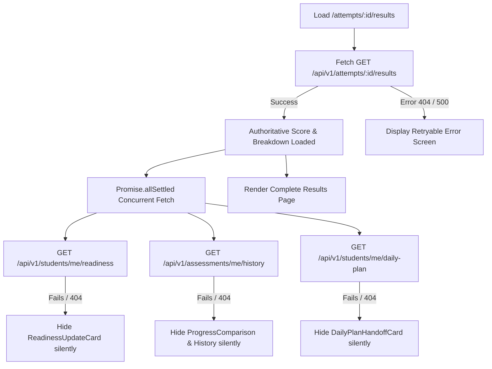

# Student Assessment Results Experience UX Specification & Architecture

## 1. Executive Summary & Product Purpose

The **Student Assessment Results Experience** (`/attempts/:id/results`) is the cognitive bridge between assessment evaluation and guided learning. Rather than presenting a dead-end numeric scorecard, this page transforms raw assessment performance data into an immediate, actionable learning trajectory.

### Core Pedagogical Principle
```
RESULT ──► EXPLANATION ──► WEAKNESS ──► ACTION
```
1. **Result**: The student sees their calibrated overall score and estimated CEFR level (*Niveau estimé*).
2. **Explanation**: Clear comparative synthesis across exam sections and subskills, highlighting what went well and what needs focus.
3. **Weakness**: Concrete diagnostics detailing specific errors, with explicit rationales (*Pourquoi ?*) and skill categorization.
4. **Action**: An unambiguous, prominent next step (*Recommandation prioritaire*) with a direct single-click CTA into the relevant practice exercise, plus seamless handoffs to the candidate's Readiness Profile and Daily Study Plan.

---

## 2. Regulatory Compliance & Calibrated Terminology

To adhere strictly to legal, contractual, and pedagogical standards, the Results page enforces precise language:

| Authorized Terminology (Mandatory) | Prohibited Terminology (Strictly Forbidden) | Rationale |
|:---|:---|:---|
| **Score / Résultat** | *Score officiel / Résultat officiel* | Avoids confusion with CCIP-issued certificates |
| **Niveau estimé (ex: B2)** | *Niveau certifié / Score garanti* | Clarifies that levels are formative simulations |
| **Performance observée** | *Validation officielle* | Accurately describes algorithmic observation |
| **Indice de confiance (Élevé / Modéré / Préliminaire)** | *Certitude absolue* | Reflects statistical confidence bounds |
| **Écart à l'objectif** | *Note éliminatoire* | Keeps student growth-oriented |
| **Estimation indicative** | *Attestation TEF* | Legally disclaims official authority |

### Non-Certifying Official Disclaimer
Every results view renders a prominent legal disclaimer:
> *"Ce résultat constitue une estimation indicative de performance basée sur notre algorithme de simulation. Il ne s'agit en aucun cas d'une attestation ou certification officielle TEF délivrée par la CCI Paris Île-de-France."*

---

## 3. Layout Architecture & Grid Hierarchy

The page is built using an asymmetric desktop grid (`lg:grid-cols-12`) that prioritizes pedagogical comprehension while keeping actionable guidance within immediate sight:

```
┌────────────────────────────────────────────────────────────────────────────────────────┐
│ Breadcrumb: Évaluations > Résultat de session • Action: [Télécharger le rapport]       │
├────────────────────────────────────────────────────────────────────────────────────────┤
│ Disclaimer Banner: Notice d'évaluation indicative (Non-certifying legal notice)         │
├────────────────────────────────────────────────────────────────────────────────────────┤
│ Hero Card: Score global (80%) • Niveau estimé (B2) • Indice de confiance • Objectif    │
├─────────────────────────────────────────────┬──────────────────────────────────────────┤
│ MAIN PEDAGOGICAL COLUMN (col-span-8)        │ ACTION & TRAJECTORY SIDEBAR (col-span-4) │
│                                             │                                          │
│ 1. ResultSummary                            │ 1. NextStepCard (Primary CTA)            │
│    - Comparative narrative synthesis        │    - High-priority exercise CTA          │
│    - Section contrast (Écrit vs Oral)       │    - Explicit "Pourquoi ?" pedagogical   │
│                                             │      justification                       │
│ 2. SectionResults                           │    - Secondary recommendations           │
│    - Section-by-section progress bars       │                                          │
│    - Points obtained / total points         │ 2. ProgressComparison                    │
│    - Mastery status badges                  │    - Delta vs previous attempts          │
│                                             │    - Trajectory indicator (+7 pts)       │
│ 3. SkillBreakdown                           │                                          │
│    - Fine-grained subskill scores           │ 3. ReadinessUpdateCard                   │
│    - Progressive disclosure toggle          │    - Impact on overall TEF readiness     │
│      [Voir toutes les compétences]          │    - Quick link to /readiness            │
│                                             │                                          │
│ 4. Strengths & Weaknesses                   │ 4. DailyPlanHandoffCard                  │
│    - StrengthsSection (validated skills)    │    - Next tasks in daily study plan      │
│    - WeaknessesSection (priority targets)   │    - Quick link to /practice             │
│    - Direct [Pratiquer] action buttons      │                                          │
│                                             │ 5. ResultHistory                         │
│ 5. MistakesSummary & MistakeReview          │    - Recent 3 attempts with scores       │
│    - Categorized mistake counts by skill    │    - Link to /progress                   │
│    - [Erreurs à revoir (N)] toggle button   │                                          │
│    - Expandable question-by-question review │                                          │
│    - Student answer vs Correct answer       │                                          │
│    - "Pourquoi ?" explanation box           │                                          │
└─────────────────────────────────────────────┴──────────────────────────────────────────┘
```

---

## 4. Component Taxonomy & Responsibilities

| Component | File Path | Primary Responsibility |
|:---|:---|:---|
| `AssessmentResultsPage` | `AssessmentResultsPage.tsx` | Main orchestrator; integrates `useAssessmentResults`, page shell, breadcrumbs, and error handling. |
| `AssessmentResultHero` | `AssessmentResultHero.tsx` | Hero banner with overall score %, total points, estimated CEFR level badge, confidence index, and target gap context. |
| `ResultSummary` | `ResultSummary.tsx` | Concise textual synthesis analyzing performance consistency across test sections. |
| `SectionResults` | `SectionResults.tsx` | Section breakdown with progress bars, scores, and mastery badges (*Maîtrisé*, *En progression*, *À renforcer*). |
| `SkillBreakdown` | `SkillBreakdown.tsx` | Fine-grained subskill competencies with progressive disclosure (`[Voir toutes les compétences]`). |
| `StrengthsSection` | `StrengthsSection.tsx` | 2-4 validated strengths reassuring the candidate of acquired competencies. |
| `WeaknessesSection` | `WeaknessesSection.tsx` | 1-3 prioritized areas for improvement with direct `[Pratiquer]` action buttons. |
| `MistakesSummary` | `MistakesSummary.tsx` | Aggregated error counts grouped by skill with toggle button to open question reviews. |
| `MistakeReview` | `MistakeReview.tsx` | Question-by-question expandable review displaying candidate choice, correct choice, and pedagogical explanation. |
| `NextStepCard` | `NextStepCard.tsx` | Primary actionable recommendation card with explicit rationale and single-click start CTA. |
| `ProgressComparison` | `ProgressComparison.tsx` | Mathematical comparison against previous attempts showing score delta and trend. |
| `ResultHistory` | `ResultHistory.tsx` | Mini-history list of past attempts with links to full analytics. |
| `ReadinessUpdateCard` | `ReadinessUpdateCard.tsx` | Handoff widget displaying estimated global readiness score update. |
| `DailyPlanHandoffCard` | `DailyPlanHandoffCard.tsx` | Handoff card linking back to the student's daily study plan. |
| `AssessmentResultsSkeleton` | `AssessmentResultsSkeleton.tsx` | Modular skeleton loader preventing jarring layout shifts during data hydration. |

---

## 5. Fault Tolerance & Data Resilience Architecture

Assessment results are critical: candidates must never be blocked by secondary system outages.



- **Critical Path**: Only `GET /api/v1/attempts/:id/results` is required to display the results page.
- **Supplementary Services**: Readiness, History, and Daily Plan are loaded concurrently with `Promise.allSettled()`. If any or all supplementary calls fail or return non-200 responses, the page degrades gracefully without crashing or flashing error dialogs.

---

## 6. Telemetry & Analytics Instrumentation

The Results page dispatches privacy-compliant telemetry events through the central dispatch pipeline:

| Event Name | Trigger | Payload |
|:---|:---|:---|
| `assessment_results_viewed` | On page mount with valid results | `attempt_id`, `assessment_id`, `score_percentage`, `estimated_level` |
| `results_mistakes_expanded` | Candidate toggles the mistake review panel | `attempt_id`, `mistakes_count` |
| `results_exercise_started` | Candidate clicks primary/secondary recommended exercise CTA | `attempt_id`, `exercise_id`, `source` |
| `results_readiness_clicked` | Candidate navigates to readiness profile | `attempt_id`, `current_readiness` |
| `results_daily_plan_clicked` | Candidate navigates to daily study plan | `attempt_id` |

---

## 7. Verification & Quality Assurance

- **Vitest Unit & Component Suite**: `tests/AssessmentResults.test.tsx` (18 unit tests covering all 14 components and edge cases).
- **End-to-End Journey Suite**: `tests/StudentAssessmentJourney.test.tsx` (5 comprehensive integration tests covering list -> detail -> taking -> results -> exercise handoff).
- **Cross-Feature Regression**: 19 test files, 159 tests passing across web app.
- **Production Build**: `pnpm --filter web build` passes with zero TypeScript warnings or errors.
- **Backend & Content Integrity**: `test_assessments.py`, `test_student_assessment_flow.py`, `validate_content.py`, and `validate_data.py` all passing with 100% integrity.
