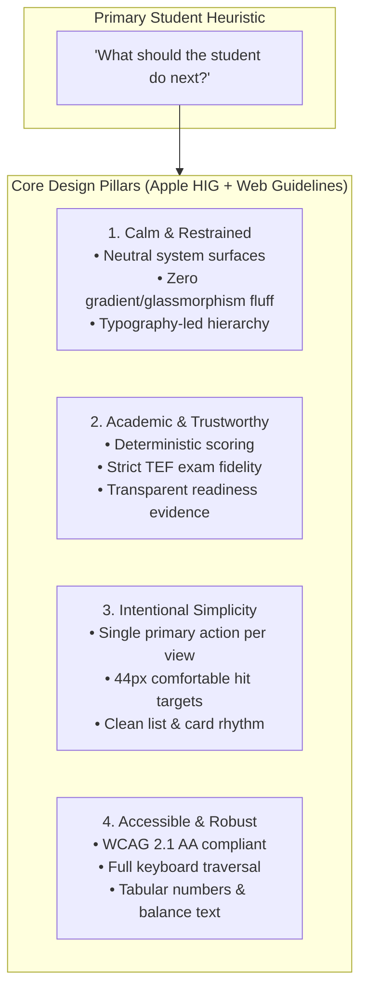

# TEF Canada Platform: Comprehensive UX Audit, Design System Direction & Architecture

## Executive Summary

As **Lead Product Designer & Senior Frontend Engineer**, this document establishes the authoritative User Experience Audit, Design System Direction, and Information Architecture for the TEF Canada student preparation platform.

This audit is guided strictly by two foundational design skills:
1. **Web Interface Guidelines** (`web-design-guidelines` / `web-design-principles`): Web standards for accessibility (WCAG 2.1 AA), keyboard interaction, form mechanics, focus visibility, typography precision, content overflow handling, and performance.
2. **Apple UI Designer** (`apple-ui-designer` from Atelier UI & Apple HIG): Native over custom, subtle over expressive, calm/confident/human, "feels obvious" rather than "looks fancy", clear hierarchy using size and weight rather than excessive color, neutral system-like surfaces with restrained accents, generous whitespace, 44px touch targets, and purposeful motion.

### Core Mandate & Guardrails
- **Scope**: Comprehensive AUDIT + ARCHITECTURAL SPECIFICATION.
- **Strict Separation**: Every dimension is explicitly bifurcated into **`CURRENT`** (verified codebase reality) and **`PROPOSED`** (target architectural evolution).
- **No Speculative Architecture**: No phantom routes, no unbacked backend features, no artificial redesigns that break existing API contracts or backend business logic.
- **Tone & Product Character**: Academic, premium, calm, modern, and trustworthy. We intentionally reject flashy gamification (XP bars, confetti, arbitrary streaks), card-cluttered SaaS patterns, heavy gradients, and non-educational decorative visual noise.

---

## 1. Product UX Principles & Design Philosophy



### The Guiding Question: *"What should the student do next?"*
Candidates preparing for the TEF Canada (often for Express Entry or Quebec immigration) experience high cognitive pressure and time scarcity. The interface must never induce decision paralysis. Every major screen prioritizes:
1. **Primary Next Action**: Prominently surfaced, immediately actionable, pedagogically justified.
2. **Secondary Options**: Visible but subordinate, clearly grouped and categorized.
3. **Tertiary / Administrative**: Tucked into contextual drawers, headers, or footers.

---

## 2. Token Architecture & Visual Hierarchy Audit

### 2.1 Color & Surface Palette

#### `CURRENT` Implementation
- Defined in `apps/web/src/index.css` via CSS variables (`--background`, `--foreground`, `--card`, `--primary`, `--border`, etc.) and mapped in Tailwind v4 `@theme inline`.
- Light background: `oklch(0.99 0.002 240)` (neutral paper tint); Card: `oklch(1.0 0 0)`.
- Primary Accent: Cobalt blue `oklch(0.42 0.16 260)` (light) / `oklch(0.68 0.18 260)` (dark).
- *Audit Finding*: The Dashboard hero card uses a multi-stop gradient (`bg-gradient-to-br from-card via-card to-primary/5`), creating minor visual discordance with the sober academic aesthetic. Multiple saturated badge colors (emerald, amber, rose, blue) compete for visual dominance on the same surface.

#### `PROPOSED` Evolution (Apple UI + Web Guidelines)
- **Eliminate Gradient Slop**: Replace all gradient card backgrounds with pure, calm, flat system surfaces (`bg-card border border-border/80`).
- **Restrained Accent Policy**: Apply the brand accent **at most once per surface** (reserved exclusively for the primary CTA button or active navigation indicator).
- **Subtle Surface Elevation**: Use hairline borders (`border-border/60` or `border-neutral-200/80`) and minimal elevation (`shadow-xs` / `shadow-sm`) instead of thick borders or heavy drop shadows.
- **De-saturated Status Indicators**: Replace high-saturation badges with calm, muted status chips (`bg-emerald-50 text-emerald-800 border-emerald-200/60` in light mode; `bg-emerald-950/40 text-emerald-300 border-emerald-800/50` in dark mode) paired with explicit non-color icons.

---

### 2.2 Typography & Numerical Formatting

#### `CURRENT` Implementation
- Font Stack: Geist Sans (primary UI) and Geist Mono (code/numbers) loaded locally in `index.css`.
- Headings use standard Tailwind sizes (`text-2xl font-bold`, `text-xl font-semibold`).
- Some score counters and timers use proportional numbers, which cause layout jitter during real-time updates.
- Microcopy occasionally uses three ASCII periods (`...`) instead of the typographical ellipsis (`…`) and straight quotes.

#### `PROPOSED` Evolution (Apple UI + Web Guidelines)
- **System-First Hierarchy**: Structure hierarchy strictly through **size and weight** rather than excessive color variation:
  - Large Page Title: `text-2xl font-semibold tracking-tight text-foreground` (iOS Large Title style).
  - Section Header: `text-lg font-medium text-foreground`.
  - Body Text: `text-sm font-normal text-muted-foreground leading-relaxed`.
  - Captions/Metadata: `text-xs font-normal text-muted-foreground/80`.
- **Mandatory Tabular Numerals**: Enforce `tabular-nums font-mono` on all timers, score counts, word counts, NCLC bands, and percentage deltas to prevent numerical layout shift (CLS).
- **Typographical Polish**:
  - Replace all `...` with true ellipsis `…` across loading states (`"Chargement…"`, `"Sauvegarde en cours…"`).
  - Enforce `text-wrap: balance` / `text-pretty` on headings and modal titles to eliminate typographical widows.
  - Insert non-breaking spaces before units: `15\u00A0min`, `699\u00A0pts`, `250\u00A0mots`, `NCLC\u00A07`.

---

## 3. Application Shell & Navigation Architecture Audit

```
┌─────────────────────────────────────────────────────────────────────────────┐
│ DESKTOP VIEWPORT (>= 1024px)                                                │
├──────────────────┬──────────────────────────────────────────────────────────┤
│ 256px SIDEBAR    │ MAIN CONTENT AREA (max-w-6xl mx-auto)                    │
│                  │                                                          │
│ [Brand Header]   │ [PageHeader: Title + Subtitle + Actions Slot]            │
│                  ├──────────────────────────────────────────────────────────┤
│ [5 Pillars Nav]  │ [Next Best Action / Hero Workspace]                      │
│ 1. Dashboard     │                                                          │
│ 2. Practice      ├──────────────────────────────────────────────────────────┤
│ 3. Progress      │ [Structured Workspace: 8 cols main / 4 cols sidebar]    │
│ 4. Teachers      │                                                          │
│ 5. Practice Pool │                                                          │
│                  │                                                          │
│ [Secondary Nav]  │                                                          │
│ • Simulations    │                                                          │
│ • Submissions    │                                                          │
│                  │                                                          │
│ [Footer Profile] │                                                          │
└──────────────────┴──────────────────────────────────────────────────────────┘
┌─────────────────────────────────────────────────────────────────────────────┐
│ MOBILE VIEWPORT (< 1024px)                                                  │
├─────────────────────────────────────────────────────────────────────────────┤
│ 56px Top Header: [Brand Logo]                    [Notification Bell] [Menu] │
├─────────────────────────────────────────────────────────────────────────────┤
│ Scrollable Main Content Area (padding-bottom: 80px)                         │
│                                                                             │
├─────────────────────────────────────────────────────────────────────────────┤
│ 64px Fixed Bottom Navigation Bar (5 Core Pillars with 44x44px touch targets)│
└─────────────────────────────────────────────────────────────────────────────┘
```

### 3.1 App Shell (`StudentLayout.tsx`)

#### `CURRENT` Implementation
- Desktop: 256px fixed sidebar containing Brand header, 5 primary navigation links, 2 secondary links, notification center popover, theme toggle, and logout button.
- Mobile: 56px sticky top header with hamburger trigger opening a slide-out drawer, plus a 64px fixed bottom navigation bar exposing the 5 core pillars.
- *Audit Findings*:
  1. Main content container lacks an accessible skip link (`<a href="#main-content">Aller au contenu principal</a>`), violating Web Interface Guidelines for keyboard navigation.
  2. The sidebar applies `backdrop-blur-md bg-card/60`. While aesthetic, blur on a non-overlay desktop column diverges from native Apple desktop/iPad sidebar conventions where sidebars use opaque subtle tints (`bg-sidebar`).
  3. Interactive icon buttons (theme toggle, mobile hamburger) lack explicit `aria-label` tags.

#### `PROPOSED` Evolution
1. **Add Accessible Skip Navigation**: Include an off-screen keyboard skip link at the top of `StudentLayout`:
   ```tsx
   <a href="#main-content" className="sr-only focus:not-sr-only focus:absolute focus:top-4 focus:left-4 focus:z-50 focus:px-4 focus:py-2 focus:bg-primary focus:text-primary-foreground focus:rounded-lg focus:shadow-md">
     Aller au contenu principal
   </a>
   ```
2. **Solid, Calmer Desktop Sidebar**: Switch from semi-transparent blur to a clean, solid system surface (`bg-card border-r border-border/60`).
3. **Explicit Hit Targets & Labels**: Ensure all icon-only buttons (`ThemeToggle`, `Menu`, `NotificationCenter`) include explicit `aria-label` attributes (e.g., `aria-label="Basculer le mode sombre"`).
4. **Bottom Sheet Drawer on Mobile**: Replace standard mobile modal dialogs with smooth, gesture-friendly bottom sheets (`Sheet`) with drag handle affordances.

---

## 4. Screen-by-Screen UX Audit: Current vs. Proposed

---

### 4.1 Student Dashboard (`/dashboard`)

```
+-----------------------------------------------------------------------------+
| CURRENT DASHBOARD                                                           |
| - Hero has gradient 'from-card via-card to-primary/5'                       |
| - Competing badge colors (green, blue, amber, red) on top header             |
| - Proportional numbers in countdown and readiness gauges                    |
+-----------------------------------------------------------------------------+
                                      |
                                      v
+-----------------------------------------------------------------------------+
| PROPOSED DASHBOARD (Apple UI + Web Interface Guidelines)                    |
| - Flat, calm system hero surface with subtle hairline border                |
| - Single primary CTA: 'Démarrer l'exercice' with clear duration estimate   |
| - Monospaced tabular numerals: 'font-mono tabular-nums' (e.g. 642 / 699)    |
| - Restrained status indicators: muted background chips with icons           |
| - Clear typographic hierarchy: Large Title -> Callout -> Caption            |
+-----------------------------------------------------------------------------+
```

#### `CURRENT` Implementation
- Located in `apps/web/src/features/dashboard/StudentDashboardPage.tsx`.
- Displays top hero with Next Best Action + readiness score out of 699, daily study plan time budget (e.g., 25/45 min), weakest skills gap diagnosis, curated recommended exercises, and upcoming teacher coaching.
- *Audit Findings*:
  - The hero card background uses a gradient that breaks visual serenity.
  - Readiness metric and countdown timers lack `tabular-nums`.
  - Empty states render generic fallback text rather than guided next steps.
  - Multiple actionable cards have identical primary visual weight, creating minor hesitation about which action is most urgent.

#### `PROPOSED` Evolution
- **Sober Hero Container**: Flat surface with light border (`bg-card border border-border rounded-2xl p-6 sm:p-8`).
- **Unambiguous Primary CTA**: Only ONE filled primary button on the hero (`Button variant="default"`). All secondary pathways use `variant="outline"` or `variant="ghost"`.
- **Tabular Readiness Presentation**:
  ```tsx
  <span className="font-mono text-3xl font-bold tracking-tight tabular-nums text-foreground">
    {score}&nbsp;<span className="text-sm font-normal text-muted-foreground">/ 699</span>
  </span>
  ```
- **Consistent List Rhythm**: Daily plan items formatted with clean hairline dividers (`divide-y divide-border/40`), eliminating redundant card borders around each micro-item.

---

### 4.2 Practice Hub & Drill Directory (`/practice`)

#### `CURRENT` Implementation
- Located in `apps/web/src/features/practice/PracticePage.tsx`.
- Recommended drills surfaced at the top, followed by 8 category filter chips (Compréhension écrite, Compréhension orale, Expression écrite, Expression orale, Grammaire, Vocabulaire, Conjugaison) and 4 level pills (Tous, B1, B2, C1).
- Search input for real-time exercise filtering.
- *Audit Findings*:
  - The horizontal filter chips can cause overflow on narrow screens without scroll affordances.
  - Search input lacks `type="search"`, `inputmode="search"`, `spellCheck={false}`, and an accessible clear button.
  - Card hover states apply multiple effects simultaneously (border color change + scale/shadow), feeling slightly restless.

#### `PROPOSED` Evolution
- **iOS-Style Segmented Filters**: Group category filters into a clean, keyboard-navigable tablist or segmented control with subtle background pill indicators (`bg-muted p-1 rounded-xl`).
- **Standardized Search Input**:
  - Add `type="search"`, `inputmode="search"`, `spellCheck={false}`, and `autoComplete="off"`.
  - Add inline clear button (`<button aria-label="Effacer la recherche">`) visible when text is present.
- **Calm Card Interactions**: Refined card hover state limited to a single subtle border shift (`transition-colors duration-150 ease-out hover:border-foreground/20`), avoiding layout scaling.
- **Non-Breaking Microcopy**: Display durations and points with non-breaking spaces (`10\u00A0min`, `5\u00A0questions`).

---

### 4.3 Progress & Diagnostic Readiness (`/progress` & `/readiness`)

#### `CURRENT` Implementation
- Located in `apps/web/src/features/progress/ProgressPage.tsx` and `apps/web/src/features/readiness/ReadinessPage.tsx`.
- Historical ability trajectory over 7d, 30d, 90d, and all time; skill breakdowns across the 4 core competencies; explainable algorithm accordion detailing score decay and variance penalties; legal simulation disclaimer.
- *Audit Findings*:
  - Charts lack accessible text alternatives for screen reader users (violating WCAG 2.1 AA 1.1.1 Non-text Content).
  - Time filter buttons lack `role="tab"` or `aria-selected` semantic bindings.
  - Confidence intervals and delta badges do not use `tabular-nums`.

#### `PROPOSED` Evolution
- **Accessible Screen Reader Data Table**: Include a hidden `<table className="sr-only">` summarizing historical dates and ability estimates alongside visual SVG/Canvas charts.
- **Semantic Tablist for Time Filters**: Structure 7d/30d/90d toggles as an accessible `role="tablist"` with proper `aria-selected` attributes and arrow key navigation.
- **Tabular Confidence Intervals**: Format confidence intervals deterministically (`[580, 620] ± 20 pts`) in monospace tabular format.
- **Calm, Educational Framing**: Emphasize that language acquisition is non-linear; present variance penalties not as "punishments" but as "zones requiring calibration".

---

### 4.4 Certified Teachers Directory & Booking (`/teachers` & `/teachers/:id`)

#### `CURRENT` Implementation
- Located in `apps/web/src/features/teachers/TeachersDirectoryPage.tsx` and `TeacherDetailPage.tsx`.
- Lists instructors with verified examiner status, hourly CAD rates, native speaker tags, ratings, and completed sessions.
- Detail page offers interactive 60-minute slot selection, student preparation note input, and booking modal confirmation.
- *Audit Findings*:
  - On mobile viewports, the booking confirmation modal renders as a centered dialog (`Dialog`), which can clip or force awkward scrolling on small screens.
  - Rating display uses yellow stars, which can evoke a generic marketplace feel rather than an accredited academic institution.

#### `PROPOSED` Evolution
- **Academic Accreditation Presentation**: Replace consumer-style star clusters with authoritative academic credentials:
  - *"Examinateur certifié TEF / DFP"* badge.
  - Clean numerical summary: `4.9 / 5.0 (38 séances)`.
- **Mobile Bottom Sheet Booking Flow**: Use a bottom sheet (`Sheet`) on mobile devices (<768px) that slides up naturally from the bottom of the screen with a swipe-down-to-dismiss gesture.
- **Transparent Hourly Billing**: Highlight clear all-inclusive CAD rates (`85\u00A0$ CAD / heure`, zero hidden platform fees).
- **Timezone Safety**: Explicitly display the student's local timezone alongside the teacher's timezone with a 1-click change link.

---

### 4.5 Writing Studio & Submissions (`/writing` & `/writing/tasks/:id`)

```
┌─────────────────────────────────────────────────────────────────────────────┐
│ DISTRACTION-FREE WRITING STUDIO (/writing/tasks/:id)                        │
├──────────────────────────────────────┬──────────────────────────────────────┤
│ 40% PROMPT & CRITERIA PANE           │ 60% DISTRACTION-FREE WRITING CANVAS  │
│                                      │                                      │
│ [Task Badge: Section B - Fait divers]│ [Autosave: 'Brouillon enregistré']   │
│                                      │                                      │
│ Official Subject Description:        │ Textarea (line-height: 1.7)          │
│ 'Vous venez de lire un article...'   │ Focus-visible: subtle ring           │
│                                      │                                      │
│ Official Assessment Criteria:        │                                      │
│ • Respect de la consigne             │                                      │
│ • Cohérence et argumentation         │                                      │
│ • Richesse du vocabulaire            │ [Word Count Badge: 228 / 200-250]    │
│                                      │                                      │
│ [Official Time Allowed: 25 min]      │ [Soumettre pour correction]          │
└──────────────────────────────────────┴──────────────────────────────────────┘
```

#### `CURRENT` Implementation
- Located in `apps/web/src/features/writing/WritingEditorPage.tsx` and `WritingSubmissionsPage.tsx`.
- Two-pane workspace: Prompt and rubric on the left, writing canvas on the right. Live word counter enforcing official boundaries (`200–250 mots`), debounced autosave, and dual submission modal (Instant AI vs Certified Examiner).
- *Audit Findings*:
  - The word counter updates on every keystroke, which can cause excessive screen reader chatter if wrapped in `aria-live="polite"` without debouncing.
  - The textarea does not link to the prompt via `aria-describedby`.
  - Browser navigation warning (`beforeunload`) needs verification to prevent accidental work loss.

#### `PROPOSED` Evolution
- **Distraction-Free Editorial Layout**: Eliminate all global navigation chrome (sidebar, bottom bar) during writing sessions.
- **Polite Word Count Announcements**: Update `aria-live` only when the candidate enters or leaves the valid word boundary (e.g., crossing 200 words or exceeding 250 words), rather than on every character.
- **Ergonomic Typography**: Set `line-height: 1.7` (`leading-relaxed`), comfortable font size (`text-base`), and capped line length (`max-w-prose` ~ 65 characters) to maximize reading ease.
- **Unsaved Changes Guard**: Standardize `useBlocker` or `beforeunload` event handler displaying: *"Vous avez des modifications non enregistrées. Êtes-vous sûr de vouloir quitter cette tâche d'écriture ?"*.

---

### 4.6 Speaking Simulation Room (`/speaking` & `/speaking/session/:id`)

#### `CURRENT` Implementation
- Located in `apps/web/src/features/speaking/SpeakingSessionPage.tsx`.
- Structured 3-phase flow:
  1. *Briefing*: Topic prompt, instructions, microphone audio test.
  2. *Active Simulation*: Live countdown timer, audio level visualizer, and stop recording button.
  3. *Debrief*: Automated speech transcription review, fluency score, grammar diagnostics.
- *Audit Findings*:
  - The audio recording timer lacks `role="timer"` semantics.
  - Audio visualizer motion can cause distraction if not respecting `prefers-reduced-motion`.
  - Microphone permission denial does not provide clear native OS resolution instructions.

#### `PROPOSED` Evolution
- **Calm, High-Contrast Timer**: Large tabular display (`font-mono text-4xl font-bold tabular-nums`) with `role="timer"`.
- **Reduced Motion Support**:
  ```css
  @media (prefers-reduced-motion: reduce) {
    .audio-visualizer-bar {
      transition: none !important;
      animation: none !important;
    }
  }
  ```
- **Clear System Permission Guidance**: Provide clear Apple/Chrome-specific step-by-step guidance when microphone access is blocked: *"Cliquez sur l'icône de cadenas dans la barre d'adresse pour autoriser le microphone"*.

---

### 4.7 Peer Practice Pool (`/practice-pool`)

#### `CURRENT` Implementation
- Located in `apps/web/src/features/practice-pool/PracticeHubPage.tsx`.
- 1-click level selection (B1, B2, C1), matchmaking queue, audio-only guarantee, and live discussion prompt.
- *Audit Findings*:
  - Queue status changes lack `aria-live="polite"` announcements for blind or low-vision candidates.
  - Matchmaking cancel button lacks high-contrast focus ring.

#### `PROPOSED` Evolution
- **Zero-PII Trust Framing**: Prominently emphasize the privacy guarantee with an Apple-style trust callout:
  - *"Échanges strictement audio. Aucun profil personnel ni caméra requis. Données éphémères."*
- **Accessible Queue Updates**: Wrap matchmaking status messages in `aria-live="polite"` so screen reader users hear when a peer connects.
- **Large Cancel Button**: 44px touch target with clear hover/focus ring to allow effortless exit from the queue.

---

### 4.8 Timed Full Exam Simulations (`/assessments` & `/attempts/:id`)

#### `CURRENT` Implementation
- Located in `apps/web/src/features/assessments/AssessmentTakingPage.tsx`.
- Fullscreen examination shell, countdown timer, question navigation drawer, question response pane, and dedicated single-playback audio player (`ListeningPlayer.tsx`).
- *Audit Findings*:
  - Audio player buttons need keyboard shortcuts and explicit `aria-label` tags (`"Lancer l'écoute unique"`).
  - The remaining play counter (`1 écoute restante`) should announce changes politely.
  - Timer expiration should offer an emergency auto-submit modal rather than an unannounced hard redirect.

#### `PROPOSED` Evolution
- **Strict Linear Exam Mode**: Completely isolate the viewport: no sidebar, no external links, no header distraction.
- **Official Audio Rules Display**: Clear exam notice: *"Conformément aux règles du TEF Canada, chaque extrait audio ne peut être écouté qu'une seule fois. L'avance rapide et le rembobinage sont désactivés."*
- **Polite 5-Minute Warning**: Subtly pulse the countdown timer in amber when $< 5\text{ min}$ remain, without intrusive popups that break concentration.

---

## 5. Web Interface Guidelines & Apple UI Compliance Checklist

| Guideline / Principle | Rule / Specification | Current Status | Proposed Architectural Remedy |
|---|---|:---:|---|
| **WCAG 2.1 AA Contrast** | $\ge 4.5:1$ text contrast; $\ge 3:1$ borders | **PASS** | Maintain current OKLCH token contrast thresholds. |
| **Visible Focus States** | `focus-visible:ring-2 focus-visible:ring-primary/20` | **PASS** | Standardized across all buttons, inputs, and tab items. |
| **Skip Link** | Skip to main content for keyboard users | **GAP** | Add `<a href="#main-content">` to `StudentLayout.tsx`. |
| **Tabular Numerals** | `tabular-nums font-mono` on counters & scores | **PARTIAL** | Enforce `tabular-nums` on all metrics, timers, and dates. |
| **Typographical Ellipsis** | Use true `…` instead of `...` | **PARTIAL** | Audit and replace all trailing three dots in copy strings. |
| **Text Balancing** | `text-wrap: balance` / `text-pretty` on titles | **GAP** | Apply `text-balance` to all `PageHeader` and card titles. |
| **Touch Targets** | Minimum $44 \times 44\text{px}$ hit areas | **PASS** | Mobile bottom nav and icon buttons verified $\ge 44\text{px}$. |
| **Reduced Motion** | Honor `prefers-reduced-motion` | **PARTIAL** | Wrap spinners and audio visualizers in motion media queries. |
| **Mobile Modals** | Bottom sheets (`Sheet`) over centered dialogs | **PARTIAL** | Migrate mobile filters and booking modals to `Sheet`. |
| **Zero SaaS Fluff** | No gradients, no confetti, no arbitrary XP | **PARTIAL** | Strip hero card background gradient; keep surfaces flat. |

---

## 6. Phased Implementation Strategy

To ensure platform stability and maintain all 5 platform quality gates, execution should proceed across three focused phases:

### Phase 1: Micro-Typography, Focus & Token Hygiene (Immediate)
- Strip hero card gradient in `StudentDashboardPage.tsx` in favor of flat system surface.
- Add `<a href="#main-content">` skip link in `StudentLayout.tsx`.
- Enforce `tabular-nums` across all metric cards, countdown timers, and word counters.
- Audit string literals to ensure true ellipsis `…` and non-breaking spaces before units.

### Phase 2: Mobile Bottom Sheet & Form Polish (Next Sprint)
- Implement `Sheet` pattern for mobile teacher booking and filter dialogs.
- Ensure all form inputs specify `inputmode`, `spellCheck`, `autoComplete`, and clickable labels.
- Add live region announcements for word count thresholds and queue state transitions.

### Phase 3: Distraction-Free Exam Shell Refinement
- Finalize keyboard shortcuts and ARIA state announcements in `ListeningPlayer.tsx`.
- Polish Speaking Room microphone permission guidance and waveform motion damping.
- Verify comprehensive screen-reader traversals across the entire student path.
