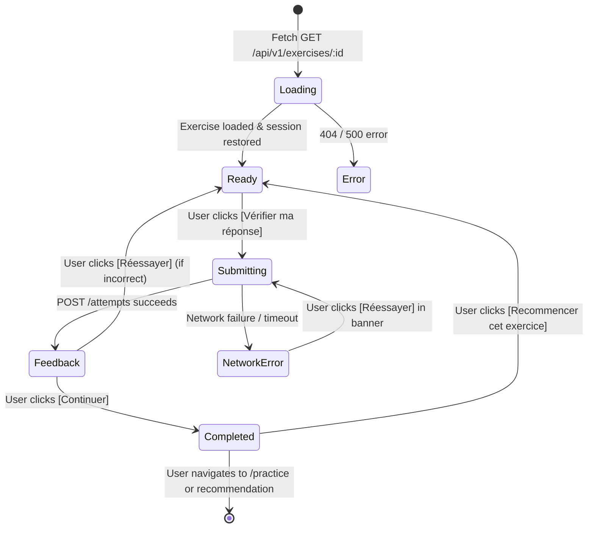

# Student Exercise Player Experience UX Specification & Architecture

## 1. Executive Summary & Product Purpose

The **Student Exercise Player Experience** (`/exercises/:id`) is the dedicated, distraction-free practice environment designed for formative learning, immediate understanding, repetition, and continuous skill progression.

### Core Pedagogical Philosophy
```
EXERCISE:
Answer ──► Feedback ──► Understand ("Pourquoi ?") ──► Retry / Continue ──► Improve
```
In sharp contrast to formal examination simulation (`/attempts/:id`), where answers are submitted under time pressure and evaluated after the entire test concludes, the Exercise Player is:
- **Interactive & Forgiving**: Immediate feedback on every drill.
- **Pedagogical First**: Explains *why* an answer is correct or incorrect ("Pourquoi ?") and links the item to the underlying skill taxonomy.
- **Low-Friction**: Native semantic controls, 44px+ touch targets, clean typography, and quick keyboard-driven workflows.
- **Server-Authoritative**: Scores, skill updates, and readiness impacts are strictly computed by the backend; the frontend never calculates fake improvements.

---

## 2. Page Structure & Focused Practice Shell

The practice interface departs from the heavy dashboard layout, using `FocusedPracticeShell` to provide a calm, centered canvas (`max-w-3xl` on desktop, single-column on mobile):

```
┌────────────────────────────────────────────────────────────────────────────────────────┐
│ Header: [← Pratique] • [Grammaire] [B1] • ~10 min • Question 1 sur 1 • Entraînement   │
├────────────────────────────────────────────────────────────────────────────────────────┤
│ PROGRESS:                                                                              │
│ Question 1 sur 1                                                                  100% │
│ [████████████████████████████████████████████████████████████████████████████████████] │
├────────────────────────────────────────────────────────────────────────────────────────┤
│ QUESTION CARD:                                                                         │
│                                                                                        │
│ [Optional Reading Passage or Listening Audio Player]                                   │
│                                                                                        │
│ Prompt: Complétez : 'Il est venu, _____ il soit malade.'                               │
│                                                                                        │
│ ○ bien qu'                                                                             │
│ ○ malgré                                                                               │
│                                                                                        │
│ [Vérifier ma réponse]                                                                  │
├────────────────────────────────────────────────────────────────────────────────────────┤
│ FEEDBACK (After validation):                                                           │
│                                                                                        │
│ ✓ Bonne réponse ! (+10 pts)                                                            │
│                                                                                        │
│ Pourquoi ?                                                                             │
│ "Après la locution conjonctive 'bien que', le verbe subordonné est au subjonctif."     │
│                                                                                        │
│ Compétence travaillée : Grammaire • Connecteurs logiques                               │
│                                                                                        │
│ [Continuer]                                                                            │
└────────────────────────────────────────────────────────────────────────────────────────┘
```

---

## 3. Component Taxonomy & Responsibilities

| Component | File Path | Primary Responsibility |
|:---|:---|:---|
| `FocusedPracticeShell` | `components/layout/FocusedPracticeShell.tsx` | Minimalist practice layout with skill badge, title, level, estimated duration, and exit CTA. |
| `ExerciseProgress` | `features/exercises/components/ExerciseProgress.tsx` | Non-gamified progress tracker with accessible progress bar (`role="progressbar"`). |
| `ExerciseQuestion` | `features/exercises/components/ExerciseQuestion.tsx` | Central question canvas with typography, optional reading passage container, optional `ListeningPlayer`, and fallback for unsupported types. |
| `ExerciseAnswerGroup` | `features/exercises/components/ExerciseAnswerGroup.tsx` | Semantic native controls (`input[type="radio"]`, `input[type="checkbox"]`, `input[type="text"]`) with comfortable touch targets. |
| `ExerciseFeedback` | `features/exercises/components/ExerciseFeedback.tsx` | Immediate, constructive feedback banner (*"Bonne réponse"* / *"Pas tout à fait"*) and screen-reader announcement (`aria-live="polite"`). |
| `ExerciseExplanation` | `features/exercises/components/ExerciseExplanation.tsx` | Concise pedagogical rationale answering *"Pourquoi ?"* and connecting the exercise to tracked skills. |
| `ExerciseNavigation` | `features/exercises/components/ExerciseNavigation.tsx` | Dynamic action bar handling answer checking (`[Vérifier ma réponse]`), retries (`[Réessayer]`), and continuation (`[Continuer]`). |
| `ExerciseCompletion` | `features/exercises/components/ExerciseCompletion.tsx` | Completion summary displaying score, accuracy %, practice duration, skills practiced, and next recommended activity card. |
| `ExerciseSkeleton` | `features/exercises/components/ExerciseSkeleton.tsx` | Stable skeleton placeholder preventing layout shifts during data loading. |
| `ExercisePracticePage` | `features/exercises/ExercisePracticePage.tsx` | Top-level orchestrator; handles state transitions, redirects, network recovery, and past attempt reviews. |
| `useExercisePlayer` | `features/exercises/useExercisePlayer.ts` | Custom hook managing fetching, answer submission, retry logic, refresh persistence, cache invalidation, and telemetry. |

---

## 4. State Machine & Lifecycle

The practice player enforces a deterministic state machine:



### State Definitions:
1. **`loading`**: Renders `ExerciseSkeleton` within `FocusedPracticeShell`.
2. **`ready`**: Prompt and answer controls are interactive; `[Vérifier ma réponse]` is active once an option is selected.
3. **`submitting`**: Controls disabled, submit button shows `[Vérification...]` with spinner.
4. **`feedback`**: Displays immediate positive or corrective feedback, correct answer reveal (if configured), and "Pourquoi ?" explanation.
5. **`completed`**: Displays score, accuracy, skills practiced, and recommendation handoff.
6. **`network_error`**: Retains user's local selection in memory, displays retry banner with `[Réessayer]`, preventing answer loss.
7. **`error`**: Friendly alert for 404/unpublished exercises with `[Retour à la pratique]`.

---

## 5. Answer Persistence & Refresh Survival

To protect students from losing progress during accidental browser refreshes:
- Active state (`selectedOptionIndex`, `textResponse`, `result`, `state`) is synchronized to `sessionStorage` under `tef_exercise_attempt_${exerciseId}`.
- Upon page refresh, `useExercisePlayer` immediately hydrates local state from `sessionStorage` without creating duplicate server attempts or restarting the drill unexpectedly.
- When the student clicks `[Recommencer cet exercice]`, the session key is cleared, resetting the canvas for a clean new attempt.

---

## 6. Supported Question Formats

| Format | Question Type | Input Control | Behavior |
|:---|:---|:---|:---|
| **Single Choice** | `single_choice` | `<input type="radio">` | Radio group with unique name; selecting one deselects others. |
| **Multiple Choice** | `multiple_choice` | `<input type="checkbox">` | Checkbox group; allows selecting multiple options. |
| **Text Input / Conjugation** | `text_input` | `<input type="text">` | Direct text field; pressing `Enter` submits answer. |
| **Reading Drill** | `single_choice` | Passage container + radios | Displays text passage above prompt. |
| **Listening Drill** | `single_choice` | `ListeningPlayer` + radios | Displays audio player with replay rules above prompt. |
| **Writing / Speaking** | Specialized | Automatic Redirect | Automatically redirects to `/writing/tasks/:id` or `/speaking`. |
| **Unsupported Type** | Unknown | Graceful Card | Renders graceful technical message without crashing. |

---

## 7. TanStack Query Cache Invalidation

Upon exercise completion, the following TanStack Query keys are automatically invalidated using `Promise.allSettled`:
- `["dashboard"]`: Updates daily progress metrics and streak.
- `["readiness"]`: Refreshes readiness radar and CEFR estimate.
- `["skills"]`: Updates rolling mastery scores and confidence.
- `["recommendations"]`: Removes completed recommendation, generates fresh next activity.
- `["daily-plan"]`: Updates today's practice checklist.
- `["recent-activity"]`: Adds new exercise attempt to activity feed.

---

## 8. Telemetry & Analytics Events

| Event Name | Trigger | Payload |
|:---|:---|:---|
| `exercise_viewed` | On exercise mount | `exercise_id`, `category`, `level` |
| `exercise_started` | On exercise session start | `exercise_id`, `category` |
| `exercise_answer_checked` | On submitting an answer | `exercise_id`, `is_correct`, `points` |
| `exercise_correct` | When backend grades answer as correct | `exercise_id`, `points` |
| `exercise_incorrect` | When backend grades answer as incorrect | `exercise_id` |
| `exercise_retry` | When user clicks [Réessayer] | `exercise_id` |
| `exercise_completed` | On reaching completion screen | `exercise_id`, `score`, `is_correct`, `duration_seconds` |
| `exercise_recommendation_clicked` | When user clicks recommendation CTA | `source_exercise_id`, `target_entity_id` |

---

## 9. Quality Assurance & Verification

- **Vitest Unit & Integration Suite**: `tests/ExercisePlayer.test.tsx` (18/18 PASS).
- **Frontend Regression Suite**: 20 test files, 177/177 tests PASS.
- **Production Build**: `pnpm --filter web build` passes with 0 TypeScript errors.
- **Backend Test Suite**: `pytest` passes 22/22 tests in `apps/api`.
- **Content & Database Integrity**: Both `validate_content.py` and `validate_data.py` report 100% validity across all vectors.
