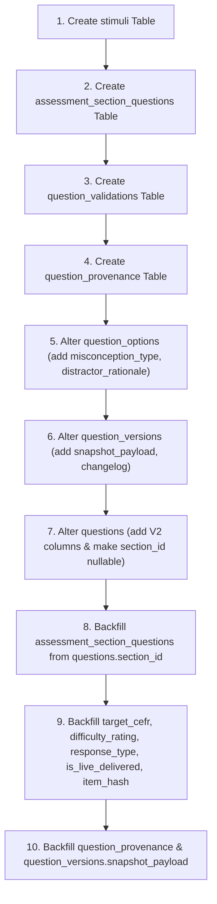

# TEF Question System V2 — Database Migration Report (Phase 1)

**Status:** Completed & Verified  
**Revision:** `0035_question_system_v2_foundation`  
**Down Revision:** `0034_taxonomy_versioning_and_historical_integrity`  
**Test Suite:** `apps/api/tests/test_question_v2_db_migration.py` (Passing)

---

## 1. Schema Inventory (Current vs. Target)

### 1.1 Legacy Schema (Pre-V2 Foundation)
- **`questions`**: Bound to `assessment_sections.id` via non-nullable foreign key `section_id`. Had `level` and `difficulty` as uncalibrated single-dimensional metrics, `question_type` as a string enum (`single_choice`, `multiple_choice`, `text_input`), and lacked stimulus separation and deduplication hashes.
- **`question_options`**: Stored only `content`, `order_index`, `is_correct`, `explanation`. Lacked diagnostic misconception categorization and distractor rationales.
- **`question_versions`**: Only snapshotted options (`options_snapshot`) and basic scalar fields. Lacked comprehensive frozen item snapshots (`snapshot_payload`).
- **`assessment_sections`**: Owned questions directly via one-to-many relationship, preventing question reuse across drills, diagnostic tests, and mock exams.

### 1.2 Target V2 Foundation Schema
- **`stimuli` (New Table)**: Independent catalog of stimuli (reading passages, listening audio recordings, graphics, source citations) with cryptographic SHA-256 fingerprinting (`content_hash`).
- **`assessment_section_questions` (New Table)**: Association table decoupling questions from specific assessment sections. Supports many-to-many reuse of question items across multiple sections and assessments.
- **`question_validations` (New Table)**: Persistent log of automated lint audits, blocking errors, and warnings for quality control.
- **`question_provenance` (New Table)**: Tracks author type (`human`, `ai`, `imported`), generator models, prompt versions, parameters, and review audits.
- **`questions` (Altered Table)**: 
  - `section_id`: Made nullable (deprecated compatibility field).
  - Added `stimulus_id` (FK to `stimuli.id`).
  - Added `response_type` (e.g. `single_choice`, `multiple_choice`, `matching`, `ordering`, `gap_fill`, `short_text`, `long_text`, `spoken_response`).
  - Added `target_cefr` and `difficulty_rating` (decoupling CEFR target from item difficulty).
  - Added `cognitive_complexity` (Bloom/Webb depth of knowledge).
  - Added `is_live_delivered` (immutability flag set when attempts exist).
  - Added `item_hash` (deterministic deduplication hash).
  - Added `instructions` and `scoring_payload`.
- **`question_options` (Altered Table)**:
  - Added `misconception_type` (diagnostic classification).
  - Added `distractor_rationale` (psychometric explanation for wrong options).
- **`question_versions` (Altered Table)**:
  - Added `snapshot_payload` (`JSONB` storing the frozen state of stimulus, prompt, options, answer keys, and skill tags).
  - Added `changelog` (version explanation).

---

## 2. Migration Sequence (`0035_question_system_v2_foundation.py`)

The migration executes in strict transactional order:

---

## 3. Data Backfills

1. **Section Decoupling:**
   Every existing question with `section_id IS NOT NULL` was backfilled into `assessment_section_questions` with `order_index` preserved.
2. **Target CEFR & Difficulty:**
   - `target_cefr` initialized from existing `questions.level`.
   - `difficulty_rating` initialized from existing `questions.difficulty`.
   - `level` and `difficulty` remain untouched to preserve legacy queries.
3. **Response Type Mapping:**
   - `text_input` $\rightarrow$ `short_text`
   - `single_choice` $\rightarrow$ `single_choice`
   - `multiple_choice` $\rightarrow$ `multiple_choice`
4. **Live Delivery Status (`is_live_delivered`):**
   - Automatically flagged as `is_live_delivered = TRUE` for any question referenced in `attempt_answers`.
5. **Deterministic Item Hash (`item_hash`):**
   - Computed as: `SHA256(normalize_spaces(lowercase(prompt)))`.
6. **Provenance:**
   - Baseline `question_provenance` records inserted for all questions with `author_type = 'human'`, `source_type = 'original'`, and `created_by_user_id` inherited from question.
7. **Version Snapshots:**
   - Pre-existing `question_versions` backfilled with synthesized `snapshot_payload` JSON.

---

## 4. Compatibility & Deprecation Invariants

| Field / Relationship | Status | Handling |
| :--- | :--- | :--- |
| `questions.section_id` | **Deprecated Compatibility Column** | Nullable. Retained so existing query filters or ORM references don't break. |
| `questions.level` | **Legacy Compatibility Column** | Maintained in tandem with `target_cefr`. |
| `questions.difficulty` | **Legacy Compatibility Column** | Maintained in tandem with `difficulty_rating`. |
| `questions.question_type` | **Legacy Compatibility Column** | Maintained alongside `response_type`. |
| `AssessmentSection.questions` | **Active Backward Compatible Property** | Resolved via `section_id` fallback while `question_associations` provides decoupled access. |

---

## 5. Fields Intentionally Left Nullable

1. `questions.stimulus_id`: Questions that do not require an external stimulus (e.g. standalone vocabulary/grammar drills or isolated sentences) have `stimulus_id = NULL`.
2. `questions.cognitive_complexity`: Left `NULL` for legacy items where cognitive operation has not yet been audited. Avoids silent, uncalibrated classification.
3. `question_options.misconception_type`: Correct options do not have a misconception type; legacy distractors remain `NULL` until reviewed.
4. `question_options.distractor_rationale`: Left `NULL` until pedagogical rationales are authored or backfilled.
5. `questions.instructions`: Optional per-item consigne.

---

## 6. Rollback Considerations

The `downgrade()` implementation in `0035_question_system_v2_foundation.py`:
1. Reverts `questions.section_id` to `NOT NULL`.
2. Drops all added V2 columns from `questions`, `question_options`, and `question_versions`.
3. Drops tables `question_provenance`, `question_validations`, `assessment_section_questions`, and `stimuli`.
4. Executes safely across PostgreSQL and SQLite test environments.

---

## 7. Next Phase: Phase 2 (Validation Engine & Lifecycle Services)

Now that the database foundation is deployed and verified, the next implementation phase will construct:
1. `QuestionValidationEngine` with blocking/warning rules (weight sums, clueing checks, distractor counts).
2. Authoring and review lifecycle service methods (`create_draft`, `submit_review`, `approve`, `reject`, `fork`).
3. Immutability enforcement in `update_question` (blocking in-place updates when `is_live_delivered = TRUE`).
