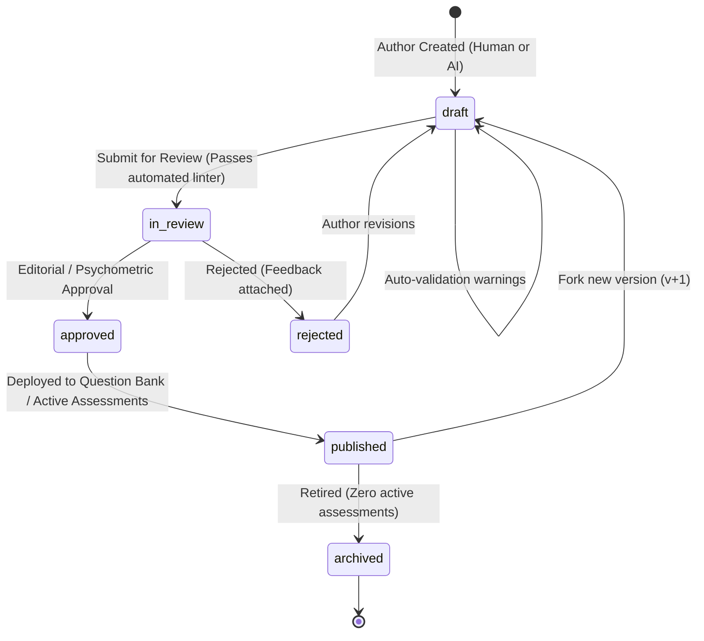

# TEF Question System V2 — Architecture & Contract Specification

**Status:** Approved Technical Architecture & Canonical Contract  
**Version:** 2.0.0  
**Domain:** Assessment Engine / Content Studio / Item Banking / Psychometrics  
**Canonical Dependencies:** `TEF_SKILL_SYSTEM_REFERENCE.md`, `docs/architecture/TEF_TAXONOMY_V2_IMPLEMENTATION_SPEC.md`  
**Target Repository:** `tef-platform` (`apps/api`, `apps/web`, `alembic`)

---

## 1. Executive Summary & Problem Statement

### 1.1 Legacy Question Architecture (V1) Deficiencies
The legacy question system in `apps/api/app/modules/assessments/models.py` was designed as a simple multiple-choice schema tightly coupled to assessment sections:

1. **Tight Section Coupling:** `Question.section_id` is a non-nullable foreign key directly to `assessment_sections.id`. Items cannot exist independently in a reusable question bank or be linked across multiple mock exams and diagnostic drills without duplicating records.
2. **Conflated Content Model:** Passage text, media, instructions, prompts, and options are intermingled across `Question`, `AssessmentSection`, and `Exercise`. In `learning/models.py`, `Exercise` duplicates `prompt`, `explanation`, `points`, `difficulty`, and stores options as unvalidated `JSON` blobs (`options_payload`).
3. **Flat Binary Answer Key:** `QuestionOption.is_correct` only tracks whether an option is true/false. It lacks **distractor rationales**, diagnostic error classification, and partial credit models.
4. **Conflated Difficulty:** `level` ("B1") and `difficulty` (integer 1–5) are treated interchangeably. The system lacks separation between target CEFR level, empirical item response difficulty, and cognitive processing complexity.
5. **Vulnerable Mutability:** In `AdminContentService.update_question()`, prompts, options, correct answers, and skill tags can be edited in place even after candidates have taken the question, retroactively skewing historical test scores and mistake logs.
6. **No Item Provenance or Review Gate:** Content generation metadata (AI prompts, model parameters, human editorial approvals) is absent, preventing systematic quality control for AI-assisted question generation.

### 1.2 Mission of Question System V2
Question System V2 delivers an **independent, versioned, psychometrically grounded Question Bank** that decouples question authoring from assessment delivery while guaranteeing:
- **Canonical Taxonomy V2 integration** (`TaskType`, `Skill` reasoning/language tagging with weights).
- **Multi-response format support** tailored to official TEF Canada tasks.
- **Deep diagnostic distractors** explaining candidate misconceptions.
- **Strict immutability for delivered items**, backed by explicit content versioning.
- **Automated validation & linting** to ensure pedagogical and psychometric integrity.

---

## 2. Exam Context & Modality Alignment

Every question exists within the psychometric framework of the TEF Canada examination. Question V2 enforces strict alignment between **Exam Modality**, **Canonical Task Type**, and **Competency Dimensions**.

```text
+---------------------------------------------------------------------------------------+
|                                    EXAM CONTEXT                                       |
+---------------------------------------------------------------------------------------+
|  Exam Modality:  READING | LISTENING | WRITING | SPEAKING                            |
|                                                                                       |
|  Task Type (FK: task_types.id - Canonical Taxonomy V2 metadata):                      |
|    - Reading:   daily_document | sentence_gap | text_gap | document_matching         |
|                 graph_matching | administrative_document | professional_document     |
|                 press_article                                                         |
|    - Listening: public_announcement | radio_broadcast | interview | conversation     |
|                 phonetic_discrimination | speaker_attitude                            |
|    - Writing:   narrative_fait_divers (Section A) | argumentative_letter (Section B)  |
|    - Speaking:  oral_inquiry (Section A) | oral_persuasion (Section B)               |
+-------------------------------------------+-------------------------------------------+
                                            |
                                            v
+---------------------------------------------------------------------------------------+
|                                  QUESTION ITEM V2                                     |
|  - Stimulus / Source Document (Decoupled text/audio/graphic asset)                    |
|  - Instructions (Consigne)                                                            |
|  - Prompt (Specific target probe)                                                     |
|  - Response Model (Single Choice | Multiple Choice | Matching | Gap Fill | ...)       |
|  - Diagnostic Answer Model (Correct Keys + Distractor Misconceptions)                 |
+---------------------------------------------------------------------------------------+
```

### 2.1 Modality Invariants
1. `modality` is derived directly from the canonical `task_types` table (`task_types.modality`). Questions must never define their own independent or conflicting modality string.
2. Incompatible skill assignments are rejected at validation time (e.g. assigning a speaking discourse skill to a reading comprehension task).

---

## 3. Response Model (Item Formats)

Question V2 avoids speculative or exotic response formats, restricting the response model to formats strictly required by TEF Canada exam specifications and core diagnostic drills.

| Response Type (`response_type`) | Definition | TEF Exam Modality / Section | Delivery / Scoring Characteristics |
| :--- | :--- | :--- | :--- |
| **`single_choice`** | Standard 1-of-$N$ multiple choice ($N \in [3, 4, 5]$). | Reading Sec A, B, D; Listening Sec A, B, C, D; Grammar Drills | Exactly 1 correct option. Distractors have distinct rationales. |
| **`multiple_choice`** | $M$-of-$N$ multiple selection ($M \ge 2$). | Diagnostic Drills, Reading synthesis | Multi-select with strict or partial credit scoring policies. |
| **`matching`** | Pairwise association between source premises and target statements. | Reading Sec D (document matching, text-to-graph association) | Matrix of source items to target pool. Distractor targets supported. |
| **`ordering`** | Sequential permutation of $N$ scrambled text elements. | Reading text reconstruction, paragraph cohesion drills | Exact permutation or Kendall's tau rank correlation scoring. |
| **`gap_fill`** | Structured text passage with embedded inline gaps. | Reading Sec C (sentence gaps, cloze passages) | Each gap references a discrete sub-option set or target vocabulary token. |
| **`short_text`** | Constrained string entry (single token or phrase). | Grammar & Conjugation drills | Case/accent-tolerant regex matching with canonical alternative sets. |
| **`long_text`** | Open-ended free-form textual response with word count bounds. | Writing Section A (Fait divers) & Section B (Lettre d'opinion) | Evaluated via AI / Teacher writing assessment rubric. |
| **`spoken_response`** | Open-ended audio recording or live WebRTC stream. | Speaking Section A (Renseignements) & Section B (Conviction) | Evaluated via AI (Gemini Live/Whisper) or Teacher oral rubric. |

---

## 4. Content Model (Component Separation)

To prevent presentation styles from bleeding into psychometric metadata, Question V2 decouples an item into discrete, composable entities:

```text
+-------------------------------------------------------------------------------+
|                                 STIMULUS                                      |
|  - id: UUID                                                                   |
|  - title: "Changements dans les transports métropolitains"                    |
|  - content_text: Full French reading passage or transcription                 |
|  - media_asset_id: Audio recording (Listening) / Document graphic / Chart     |
|  - text_format: "plain" | "markdown" | "html"                                 |
|  - word_count: 142                                                            |
|  - register: "courant" | "soutenu" | "administratif" | "journalistique"       |
|  - source_citation: "Le Devoir, Montréal, 2025"                               |
+---------------------------------------+---------------------------------------+
                                        | 1
                                        |
                                        | * (One stimulus can anchor N items)
+---------------------------------------v---------------------------------------+
|                             QUESTION CONTENT                                  |
|  - instructions: "Lisez le document puis choisissez la réponse correcte."     |
|  - prompt: "Quelle est la conséquence directe de la nouvelle mesure ?"        |
|  - stimulus_anchor: Optional paragraph/line reference (e.g. "Paragraphe 2")   |
+---------------------------------------+---------------------------------------+
                                        |
                 +----------------------+----------------------+
                 |                                             |
+----------------v----------------+           +----------------v----------------+
|       OPTIONS / CHOICES         |           |       ANSWER KEY & FEEDBACK     |
|  - Option A: Content            |           |  - Correct Answer Key           |
|  - Option B: Content            |           |  - Pedagogical Explanation      |
|  - Option C: Content            |           |  - Distractor Misconceptions    |
|  - Option D: Content            |           |  - Scoring Rubric Criteria      |
+---------------------------------+           +---------------------------------+
```

### 4.1 Content Separation Rules
1. **Stimulus Independence:** Reading articles, public notices, and audio files belong in the `stimuli` table. Multiple questions can share one stimulus (e.g. 3 questions based on a single press article).
2. **Pure Prompt:** `prompt` contains only the specific question or instruction probe—never the passage text or instructions.
3. **No Presentation Leaks:** Font styles, line breaks for layout, and UI buttons are never embedded in the content model.

---

## 5. Diagnostic Answer Model & Distractor Rationales

In professional psychometrics and AI-assisted tutoring, a distractor is not merely a "wrong answer"—it is a **diagnostic probe designed to detect a specific cognitive misconception or linguistic deficit**.

### 5.1 Distractor Misconception Taxonomy
Every incorrect option in an objective question must have an assigned `misconception_type` and a human/AI-generated `distractor_rationale`:

```json
{
  "order_index": 1,
  "content": "Le renforcement des contrôles tarifaires.",
  "is_correct": false,
  "misconception_type": "cause_consequence_inversion",
  "distractor_rationale": "Le texte indique que les contrôles ont mené à la décision, et non l'inverse. L'élève inverse la relation causale."
}
```

#### Standard Misconception Types:
- `literal_distractor`: Surface-level word match taken from the text that contradicts or misses the actual question focus.
- `cause_consequence_inversion`: Inverting the antecedent and consequence.
- `unwarranted_extrapolation`: Conclusion goes beyond what is strictly asserted in the document.
- `lexical_false_friend`: Misinterpretation due to a false cognate or homophone.
- `partial_truth_incomplete`: Factually true according to the passage, but fails to answer the specific question asked.
- `counter_assertion`: Explicitly contradicted by the text.
- `stylistic_tone_confusion`: Mistaking irony or rhetorical doubt for sincere endorsement.

---

## 6. Assessment Profile (Canonical Taxonomy V2 Tagging)

Every question must have an explicit multidimensional assessment profile:

$$\text{Item Assessment Profile} = \{ \text{Reasoning Competencies}, \text{Language Competencies} \}$$

### 6.1 Strict Tagging Constraints
1. **Foreign Key Integrity:** `skill_id` and optional `subskill_id` must resolve to active rows in the canonical `skills` table under the active `taxonomy_version_id`.
2. **Dimension Independence:** 
   - Reasoning competencies (`dimension = 'reasoning'`) measure the cognitive operation (e.g. `reasoning_identify_cause_effect`, `reasoning_infer_implicit_meaning`).
   - Language competencies (`dimension = 'language'`) measure the linguistic dependency (e.g. `lang_discourse_markers`, `lang_semantic_nuance`).
3. **Weight Sum Invariant:**
   For each dimension present on an item:
   $$\sum_{i \in \text{dimension}} \text{weight}_i = 1.0 \pm 0.01 \quad \text{where } 0.0 < \text{weight}_i \le 1.0$$
4. **Single Primary Role Per Dimension:** At most **one** skill tag per dimension may have `role = 'primary'`. All additional tags in that dimension must have `role = 'secondary'`.

---

## 7. Difficulty Architecture (De-Conflating 3 Orthogonal Axes)

In legacy systems, "B2" and "Difficulty 4" were casually confused. Question V2 separates difficulty into three mathematically and pedagogically distinct axes:

```text
+--------------------------------------------------------------------------------+
|                         THREE-AXIS DIFFICULTY MODEL                            |
+--------------------------------------------------------------------------------+
|  1. Target CEFR Level:        A1 | A2 | B1 | B2 | C1 | C2                      |
|     (Target candidate benchmark descriptor per CEFR guidelines)               |
+--------------------------------------------------------------------------------+
|  2. Empirical Difficulty:     Integer 1 to 5 (or IRT b-parameter float)        |
|     (How hard the question is for candidates at the target level)              |
|     1 = Easy / Direct     3 = Benchmark standard     5 = Highly challenging    |
+--------------------------------------------------------------------------------+
|  3. Cognitive Complexity:     Bloom / Webb Depth of Knowledge (DOK)            |
|     - recall_recognition:     Direct lookup of explicit factual detail         |
|     - interpretation:         Paraphrase recognition, lexical re-framing       |
|     - inferencing_synthesis:  Unstated attitude, cross-sentence inference      |
|     - critical_evaluation:    Irony, subtle stylistic intent, argument validity|
+--------------------------------------------------------------------------------+
```

### 7.1 Cross-Axis Validity Matrix
- A **B1 question** can be `difficulty: 5` (a very challenging B1 item with tricky distractors).
- A **C1 question** can be `difficulty: 1` (a direct question on a complex C1 document).
- Cognitive complexity cannot violate CEFR sanity (e.g. an **A2** question cannot require `critical_evaluation` of rhetorical irony).

---

## 8. Quality, Validation & Lifecycle State Machine

Questions follow a formal editorial and psychometric lifecycle:



### 8.1 Automated Quality & Linting Rules (`QuestionValidationEngine`)

Before an item can transition from `draft` to `in_review` or `approved`, the system executes automated validation:

| Rule Code | Severity | Validation Condition |
| :--- | :--- | :--- |
| `ERR_NO_STIMULUS_OR_PROMPT` | **Blocking** | Prompt must be non-empty ($> 10$ chars). Reading/Listening must reference valid stimulus. |
| `ERR_NO_CORRECT_ANSWER` | **Blocking** | Objective items must have at least one correct option or valid answer key. |
| `ERR_SINGLE_CHOICE_MULTIPLE_CORRECT` | **Blocking** | `single_choice` must have exactly 1 correct option. |
| `ERR_TAXONOMY_TAG_MISSING` | **Blocking** | Must have at least one Reasoning skill and at least one Language skill. |
| `ERR_WEIGHT_SUM_INVALID` | **Blocking** | Skill weights per dimension must sum to $1.0 \pm 0.01$. |
| `ERR_INCOMPATIBLE_MODALITY` | **Blocking** | Skill domain must match task type modality. |
| `WARN_MISSING_DISTRACTOR_RATIONALE` | **Warning** | Distractor missing `distractor_rationale` or `misconception_type`. |
| `WARN_DISTRACTOR_COUNT` | **Warning** | Multiple-choice items should have exactly 4 choices (standard TEF format). |
| `WARN_COGNITIVE_CEFR_MISMATCH` | **Warning** | `A1/A2` with `critical_evaluation` or `C1/C2` with pure `recall_recognition`. |
| `WARN_NEAR_DUPLICATE_FOUND` | **Warning** | Similarity search detects existing item $> 85\%$ similarity in question bank. |
| `WARN_UNBALANCED_OPTION_LENGTH` | **Warning** | The correct option is significantly longer ($> 1.8\times$) than distractors (clueing bias). |

---

## 9. Provenance & Audit Trails

To guarantee full transparency—especially for AI-generated and third-party imported content—every question maintains an immutable provenance header:

```text
+-------------------------------------------------------------------------------+
|                            QUESTION PROVENANCE                                |
+-------------------------------------------------------------------------------+
|  author_type:              human | ai | imported                              |
|  source_type:              original | public_domain | licensed_press          |
|  source_reference:         URL, newspaper citation, or import package ID      |
|  generator_model:          "gemini-1.5-pro" | "gpt-4o" | NULL (if human)       |
|  generator_prompt_version: "tef_reading_qgen_v2.4"                            |
|  generator_parameters:     {"temperature": 0.3, "top_p": 0.95}               |
|  taxonomy_version_id:      UUID (FK -> taxonomy_versions)                     |
|  created_by_user_id:       UUID (FK -> users)                                 |
|  reviewed_by_user_id:      UUID (FK -> users)                                 |
|  reviewed_at:              Timestamp with timezone                            |
|  review_notes:             Editorial feedback or psychometric audit report    |
+-------------------------------------------------------------------------------+
```

---

## 10. Immutability & Content Versioning

### 10.1 The Immutability Guarantee
> **System Rule:** Once a question is delivered in an active or completed assessment attempt (`attempts`, `attempt_answers`, `exercise_attempts`), its pedagogical identity is **FROZEN IN PERPETUITY**.

### 10.2 What is Frozen
- `prompt`
- `stimulus_id` and underlying stimulus text
- `options` (content, order, correct key)
- `skill_tags` (skills, roles, weights)
- `points` and `penalty_points`
- `target_cefr` and `difficulty`

### 10.3 Versioning Workflow
If a typo must be fixed, an option clarified, or a skill retagged:
1. The author or admin invokes `POST /api/v1/admin/questions/{id}/fork`.
2. A new revision record is spawned with `version = current_version + 1` in `draft` status.
3. Historical `attempt_answers` remain explicitly bound to `question_id` + `version_id`.
4. Future assessments ingest the new `approved` version. Historical score calculations and psychometric calibrations remain $100\%$ reproducible.

---

## 11. Duplication & Semantic Equivalence Detection

To prevent question bank pollution and test compromise:

1. **Exact Duplicate Check:**
   - Normalization: Lowercase, strip punctuation, collapse whitespace.
   - SHA-256 hash generated on `normalized(prompt) + normalized(stimulus_text)`.
   - Enforced by unique index on `hash_key` within the question bank.
2. **Near-Duplicate Check (Lexical):**
   - Trigram cosine similarity ($> 0.85$) on prompt text.
   - Flags automated warning: `WARN_NEAR_DUPLICATE_FOUND`.
3. **Stimulus Association vs Duplicate:**
   - The system cleanly distinguishes between:
     - **Valid multi-item stimulus:** Multiple distinct questions pointing to the same `stimulus_id` (standard TEF Section B format).
     - **Accidental duplicate stimulus:** Two different `stimulus_id` records with identical passage text (prevented via stimulus fingerprinting).

---

## 12. Internationalization & Language Boundaries

1. **Canonical Content Language:**
   - TEF is a French language examination. All stimuli, prompts, choices, and answers are **strictly French** (`fr-CA` / `fr-FR`).
2. **Pedagogical Explanations:**
   - Canonical explanation is provided in **French** (`fr`).
   - The schema provides an optional translation mapping for learner scaffolding:
     ```json
     {
       "fr": "L'auteur utilise l'ironie pour critiquer l'inefficacité du projet...",
       "en": "The author uses irony to criticize the project's inefficiency...",
       "es": "El autor utiliza la ironía para criticar la ineficacia del proyecto..."
     }
     ```
3. **No UI Bleed:** Content strings are never used as localization keys for frontend interfaces.

---

## 13. Target Database Schema (PostgreSQL)

```sql
-- ============================================================================
-- ENUMS FOR QUESTION SYSTEM V2
-- ============================================================================
CREATE TYPE question_response_type AS ENUM (
    'single_choice',
    'multiple_choice',
    'matching',
    'ordering',
    'gap_fill',
    'short_text',
    'long_text',
    'spoken_response'
);

CREATE TYPE cognitive_complexity_level AS ENUM (
    'recall_recognition',
    'interpretation',
    'inferencing_synthesis',
    'critical_evaluation'
);

CREATE TYPE question_author_type AS ENUM (
    'human',
    'ai',
    'imported'
);

CREATE TYPE question_validation_status AS ENUM (
    'valid',
    'warning',
    'blocking'
);

-- ============================================================================
-- 1. STIMULI (Passages, Audio Assets, Visual Prompts)
-- ============================================================================
CREATE TABLE stimuli (
    id UUID PRIMARY KEY DEFAULT gen_random_uuid(),
    title VARCHAR(255) NOT NULL,
    modality VARCHAR(30) NOT NULL, -- 'reading', 'listening', 'writing', 'speaking'
    content_text TEXT,
    text_format VARCHAR(20) NOT NULL DEFAULT 'plain', -- 'plain', 'markdown', 'html'
    word_count INT,
    register VARCHAR(50), -- 'courant', 'soutenu', 'familier', 'professionnel'
    media_asset_id UUID REFERENCES media_assets(id) ON DELETE SET NULL,
    media_url VARCHAR(512),
    source_citation TEXT,
    content_hash VARCHAR(64) NOT NULL UNIQUE, -- SHA-256 for duplicate detection
    created_at TIMESTAMPTZ NOT NULL DEFAULT NOW(),
    updated_at TIMESTAMPTZ NOT NULL DEFAULT NOW()
);
CREATE INDEX ix_stimuli_modality ON stimuli(modality);
CREATE INDEX ix_stimuli_content_hash ON stimuli(content_hash);

-- ============================================================================
-- 2. QUESTIONS (Item Core Header & Metadata)
-- ============================================================================
CREATE TABLE questions (
    id UUID PRIMARY KEY DEFAULT gen_random_uuid(),
    stimulus_id UUID REFERENCES stimuli(id) ON DELETE SET NULL,
    task_type_id UUID NOT NULL REFERENCES task_types(id) ON DELETE RESTRICT,
    response_type question_response_type NOT NULL DEFAULT 'single_choice',
    
    -- Difficulty & Psychometrics
    target_cefr cefr_band NOT NULL DEFAULT 'B1',
    difficulty_rating INT NOT NULL DEFAULT 3 CHECK (difficulty_rating BETWEEN 1 AND 5),
    cognitive_complexity cognitive_complexity_level NOT NULL DEFAULT 'interpretation',
    points INT NOT NULL DEFAULT 1 CHECK (points > 0),
    penalty_points INT NOT NULL DEFAULT 0 CHECK (penalty_points >= 0),
    
    -- Content State & Versioning
    status content_status NOT NULL DEFAULT 'draft',
    current_version INT NOT NULL DEFAULT 1,
    is_live_delivered BOOLEAN NOT NULL DEFAULT FALSE, -- True once delivered in a test
    
    -- Core Content
    instructions TEXT,
    prompt TEXT NOT NULL,
    explanation TEXT,
    multilingual_explanations JSONB DEFAULT '{}'::jsonb,
    scoring_payload JSONB DEFAULT '{}'::jsonb, -- Specialized config for gap_fill/matching
    
    -- Deduplication & Fingerprinting
    item_hash VARCHAR(64) NOT NULL, -- SHA-256 (prompt + stimulus_id)
    
    -- Audit & Timestamps
    created_by_user_id UUID REFERENCES users(id) ON DELETE SET NULL,
    updated_by_user_id UUID REFERENCES users(id) ON DELETE SET NULL,
    created_at TIMESTAMPTZ NOT NULL DEFAULT NOW(),
    updated_at TIMESTAMPTZ NOT NULL DEFAULT NOW(),
    
    CONSTRAINT uq_questions_item_hash UNIQUE (item_hash)
);
CREATE INDEX ix_questions_task_type ON questions(task_type_id);
CREATE INDEX ix_questions_target_cefr ON questions(target_cefr);
CREATE INDEX ix_questions_status ON questions(status);
CREATE INDEX ix_questions_stimulus_id ON questions(stimulus_id);

-- ============================================================================
-- 3. QUESTION OPTIONS (Choices, Matching Targets, Ordering Elements)
-- ============================================================================
CREATE TABLE question_options (
    id UUID PRIMARY KEY DEFAULT gen_random_uuid(),
    question_id UUID NOT NULL REFERENCES questions(id) ON DELETE CASCADE,
    order_index INT NOT NULL DEFAULT 0,
    content TEXT NOT NULL,
    is_correct BOOLEAN NOT NULL DEFAULT FALSE,
    misconception_type VARCHAR(50), -- e.g. 'cause_consequence_inversion'
    distractor_rationale TEXT, -- Psychometric explanation of why candidate picks this
    created_at TIMESTAMPTZ NOT NULL DEFAULT NOW(),
    updated_at TIMESTAMPTZ NOT NULL DEFAULT NOW()
);
CREATE INDEX ix_question_options_question_id ON question_options(question_id);
CREATE INDEX ix_question_options_order ON question_options(question_id, order_index);

-- ============================================================================
-- 4. QUESTION SKILL TAGS (Taxonomy V2 Relational Competency Junction)
-- ============================================================================
CREATE TABLE question_skill_tags (
    id UUID PRIMARY KEY DEFAULT gen_random_uuid(),
    question_id UUID NOT NULL REFERENCES questions(id) ON DELETE CASCADE,
    skill_id UUID NOT NULL REFERENCES skills(id) ON DELETE RESTRICT,
    subskill_id UUID REFERENCES skills(id) ON DELETE RESTRICT,
    role skill_tag_role NOT NULL DEFAULT 'primary',
    weight FLOAT NOT NULL DEFAULT 1.0 CHECK (weight > 0.0 AND weight <= 1.0),
    context JSONB DEFAULT '{}'::jsonb,
    created_at TIMESTAMPTZ NOT NULL DEFAULT NOW(),
    updated_at TIMESTAMPTZ NOT NULL DEFAULT NOW(),
    
    CONSTRAINT uq_question_skill_tags_question_skill UNIQUE (question_id, skill_id)
);
CREATE INDEX ix_question_skill_tags_skill_role ON question_skill_tags(skill_id, role);

-- ============================================================================
-- 5. QUESTION VERSIONS (Immutable Historical Snapshots)
-- ============================================================================
CREATE TABLE question_versions (
    id UUID PRIMARY KEY DEFAULT gen_random_uuid(),
    question_id UUID NOT NULL REFERENCES questions(id) ON DELETE CASCADE,
    version INT NOT NULL,
    snapshot_payload JSONB NOT NULL, -- Full frozen item JSON (prompt, options, tags, key)
    changelog TEXT,
    created_by_user_id UUID REFERENCES users(id) ON DELETE SET NULL,
    created_at TIMESTAMPTZ NOT NULL DEFAULT NOW(),
    
    CONSTRAINT uq_question_version_number UNIQUE (question_id, version)
);
CREATE INDEX ix_question_versions_lookup ON question_versions(question_id, version);

-- ============================================================================
-- 6. QUESTION VALIDATION (Automated Lint & Quality Audits)
-- ============================================================================
CREATE TABLE question_validations (
    id UUID PRIMARY KEY DEFAULT gen_random_uuid(),
    question_id UUID NOT NULL REFERENCES questions(id) ON DELETE CASCADE,
    validation_status question_validation_status NOT NULL,
    blocking_error_count INT NOT NULL DEFAULT 0,
    warning_count INT NOT NULL DEFAULT 0,
    issues_payload JSONB NOT NULL DEFAULT '[]'::jsonb,
    checked_at TIMESTAMPTZ NOT NULL DEFAULT NOW(),
    validated_by_system_version VARCHAR(50) NOT NULL
);
CREATE INDEX ix_question_validations_question_id ON question_validations(question_id);

-- ============================================================================
-- 7. QUESTION PROVENANCE (AI Generation, Editorial Reviews, Licensing)
-- ============================================================================
CREATE TABLE question_provenance (
    id UUID PRIMARY KEY DEFAULT gen_random_uuid(),
    question_id UUID NOT NULL REFERENCES questions(id) ON DELETE CASCADE,
    author_type question_author_type NOT NULL DEFAULT 'human',
    source_type VARCHAR(50) NOT NULL DEFAULT 'original',
    source_reference TEXT,
    generator_model VARCHAR(100),
    generator_prompt_version VARCHAR(100),
    generator_parameters JSONB DEFAULT '{}'::jsonb,
    taxonomy_version_id UUID REFERENCES taxonomy_versions(id) ON DELETE RESTRICT,
    reviewed_by_user_id UUID REFERENCES users(id) ON DELETE SET NULL,
    reviewed_at TIMESTAMPTZ,
    review_notes TEXT,
    created_at TIMESTAMPTZ NOT NULL DEFAULT NOW(),
    
    CONSTRAINT uq_question_provenance_question UNIQUE (question_id)
);

-- ============================================================================
-- 8. ASSESSMENT SECTION QUESTIONS (Reusable Item Association)
-- ============================================================================
CREATE TABLE assessment_section_questions (
    id UUID PRIMARY KEY DEFAULT gen_random_uuid(),
    section_id UUID NOT NULL REFERENCES assessment_sections(id) ON DELETE CASCADE,
    question_id UUID NOT NULL REFERENCES questions(id) ON DELETE RESTRICT,
    order_index INT NOT NULL DEFAULT 0,
    created_at TIMESTAMPTZ NOT NULL DEFAULT NOW(),
    
    CONSTRAINT uq_section_question UNIQUE (section_id, question_id)
);
CREATE INDEX ix_asq_section ON assessment_section_questions(section_id, order_index);
```

---

## 14. Canonical API Operations Contract

All Question V2 endpoints operate under `/api/v1/admin/questions`:

```text
POST   /api/v1/admin/questions/draft             -> Create new question item in DRAFT state
GET    /api/v1/admin/questions/{id}              -> Retrieve complete item details + validation
PUT    /api/v1/admin/questions/{id}              -> Update mutable fields of a DRAFT item
POST   /api/v1/admin/questions/{id}/validate     -> Execute validation linter & return issue list
POST   /api/v1/admin/questions/{id}/review       -> Submit draft item for editorial review
POST   /api/v1/admin/questions/{id}/approve      -> Approve item for assessment inclusion
POST   /api/v1/admin/questions/{id}/reject       -> Reject item with attached review notes
POST   /api/v1/admin/questions/{id}/archive      -> Archive item (prevent future deliveries)
POST   /api/v1/admin/questions/{id}/fork         -> Spawn new version (v+1) for delivered item
POST   /api/v1/admin/questions/{id}/duplicate    -> Clone item into a separate new question
GET    /api/v1/admin/questions/{id}/preview      -> Render preview: student view + admin diagnostic view
GET    /api/v1/admin/questions/{id}/history      -> List immutable version snapshots
```

### 14.1 Request & Response Schema Contracts (Pydantic V2)

```python
class QuestionOptionV2Create(BaseModel):
    order_index: int
    content: str
    is_correct: bool = False
    misconception_type: str | None = None
    distractor_rationale: str | None = None

class QuestionSkillTagV2Create(BaseModel):
    skill_id: uuid.UUID
    subskill_id: uuid.UUID | None = None
    role: SkillTagRole = SkillTagRole.PRIMARY
    weight: float = Field(default=1.0, gt=0.0, le=1.0)
    context: dict[str, Any] | None = None

class QuestionV2DraftCreate(BaseModel):
    stimulus_id: uuid.UUID | None = None
    task_type_id: uuid.UUID
    response_type: QuestionResponseType = QuestionResponseType.SINGLE_CHOICE
    target_cefr: CEFRBand = CEFRBand.B1
    difficulty_rating: int = Field(default=3, ge=1, le=5)
    cognitive_complexity: CognitiveComplexityLevel = CognitiveComplexityLevel.INTERPRETATION
    points: int = Field(default=1, gt=0)
    penalty_points: int = Field(default=0, ge=0)
    instructions: str | None = None
    prompt: str
    explanation: str | None = None
    multilingual_explanations: dict[str, str] = Field(default_factory=dict)
    options: list[QuestionOptionV2Create] = Field(default_factory=list)
    skill_tags: list[QuestionSkillTagV2Create] = Field(default_factory=list)
    
    # Provenance
    author_type: QuestionAuthorType = QuestionAuthorType.HUMAN
    source_type: str = "original"
    source_reference: str | None = None
    generator_model: str | None = None
    generator_prompt_version: str | None = None
```

---

## 15. Testing & Verification Matrix

| Area | Test Suite / Focus | Expected Behavior |
| :--- | :--- | :--- |
| **Schema Validation** | `test_question_v2_schema.py` | Rejects missing prompts, negative points, invalid CEFR bands, out-of-range difficulties. |
| **Answer Key Validation** | `test_question_v2_answers.py` | Enforces exactly 1 correct option for `single_choice`, at least 1 for `multiple_choice`. |
| **Distractor Rationale** | `test_question_v2_distractors.py` | Warns on missing misconception rationale; verifies distractor diagnosis on evaluation. |
| **Skill Tagging & Weights**| `test_question_v2_tagging.py` | Enforces dimension weight sum $1.0 \pm 0.01$; verifies at most 1 primary per dimension. |
| **Task Type Compatibility**| `test_question_v2_compatibility.py` | Blocks cross-modality mismatches (e.g. Speaking skill on Reading task type). |
| **Deduplication Engine** | `test_question_v2_deduplication.py` | Rejects identical hash collisions; triggers warning on trigram similarity $> 0.85$. |
| **Lifecycle State Machine**| `test_question_v2_lifecycle.py` | Blocks approval if blocking errors exist; permits publishing only from `approved`. |
| **Immutability & Forking** | `test_question_v2_immutability.py` | Prevents mutating questions with active attempts; creates clean `version + 1` snapshots. |
| **Scoring Engine Parity** | `test_question_v2_scoring.py` | Guarantees scoring backwards-compatibility across legacy and V2 assessment submissions. |

---

## 16. Architecture Transition Summary

### 16.1 Current vs. Target Comparison
- **Entity Independence:** Current questions are embedded in `assessment_sections`. Target questions reside in an independent `questions` catalog and are linked to sections via `assessment_section_questions`.
- **Stimulus Separation:** Current passages reside on `assessment_sections` or inline strings. Target stimuli are independent records (`stimuli`) sharable across multiple questions.
- **Distractor Intelligence:** Current options only store `is_correct: bool`. Target options store structured `misconception_type` and `distractor_rationale`.
- **Difficulty:** Current system has uncalibrated `level` + `difficulty`. Target decouples `target_cefr`, `difficulty_rating` (1–5), and `cognitive_complexity` (DOK).

### 16.2 Migration Risks & Mitigation
1. **Historical Attempt Preservation:** Existing student `attempt_answers` point to legacy `questions.id`. 
   - *Mitigation:* The primary key UUIDs of existing `questions` will be preserved in-place; legacy rows will receive default provenance and be initialized as `version = 1`, `is_live_delivered = true`.
2. **Assessment Section FK Breaking Change:** Removing non-nullable `section_id` from `questions`.
   - *Mitigation:* Execute a two-phase Alembic migration. First backfill `assessment_section_questions` association rows, then mark `questions.section_id` as nullable and deprecated.
3. **Frontend Compatibility:** The exam taking runner (`AssessmentTakingPage.tsx`, `QuestionRenderer.tsx`) expects `QuestionStudentResponse`.
   - *Mitigation:* Maintain strict backwards compatibility in the student-facing schema. New fields (`misconception_type`, `distractor_rationale`) are exposed exclusively to authoring and post-exam review views.

### 16.3 Implementation Order & Progress
1. **Phase 1 (Database Foundation):** [COMPLETE] Created `stimuli`, `question_validations`, `question_provenance`, `assessment_section_questions`; added V2 columns to `questions` and `question_options`. (See `docs/architecture/TEF_QUESTION_V2_DB_MIGRATION.md`).
2. **Phase 2 (Domain Models & Question Contract):** [COMPLETE] Implemented domain models, Pydantic schemas, and question contract. (See `docs/architecture/TEF_QUESTION_V2_DOMAIN_MODEL.md`).
3. **Phase 3 (Question Validation Engine):** [COMPLETE] Implemented `QuestionValidationEngine` with blocking/warning rules, psychometric validation, and item hash generation. (See `docs/architecture/TEF_QUESTION_VALIDATION_ENGINE.md`).
4. **Phase 4 (Question Lifecycle, Versioning & Immutability):** [COMPLETE] Implemented canonical lifecycle state machine (`draft -> in_review -> approved/rejected -> published -> archived`), in-place editing guards, optimistic concurrency, frozen `QuestionVersion` snapshots, delivered version tracking (`AttemptAnswer.question_version_id`), question forking, and audit events. (See `docs/architecture/TEF_QUESTION_LIFECYCLE.md`).
5. **Phase 5 (Admin & Studio UI):** [PENDING] Expose Question V2 authoring interface with distractor rationale inputs, stimulus selector, and live validation linter.
