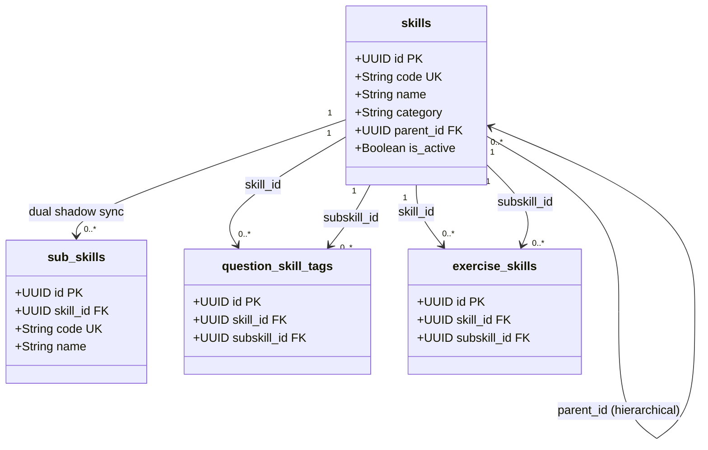
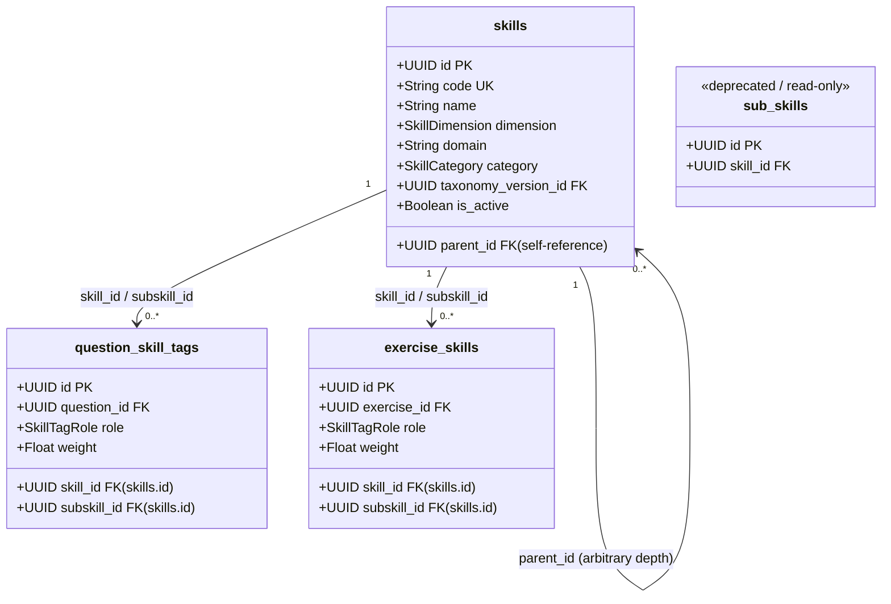

# TEF Taxonomy V2 — Dual Schema Resolution (Finding F-03) Migration Specification

## 1. Executive Summary

During the initial evolution of the TEF Platform, two parallel taxonomy mechanisms emerged:
1. **The original hierarchical `skills` model** (using `parent_id` self-referential foreign keys to represent competencies and subskills).
2. **The Content Studio `sub_skills` model** (a distinct `sub_skills` table linking to `skills.id`).

Finding **F-03** in [`TEF_TAXONOMY_V2_FINAL_INTEGRITY_AUDIT.md`](file:///c:/Users/MSI/Documents/GitHub/tef-platform/docs/architecture/TEF_TAXONOMY_V2_FINAL_INTEGRITY_AUDIT.md) established that maintaining dual storage creates severe synchronization overhead, risk of orphaned entities, and fragmented educational evidence.

This specification documents the complete migration strategy that establishes **`skills` as the sole canonical taxonomy entity** across the TEF platform, decouples all runtime operations from `sub_skills`, introduces backward-compatible API facades, blocks future writes to `sub_skills`, and outlines the final decommissioning plan.

---

## 2. Models: Old Model vs. Target Model

### 2.1 The Legacy Dual Model



**Flaws in the Legacy Dual Model:**
- Every create/update required shadow synchronization between two distinct tables.
- Deleting a subskill risked either leaving orphaned child skills or cascading destructive deletes to learning evidence.
- Multi-level taxonomies (N ≥ 2) could not be accommodated by `sub_skills` (flat parent-child only).

### 2.2 The Target Canonical Model



**Guarantees of the Target Model:**
- **Single Source of Truth:** `skills` is the authoritative entity for containers, competencies, subskills, and micro-skills.
- **Arbitrary Depth Support:** Any skill can act as a parent or leaf node.
- **Unified Tagging:** Question tags, exercise tags, mistakes, and evidence reference `skills.id` directly.
- **Immutable Historical Evidence:** Student records never link to `sub_skills`; their foreign keys terminate safely at `skills.id`.

---

## 3. Exact Row Mapping Strategy

### 3.1 Identity Mapping
In earlier migrations (`0029` and `0030`), the platform enforced that any `sub_skills` row created was assigned the exact same UUID as its corresponding `skills` child row:
$$\text{skills.id} \equiv \text{sub\_skills.id}$$
$$\text{skills.parent\_id} \equiv \text{sub\_skills.skill\_id}$$

An audit of the production database revealed:
- `sub_skills` row count: **28**
- `skills` row count: **82**
- `sub_skills` without matching `skills.id`: **0**
- Foreign keys pointing to `sub_skills`: **0**

### 3.2 Idempotent Parity Sweep (Migration 0032)
To guarantee 100% parity across all environments (including local developer databases and backup restorations), migration `0032_deprecate_legacy_subskills` executes:

```sql
INSERT INTO skills (
    id, code, name, description, category, domain, parent_id, is_active, created_at, updated_at
)
SELECT
    sub.id,
    sub.code,
    sub.name,
    sub.description,
    COALESCE(p.category, 'reading'),
    p.domain,
    sub.skill_id,
    true,
    sub.created_at,
    sub.updated_at
FROM sub_skills sub
LEFT JOIN skills p ON p.id = sub.skill_id
WHERE NOT EXISTS (
    SELECT 1 FROM skills s WHERE s.id = sub.id
)
ON CONFLICT (code) DO UPDATE
SET parent_id = EXCLUDED.parent_id,
    updated_at = NOW();
```

---

## 4. Migration Order & Execution Steps

1. **Step 1: Database Migration (`0032_deprecate_legacy_subskills.py`)**
   - Run idempotent parity sweep.
   - Attach SQL deprecation comment to table `sub_skills`.
   - Add PostgreSQL trigger `trg_prevent_sub_skills_insert` to reject any direct SQL `INSERT` statements on `sub_skills`.

2. **Step 2: Service Layer Decoupling**
   - Remove shadow synchronization logic from `SubSkillService.create_subskill` and `SubSkillService.update_subskill`.
   - Re-route `SubSkillService` operations to interact directly with `Skill` (filtering by `parent_id = skill_id`).
   - Remove `SubSkill` row insertion/synchronization from `TaxonomyService.create_skill`, `TaxonomyService.update_skill`, and `TaxonomyService.archive_skill`.
   - Update `AdminContentService.list_skills`, `get_skill`, `update_skill`, and `get_content_stats` to use `Skill.subskills` (canonical relationship) instead of `Skill.subskills_table`.

3. **Step 3: Schema & Serializer Compatibility**
   - Update `SubSkillResponse` in `schemas.py` to use `Field(validation_alias=AliasChoices("skill_id", "parent_id"))`.
   - This allows canonical child `Skill` instances to serialize directly into `SubSkillResponse` without code transformations.

4. **Step 4: Seed Script Refactoring**
   - Refactor `seed_content_studio.py` to remove all inserts into `SubSkill`.
   - Ensure all seed files (`seed.py`, `reading_taxonomy_data.py`, `seed_content_studio.py`) operate exclusively on `Skill`.

5. **Step 5: ORM Insertion Guard**
   - Add an event listener on `SubSkill` (`before_insert`) raising a `RuntimeError` if any Python code attempts to instantiate and persist a `SubSkill`.

6. **Step 6: Database Integrity Check**
   - Implement `TaxonomyService.verify_canonical_taxonomy_integrity(db)` to verify that zero active competencies exist outside `skills`, no orphan subskills exist, and relational integrity is intact.

---

## 5. Compatibility Strategy

To ensure zero regression for existing clients and frontend views:
- **Legacy Endpoints Maintained:**
  - `POST /api/v1/admin/content/skills/{skill_id}/subskills`
  - `GET /api/v1/admin/content/skills/{skill_id}/subskills`
  - `PUT /api/v1/admin/content/subskills/{subskill_id}`
  - `DELETE /api/v1/admin/content/subskills/{subskill_id}`
  - `POST /api/v1/admin/content/subskills/{subskill_id}/archive`
- **Internal Re-routing:**
  Every legacy endpoint now delegates to canonical `Skill` rows where `parent_id == skill_id`.
- **Response Format:**
  The output schema matches `SubSkillResponse` exactly, preserving backward compatibility for external consumers.

---

## 6. Rollback Considerations

If unexpected issues arise during deployment:
- **Database Rollback:**
  Migration `0032` downgrade drops the PostgreSQL trigger:
  ```sql
  DROP TRIGGER IF EXISTS trg_prevent_sub_skills_insert ON sub_skills;
  DROP FUNCTION IF EXISTS prevent_sub_skills_insert();
  ```
- **Data Safety:**
  No data in `sub_skills` is deleted or truncated during migration `0032`.
- **Zero Loss:**
  Since `sub_skills` remains physically present in the schema, read-only queries during rollback will encounter all historical rows intact.

---

## 7. Permanent Removal Plan (Next Major Milestone)

Once Taxonomy V2 has been running in production for a designated stabilization period (minimum 2 release cycles):
1. **Verification Phase:** Run automated telemetry to confirm zero SQL queries reference `sub_skills`.
2. **View Transition (Optional):** Replace `sub_skills` table with a PostgreSQL `VIEW`:
   ```sql
   CREATE VIEW sub_skills AS
   SELECT id, parent_id AS skill_id, code, name, description, created_at, updated_at
   FROM skills
   WHERE parent_id IS NOT NULL;
   ```
3. **Physical Drop:**
   Issue final migration `0033_drop_legacy_subskills_table`:
   ```sql
   DROP TABLE IF EXISTS sub_skills CASCADE;
   ```
4. **Code Cleanup:**
   Remove `class SubSkill` from `apps/api/app/modules/admin/models.py`.
