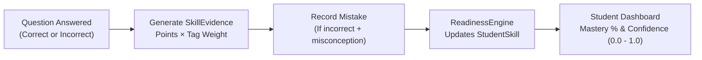

# TEF Platform — Skill System & Taxonomy Guide
## A Practical Guide for Admins, Content Authors & Curriculum Managers

**Audience:** Platform Admins, Question Authors, Curriculum Managers, Product Owners  
**Scope:** Current Taxonomy Architecture, Skill Hierarchy, Question Tagging Rules, and Diagnostic Flow

---

## 1. System Overview: Why the Taxonomy Matters

In the TEF Platform, questions and exercises are never created in a vacuum. Every single test question, practice drill, and AI-generated item is anchored to our **Canonical Skill Taxonomy**.

```
                           ┌────────────────────────┐
                           │    Taxonomy Version    │
                           │   (Active Curriculum)  │
                           └───────────┬────────────┘
                                       │
                 ┌─────────────────────┴─────────────────────┐
                 ▼                                           ▼
       ┌───────────────────┐                       ┌───────────────────┐
       │    TASK TYPES     │                       │      SKILLS       │
       │ (Document Format) │                       │   (Competencies)  │
       └─────────┬─────────┘                       └─────────┬─────────┘
                 │                                           │
                 └─────────────────────┬─────────────────────┘
                                       ▼
                       ┌───────────────────────────────┐
                       │   QUESTION / EXERCISE TAG     │
                       │ (1 Primary Reasoning + Lang)  │
                       └───────────────┬───────────────┘
                                       ▼
                       ┌───────────────────────────────┐
                       │    STUDENT SKILL EVIDENCE     │
                       │   (Mastery & Recommendations) │
                       └───────────────────────────────┘
```

When an admin authors or approves an item, the skills assigned to it dictate:
1. **What competency the question measures.**
2. **How student mistakes are categorized.**
3. **What specific practice drills the recommendation engine suggests next.**

---

## 2. Core Concepts: Skills, Dimensions & Task Types

### 2.1 The Competency Tree Structure
All competencies are modeled as a unified **Skill Tree**:
* Competencies form a hierarchy using `parent_id`.
* **Root Categories:** High-level organizational nodes (e.g. `reasoning_reading_root`, `language_root`) used for grouping.
* **Assessable Skills:** Concrete leaf nodes that can actually be tagged on questions (e.g. `reasoning_infer_implicit_meaning`, `language_connectors_contrast`).

---

### 2.2 The Two Orthogonal Dimensions: Reasoning vs. Language

Every competency belongs to one of two distinct cognitive dimensions:

| Dimension | What It Represents | Examples | Admin Purpose |
| :--- | :--- | :--- | :--- |
| **`reasoning`** | The **mental operation** required to solve the task. | • `locate_specific_detail`<br>• `infer_implicit_meaning`<br>• `identify_author_position`<br>• `interpret_data`<br>• `synthesize_arguments` | Identifies if the student has a **logic or critical comprehension** gap. |
| **`language`** | The **linguistic knowledge or processing tool** being tested. | • `vocabulary_in_context`<br>• `paraphrase_recognition`<br>• `connectors_contrast`<br>• `syntax_complex_clauses`<br>• `register_formal` | Identifies if the student has a **vocabulary, grammar, or syntax** gap. |

#### Dual-Dimension Tagging:
A question about an editorial can evaluate **both** `identify_author_position` (Reasoning) and `connectors_contrast` (Language). Tagging both dimensions ensures that when a student makes a mistake, the platform knows whether the breakdown was conceptual or lexical.

---

### 2.3 Task Types: Authentic Document Containers

A **Task Type** defines the exam format, expected stimulus document, and interaction style. It is separate from the competencies themselves.

| Task Code | Modality | Authentic Stimulus | Typical Eligible Skills |
| :--- | :--- | :--- | :--- |
| `press_article` | Reading | Journalistic article / Tribune (150–250 words) | Author position, main idea, implicit inference, vocabulary in context. |
| `graph_matching` | Reading | Data table / Bar chart / Infographic | Data interpretation, numerical comparison, relational synthesis. |
| `document_matching` | Reading | 4 short multi-documents (A, B, C, D) | Rapid scanning, requirement matching, selective reading. |
| `sentence_gap` | Reading | Single sentence with `______` gap (No stimulus) | Grammatical agreement, tense selection, prepositions. |
| `short_announcement` | Listening | Station / airport / phone audio message | Gist identification, key detail extraction, situation context. |
| `public_survey` | Listening | 4 different speakers sharing opinions | Opinion comparison, speaker stance, agreement/disagreement. |

#### The Compatibility Whitelist (`task_type_skills`):
Each Task Type has an explicit whitelist of compatible competencies. For example:
* An oral intonation skill cannot be tagged on a written `press_article`.
* An editorial author-position skill cannot be tagged on a `sentence_gap` grammatical item.
The validation engine enforces these compatibility rules automatically.

---

## 3. Question Tagging Rules (The Admin Checklist)

When creating or editing a question in the Admin Content Studio, the system enforces the following psychometric validation rules:

```
                               QUESTION TAGGING RULES
  ┌────────────────────────────────────────────────────────────────────────┐
  │ 1. Minimum 1 tag: A question must have at least one canonical skill.   │
  │ 2. Max 1 PRIMARY per dimension:                                        │
  │    • Maximum 1 PRIMARY reasoning skill tag.                            │
  │    • Maximum 1 PRIMARY language skill tag.                             │
  │ 3. Weight sum rule:                                                    │
  │    • Within each dimension, tag weights must sum to 1.0 (±0.01).       │
  │    • Example: 1 Primary (weight: 1.0)                                  │
  │    • Example: 1 Primary (0.75) + 1 Secondary (0.25) = 1.0              │
  │ 4. Modality alignment:                                                 │
  │    • Reading questions only accept reading / general skills.           │
  │    • Listening questions only accept listening / general skills.       │
  │ 5. Active & Assessable only:                                           │
  │    • Only leaf competencies with is_active = true and                   │
  │      is_assessable = true can be tagged. Root nodes are rejected.      │
  └────────────────────────────────────────────────────────────────────────┘
```

### Valid Tagging Examples:

#### Example A: Reading MCQ on an Editorial (`press_article`)
* **Tag 1 (Reasoning):** `reasoning_identify_author_position` (Role: `primary`, Weight: `1.0`)
* **Tag 2 (Language):** `language_connectors_contrast` (Role: `primary`, Weight: `1.0`)
*(Valid: 1 Primary in reasoning summing to 1.0, 1 Primary in language summing to 1.0)*

#### Example B: Data Synthesis MCQ (`graph_matching`)
* **Tag 1 (Reasoning):** `reasoning_interpret_data` (Role: `primary`, Weight: `0.75`)
* **Tag 2 (Reasoning):** `reasoning_relational_synthesis` (Role: `secondary`, Weight: `0.25`)
*(Valid: Reasoning dimension weights sum to 1.0 with exactly one Primary)*

#### Example C: Pure Grammar Gap-Fill (`sentence_gap`)
* **Tag 1 (Language):** `language_prepositions_temporal` (Role: `primary`, Weight: `1.0`)
*(Valid: Single dimension tagged at 1.0)*

---

## 4. Distractor Rationales & Misconception Types

In objective choice questions (MCQs), incorrect options (distractors) are pedagogical diagnostic tools.

Every distractor includes a **`misconception_type`** and a **`distractor_rationale`**:

| Misconception Type | Meaning for the Learner | Example in Practice |
| :--- | :--- | :--- |
| `extrapolation` | The student goes beyond what the text states and assumes unverified facts. | Text says: *"Sales rose in July."*<br>Student chooses: *"The company broke all-time profit records."* |
| `contradiction` | The option directly contradicts an explicit statement in the document. | Text says: *"Entry is strictly forbidden after 8 PM."*<br>Student chooses: *"Visitors can arrive until midnight."* |
| `overgeneralization` | The student mistakes an isolated example or opinion for a universal rule. | Text says: *"Some residents complained."*<br>Student chooses: *"The entire neighborhood opposes the project."* |
| `literal_misinterpretation` | The student took an ironic, sarcastic, or idiomatic statement literally. | Text says: *"Quel formidable gaspillage !"*<br>Student chooses: *"The author is praising the initiative."* |
| `false_friend_lexical` | The student was misled by a cognate or similar-sounding word. | Confusing *"actuellement"* (currently) with *"actually"* (en réalité). |

When a student selects a distractor, the platform records a **`Mistake`** row tagged with this exact misconception. This tells the student *why* their brain fell into the trap.

---

## 5. How Student Skill Mastery Is Calculated

The taxonomy feeds the student's mastery profile through a continuous data pipeline:



1. **Granular SkillEvidence:** Every evaluated question generates evidence rows for each tagged skill, proportional to the tag's weight.
2. **Confidence Band:** As the student answers more questions on a given competency, the statistical confidence index rises (from low $\approx 0.30$ to highly reliable $\ge 0.85$).
3. **Recommendation Trigger:** If a student's mastery in a high-weight skill drops below target threshold (e.g. $< 60\%$), the recommendation engine automatically pulls exercises linked to that exact competency.

---

## 6. How Admins Operate the System

### 6.1 Creating & Editing Questions in Admin Workspace
1. Select the **Modality** and **Task Type** (e.g. Reading $\rightarrow$ `graph_matching`).
2. Attach or generate the **Stimulus** (the table, article, or audio transcript).
3. Draft the **Prompt** and **4 Options** (1 correct, 3 distractors with misconception types and rationales).
4. Assign **Skill Tags** from the filtered dropdown. The studio automatically validates:
   * No duplicate skills in the list.
   * Proper weights (summing to 1.0 per dimension).
   * No incompatible skills for that task type.
5. Click **Validate**. The system runs the `QuestionValidationEngine` and reports any psychometric warnings or blocking errors.

---

### 6.2 Reviewing AI-Generated Questions
When using the **AI Question Studio**:
* The generator operates under strict taxonomy constraints—it selects only from active, compatible skills in the database.
* As an Admin, verify:
  1. Does the prompt and stimulus calibrate accurately to the target CEFR level (B1/B2/C1)?
  2. Are the assigned reasoning and language tags natural pedagogical fits?
  3. Are distractor rationales clear, constructive, and accurate?
* Click **Approve Draft** to persist it to the official bank. AI cannot publish directly to live assessments.

---

### 6.3 Taxonomy Versioning & Lifecycle
* Active curricula are organized under `taxonomy_versions`.
* Competency states are managed via `is_active`:
  * Active competencies (`is_active = true`) are available for new questions and drills.
  * Inactive competencies (`is_active = false`) cannot be tagged on new content, while preserving historical student analytics and past test attempts intact.

---

## Summary Reference Table for Admins

| Concept | What It Is | Database Model | Where Admin Sees It |
| :--- | :--- | :--- | :--- |
| **Taxonomy Version** | Container for the active curriculum | `TaxonomyVersion` | Settings / Taxonomy Admin |
| **Skill** | An assessable cognitive or linguistic competency | `Skill` | Skill Tree / Question Tag Selector |
| **Dimension** | `reasoning` (cognitive logic) or `language` (grammar/vocab) | `Skill.dimension` | Skill Editor & Tag Weight Validator |
| **Task Type** | Authentic document format (article, graph, audio, gap) | `TaskType` | Question Creator (Step 1) |
| **Tag Mapping** | Link between a question and its target competencies | `QuestionSkillTag` | Question Creator (Tags Tab) |
| **Distractor Misconception** | The specific trap built into an incorrect option | `QuestionOption.misconception_type` | Options Editor (Explanation column) |
| **Skill Evidence** | Data point updating student's mastery profile | `SkillEvidence` | Student Analytics / Diagnostic Report |
