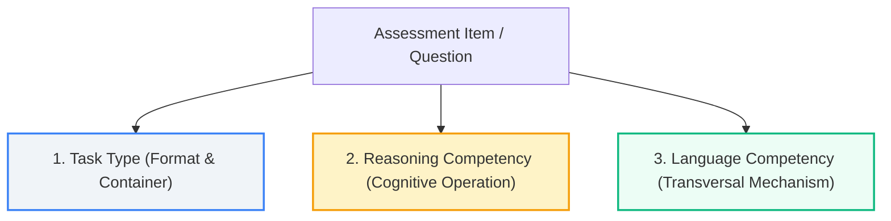

# TEF Platform — Canonical Reading Taxonomy V1 (Compréhension Écrite)

**Status:** Canonical Reference Specification  
**Taxonomy Version:** `v2.0.0-canonical` (`TEF Canada Standard Taxonomy 2026`)  
**Modality:** `reading` (Compréhension Écrite)  
**Implementation Source:** [`reading_taxonomy_data.py`](file:///c:/Users/MSI/Documents/GitHub/tef-platform/apps/api/app/modules/admin/reading_taxonomy_data.py)  
**Integrity Test Suite:** [`test_reading_taxonomy_integrity.py`](file:///c:/Users/MSI/Documents/GitHub/tef-platform/apps/api/tests/test_reading_taxonomy_integrity.py)  

---

## 1. Architectural Model & Legal Disclaimer

### 1.1 Non-Equivalence & Psychometric Boundary Notice

> [!IMPORTANT]
> **Diagnostic Competency Framework vs. Official TEF Framework:**  
> This taxonomy is a **custom internal diagnostic competency model** designed specifically for formative evaluation, adaptive practice, and skill tracking within the TEF Platform.  
> It must **NEVER** be called or represented as an "official TEF competency framework" or an official Chamber of Commerce and Industry of Paris (CCI Paris Île-de-France) specification.  
> The official TEF exam task structure and the platform's internal diagnostic competency taxonomy are distinct concepts:
> - **Official TEF Structure:** Standardized delivery formats, stimulus types, time boundaries, and scoring tables established by Le français des affaires / CCI Paris Île-de-France.
> - **Platform Diagnostic Taxonomy:** A diagnostic graph of cognitive operations and language mechanics providing micro-diagnostics, error attribution, and targeted remedial exercises.

### 1.2 The Tripartite Orthogonal Architecture

The TEF Platform decomposes reading assessment into three orthogonal layers:



1. **Task Type (`TaskType`):** What format the item takes (delivery container, stimulus characteristics, time pressure). Task types are not skills; they are test item formats.
2. **Cognitive Reasoning Competency (`Skill` with `dimension=reasoning`):** The cognitive operation the candidate executes to locate, understand, synthesize, or evaluate meaning.
3. **Transversal Language Competency (`Skill` with `dimension=language`):** The underlying grammatical, lexical, syntactical, or discourse mechanics mobilized during comprehension.

### 1.3 Strict Construction Rules

To avoid taxonomic bloat and diagnostic ambiguity:
1. **No Duplicate Concepts:** Each linguistic or cognitive construct appears exactly once.
2. **No Pedagogical Ghost Nodes:** Every node must represent an active learning container or an assessable leaf.
3. **Evidence Requirement:** Every assessable leaf explicitly answers:
   $$\text{\bfseries "What observable evidence would demonstrate that the student can do this?"}$$

---

## 2. Official TEF Reading Task Types

The 8 canonical task types represent the authentic test formats of the TEF Compréhension Écrite:

| Task Type Code | French Name | Typical CEFR | Description & Stimulus Characteristics |
|:---|:---|:---|:---|
| `daily_document` | Documents de la vie quotidienne | A1 – B1 | Practical utilitarian notices: classified advertisements, event posters, transportation schedules, store signs, community boards, and store opening announcements. Fast scanning and factual extraction. |
| `sentence_gap` | Phrases à compléter | A2 – B2 | Discrete sentence-level items requiring lexical selection, prepositional governance, pronoun replacement, or tense/mood accuracy in isolated syntactic contexts. |
| `text_gap` | Textes à trous (complétion textuelle) | B1 – C1 | Paragraph excerpts with missing words, connectors, or phrases requiring textual cohesion, logical flow, and thematic continuity analysis. |
| `document_matching` | Appariement de documents | A2 – B2 | Matching reader profiles, practical constraints, or user requirements against multiple short texts (rental ads, job postings, service packages). Multi-document comparative filtering. |
| `graph_matching` | Appariement graphiques et énoncés | B1 – B2 | Correlating factual assertions or analytical interpretations with data visualizations (infographics, bar charts, pie charts, statistical tables). Quantitative literacy in French. |
| `administrative_document` | Documents administratifs et réglementaires | B1 – C1 | Official forms, municipal notices, institutional directives, workplace safety protocols, and immigration procedures. Strict conditional logic and formal vocabulary. |
| `professional_document` | Communications professionnelles | B1 – C1 | Workplace correspondence: internal memos, project status reports, formal emails, meeting agendas, and executive summaries. Professional register and pragmatic intent. |
| `press_article` | Articles de presse et analyses | B2 – C2 | In-depth journalism: editorials, analytical columns, cultural essays, and investigative reports. Complex syntax, rhetorical devices, nuanced authorial stance, and implicit messaging. |

---

## 3. Cognitive Reasoning Competency Hierarchy (16 Nodes)

Reasoning competencies form a clean four-tier branch under one container:
- **1 Root Container** (`reasoning_reading_root`)
- **4 Functional Branch Containers** (`reasoning_info_extraction`, `reasoning_global_comprehension`, `reasoning_relational_synthesis`, `reasoning_inference_and_evaluation`)
- **11 Assessable Leaf Competencies**

```
reasoning_reading_root (Container)
├── reasoning_info_extraction (Container)
│   ├── reasoning_locate_information (Assessable)
│   └── reasoning_identify_specific_detail (Assessable)
├── reasoning_global_comprehension (Container)
│   ├── reasoning_identify_main_idea (Assessable)
│   ├── reasoning_understand_context (Assessable)
│   └── reasoning_understand_sequence (Assessable)
├── reasoning_relational_synthesis (Container)
│   ├── reasoning_identify_cause_effect (Assessable)
│   ├── reasoning_compare_and_match (Assessable)
│   └── reasoning_interpret_data (Assessable)
└── reasoning_inference_and_evaluation (Container)
    ├── reasoning_infer_implicit_meaning (Assessable)
    ├── reasoning_identify_author_position (Assessable)
    └── reasoning_identify_tone_and_intent (Assessable)
```

### Detailed Competency Specifications

#### Container: `reasoning_reading_root`
- **Stable Code:** `reasoning_reading_root`
- **French Name:** Compétences cognitives de compréhension écrite
- **Description:** Opérations intellectuelles et cognitives mobilisées pour extraire, analyser et évaluer le sens d'un texte écrit.
- **Dimension:** `reasoning`
- **Parent / Container:** `None` (Root)
- **Assessable:** `No` (Container)
- **Applicable Modalities:** `reading`
- **Applicable Task Types:** All 8 reading task types
- **Prerequisites:** None
- **Related Skills:** None

---

#### 1. Information Extraction Sub-Branch

##### Container: `reasoning_info_extraction`
- **Stable Code:** `reasoning_info_extraction`
- **French Name:** Extraction d'informations factuelles
- **Description:** Capacité à parcourir un document pour localiser et prélever des données brutes explicites.
- **Dimension:** `reasoning`
- **Parent / Container:** `reasoning_reading_root`
- **Assessable:** `No` (Container)
- **Applicable Modalities:** `reading`, `listening`
- **Applicable Task Types:** `daily_document`, `document_matching`, `administrative_document`
- **Prerequisites:** None
- **Related Skills:** None

##### Leaf 1.1: `reasoning_locate_information`
- **Stable Code:** `reasoning_locate_information`
- **French Name:** Repérage d'informations factuelles
- **Description:** Localiser rapidement et avec précision des données factuelles explicites (noms, chiffres, dates, horaires, lieux, adresses) dans des documents usuels ou discontinus.
- **Dimension:** `reasoning`
- **Parent / Container:** `reasoning_info_extraction`
- **Assessable:** `Yes`
- **Applicable Modalities:** `reading`, `listening`
- **Applicable Task Types:** `daily_document`, `document_matching`, `administrative_document`
- **Prerequisites:** None
- **Related Skills:** `reading_detail` (Legacy), `reasoning_identify_specific_detail`
- **Observable Evidence:**
  > *What observable evidence demonstrates mastery?*  
  > The student identifies and selects the correct single factual datapoint (e.g., date, exact price, contact name, or street address) from an unformatted or multi-section visual document in under 30 seconds without misidentifying neighboring distractor values.
- **Calibrated CEFR Descriptors:**
  - **A1:** Peut repérer des noms, des chiffres et des mots familiers sur une affiche, un horaire ou une annonce très simple.  
    *Evidence:* Sélection directe d'une coordonnée ou d'une date sans reformulation.
  - **A2:** Peut localiser une information prévisible dans des documents courants (menus, horaires, petites annonces, répertoires).  
    *Evidence:* Recherche guidée dans un document court avec distracteurs numériques proches.
  - **B1:** Peut parcourir rapidement un document d'une page pour repérer des consignes ou des informations spécifiques dispersées.  
    *Evidence:* Balayage d'annonces comparatives avec variation lexicale mineure.

##### Leaf 1.2: `reasoning_identify_specific_detail`
- **Stable Code:** `reasoning_identify_specific_detail`
- **French Name:** Identification de détails précis
- **Description:** Comprendre et extraire une clause spécifique, une consigne, une condition d'éligibilité ou un fait ponctuel énoncé explicitement dans le corps du texte.
- **Dimension:** `reasoning`
- **Parent / Container:** `reasoning_info_extraction`
- **Assessable:** `Yes`
- **Applicable Modalities:** `reading`, `listening`
- **Applicable Task Types:** `daily_document`, `administrative_document`, `professional_document`, `press_article`
- **Prerequisites:** `reasoning_locate_information`
- **Related Skills:** `lang_paraphrase_and_synonyms` (Supported by)
- **Observable Evidence:**
  > *What observable evidence demonstrates mastery?*  
  > The student distinguishes between a general statement and a qualifying restriction (e.g., "valable uniquement les fins de semaine pour les résidents"), selecting the answer that matches the exact restriction despite paraphrased wording in the options.
- **Calibrated CEFR Descriptors:**
  - **A2:** Peut identifier un détail pratique simple dans une consigne ou un avis d'usagers (durée, modalité d'inscription).  
    *Evidence:* Questions formulées avec des mots proches du texte.
  - **B1:** Peut extraire des détails factuels importants dans des textes d'intérêt général ou professionnel standard.  
    *Evidence:* Repérage de conditions d'application avec reformulation synonymique.
  - **B2:** Peut identifier des détails précis et des nuances dans des règlements ou des textes argumentés denses.  
    *Evidence:* Sélection exacte d'une exception contractuelle ou administrative complexe.

---

#### 2. Global & Contextual Comprehension Sub-Branch

##### Container: `reasoning_global_comprehension`
- **Stable Code:** `reasoning_global_comprehension`
- **French Name:** Compréhension globale et contextuelle
- **Description:** Comprendre le sens d'ensemble, la situation d'énonciation et l'enchaînement général du texte.
- **Dimension:** `reasoning`
- **Parent / Container:** `reasoning_reading_root`
- **Assessable:** `No` (Container)
- **Applicable Modalities:** `reading`, `listening`
- **Applicable Task Types:** `daily_document`, `professional_document`, `press_article`
- **Prerequisites:** None
- **Related Skills:** None

##### Leaf 2.1: `reasoning_identify_main_idea`
- **Stable Code:** `reasoning_identify_main_idea`
- **French Name:** Identification de l'idée principale
- **Description:** Dégager le sujet principal, la thèse centrale ou l'objectif d'ensemble d'un document en faisant abstraction des détails anecdotiques.
- **Dimension:** `reasoning`
- **Parent / Container:** `reasoning_global_comprehension`
- **Assessable:** `Yes`
- **Applicable Modalities:** `reading`, `listening`
- **Applicable Task Types:** `daily_document`, `professional_document`, `press_article`
- **Prerequisites:** None
- **Related Skills:** `reading_gist` (Legacy), `lang_cohesion_and_progression` (Supported by)
- **Observable Evidence:**
  > *What observable evidence demonstrates mastery?*  
  > The student identifies the umbrella summary title or central assertion of a multi-paragraph article, rejecting plausible distractor options that merely summarize a single sub-paragraph or anecdote.
- **Calibrated CEFR Descriptors:**
  - **A2:** Peut comprendre le sujet global d'un court message, d'un faire-part ou d'une note de service brève.  
    *Evidence:* Identification de l'événement annoncé (fête, fermeture, réunion).
  - **B1:** Peut identifier les points principaux d'articles factuels simples et de rapports d'activité.  
    *Evidence:* Résumé en une phrase du sujet sans confusion avec un exemple d'illustration.
  - **B2:** Peut dégager la thèse principale et l'articulation générale d'un article de presse d'opinion.  
    *Evidence:* Choix du titre de synthèse le plus représentatif de l'argumentation.
  - **C1:** Peut identifier l'enjeu sous-jacent et les thèses croisées d'un texte d'analyse complexe.  
    *Evidence:* Formulation de la problématique centrale dans un texte polémique non structuré linéairement.

##### Leaf 2.2: `reasoning_understand_context`
- **Stable Code:** `reasoning_understand_context`
- **French Name:** Compréhension de la situation d'énonciation
- **Description:** Identifier l'émetteur, le destinataire cible, la nature du document et le cadre institutionnel ou social de publication.
- **Dimension:** `reasoning`
- **Parent / Container:** `reasoning_global_comprehension`
- **Assessable:** `Yes`
- **Applicable Modalities:** `reading`, `listening`
- **Applicable Task Types:** `daily_document`, `administrative_document`, `professional_document`
- **Prerequisites:** None
- **Related Skills:** None
- **Observable Evidence:**
  > *What observable evidence demonstrates mastery?*  
  > The student correctly deduces the communicative setting (e.g., internal corporate memo from HR to department heads vs. public municipal warning) based on layout, salutations, register, and institutional cues.
- **Calibrated CEFR Descriptors:**
  - **A2:** Peut identifier l'émetteur et la fonction pratique d'un message quotidien (carte postale, invitation, mot sur une porte).  
    *Evidence:* Reconnaissance de la relation entre les correspondants (amis, collègues).
  - **B1:** Peut déterminer la source et le public visé d'une brochure ou d'un communiqué officiel.  
    *Evidence:* Identification de l'autorité émettrice et du groupe cible (riverains, usagers du métro).
  - **B2:** Peut identifier le contexte socioprofessionnel et les visées institutionnelles d'un document complexe.  
    *Evidence:* Distinction entre une communication interne confidentielle et une déclaration publique d'entreprise.

##### Leaf 2.3: `reasoning_understand_sequence`
- **Stable Code:** `reasoning_understand_sequence`
- **French Name:** Compréhension de la chronologie et des étapes
- **Description:** Reconstituer l'ordre chronologique des événements relatés, les phases d'un protocole ou la succession des démarches administratives.
- **Dimension:** `reasoning`
- **Parent / Container:** `reasoning_global_comprehension`
- **Assessable:** `Yes`
- **Applicable Modalities:** `reading`, `listening`
- **Applicable Task Types:** `administrative_document`, `professional_document`, `press_article`
- **Prerequisites:** None
- **Related Skills:** `lang_tense_selection_and_aspect` (Supported by)
- **Observable Evidence:**
  > *What observable evidence demonstrates mastery?*  
  > The student orders four events or mandatory administrative steps chronologically when the source text presents them non-linearly (e.g., using flashbacks, past perfect tense, or retrospective clauses).
- **Calibrated CEFR Descriptors:**
  - **A2:** Peut suivre les étapes d'un itinéraire ou le déroulement d'une journée simple décrit chronologiquement.  
    *Evidence:* Enchaînement d'actions avec balises temporelles simples (d'abord, ensuite, enfin).
  - **B1:** Peut reconstituer la succession des démarches d'une procédure administrative ou d'un mode d'emploi.  
    *Evidence:* Numérotation correcte des prérequis avant l'étape finale.
  - **B2:** Peut démêler la chronologie réelle d'un récit journalistique employant des retours en arrière et l'antériorité.  
    *Evidence:* Reconstitution de l'axe des temps incluant faits passés et perspectives futures.

---

#### 3. Relational Synthesis & Comparative Analysis Sub-Branch

##### Container: `reasoning_relational_synthesis`
- **Stable Code:** `reasoning_relational_synthesis`
- **French Name:** Analyse relationnelle et comparaison
- **Description:** Mettre en regard plusieurs sources, croiser des critères et analyser les rapports logiques entre propositions.
- **Dimension:** `reasoning`
- **Parent / Container:** `reasoning_reading_root`
- **Assessable:** `No` (Container)
- **Applicable Modalities:** `reading`
- **Applicable Task Types:** `document_matching`, `graph_matching`, `text_gap`, `professional_document`
- **Prerequisites:** None
- **Related Skills:** None

##### Leaf 3.1: `reasoning_identify_cause_effect`
- **Stable Code:** `reasoning_identify_cause_effect`
- **French Name:** Identification des liens de cause et d'effet
- **Description:** Identifier les relations d'origine, de conséquence, de but ou de condition reliant des faits énoncés.
- **Dimension:** `reasoning`
- **Parent / Container:** `reasoning_relational_synthesis`
- **Assessable:** `Yes`
- **Applicable Modalities:** `reading`, `listening`
- **Applicable Task Types:** `text_gap`, `press_article`, `professional_document`
- **Prerequisites:** None
- **Related Skills:** `lang_logical_connectors` (Supported by)
- **Observable Evidence:**
  > *What observable evidence demonstrates mastery?*  
  > The student selects the option specifying the direct root cause or primary consequence of a phenomenon when cause and effect are separated by subordinate clauses or expressed verbally rather than through explicit conjunctions (e.g., "engendrer", "découler de").
- **Calibrated CEFR Descriptors:**
  - **B1:** Peut identifier les causes explicites d'un incident ou d'un changement décrit dans un article factuel.  
    *Evidence:* Sélection de la raison d'une grève ou d'une annulation signalée par "en raison de".
  - **B2:** Peut analyser une chaîne causale complexe comprenant facteurs déterminants et répercussions indirectes.  
    *Evidence:* Discrimination entre cause immédiate et facteur aggravant de fond.
  - **C1:** Peut appréhender des causalités systémiques, récursives ou contradictoires dans un essai analytique.  
    *Evidence:* Identification des paradoxes où la cause déclarée dissimule un effet structurel inverse.

##### Leaf 3.2: `reasoning_compare_and_match`
- **Stable Code:** `reasoning_compare_and_match`
- **French Name:** Comparaison et appariement d'informations
- **Description:** Croiser des critères simultanés pour faire correspondre des besoins/profils avec des offres, textes ou services appropriés.
- **Dimension:** `reasoning`
- **Parent / Container:** `reasoning_relational_synthesis`
- **Assessable:** `Yes`
- **Applicable Modalities:** `reading`
- **Applicable Task Types:** `document_matching`, `daily_document`, `professional_document`
- **Prerequisites:** `reasoning_identify_specific_detail`
- **Related Skills:** None
- **Observable Evidence:**
  > *What observable evidence demonstrates mastery?*  
  > In a document matching exercise with 4 candidate profiles and 6 advertisements, the student pairs all profiles to their unique matching offer satisfying 3 concurrent criteria (e.g., budget, pets allowed, move-in date) while rejecting partial matches.
- **Calibrated CEFR Descriptors:**
  - **A2:** Peut associer des demandes élémentaires à des petites annonces selon un ou deux critères explicites.  
    *Evidence:* Appariement d'un budget et d'un type de logement sur 3 annonces.
  - **B1:** Peut comparer plusieurs propositions de voyage ou d'emploi et sélectionner celle répondant à 3 conditions cumulatives.  
    *Evidence:* Élimination méthodique des offres présentant une incompatibilité d'horaire ou de tarif.
  - **B2:** Peut résoudre des appariements complexes présentant des contraintes contradictoires ou des équivalences lexicales fines.  
    *Evidence:* Résolution de correspondances avec distracteurs sémantiques séduisants mais incomplets.

##### Leaf 3.3: `reasoning_interpret_data`
- **Stable Code:** `reasoning_interpret_data`
- **French Name:** Interprétation de données visuelles et chiffrées
- **Description:** Corréler des énoncés verbaux avec des représentations graphiques, des courbes, des tableaux statistiques ou des infographies.
- **Dimension:** `reasoning`
- **Parent / Container:** `reasoning_relational_synthesis`
- **Assessable:** `Yes`
- **Applicable Modalities:** `reading`
- **Applicable Task Types:** `graph_matching`, `press_article`, `professional_document`
- **Prerequisites:** None
- **Related Skills:** None
- **Observable Evidence:**
  > *What observable evidence demonstrates mastery?*  
  > The student identifies which statement accurately describes the trend shown in a graph (e.g., "une augmentation modérée suivie d'une stagnation"), rejecting statements confusing rates of change with absolute volumes.
- **Calibrated CEFR Descriptors:**
  - **B1:** Peut associer un graphique simple (diagramme en bâtons, camembert) à un énoncé décrivant la majorité ou la tendance globale.  
    *Evidence:* Repérage du secteur dominant ou de la baisse évidente.
  - **B2:** Peut interpréter des graphiques à double entrée ou courbes d'évolution temporelle avec précision chiffrée.  
    *Evidence:* Validation d'énoncés comparatifs chiffrés ("a doublé en cinq ans", "taux supérieur de 15%").
  - **C1:** Peut critiquer et vérifier la cohérence entre le corps d'un texte d'opinion et les données statistiques présentées en encadré.  
    *Evidence:* Détection d'un biais d'interprétation des chiffres commis dans le commentaire textuel.

---

#### 4. Critical Inference & Authorial Evaluation Sub-Branch

##### Container: `reasoning_inference_and_evaluation`
- **Stable Code:** `reasoning_inference_and_evaluation`
- **French Name:** Inférence et analyse critique
- **Description:** Dépasser le contenu explicite pour déduire l'implicite, évaluer la posture de l'auteur et percevoir la tonalité.
- **Dimension:** `reasoning`
- **Parent / Container:** `reasoning_reading_root`
- **Assessable:** `No` (Container)
- **Applicable Modalities:** `reading`, `listening`
- **Applicable Task Types:** `press_article`, `professional_document`
- **Prerequisites:** None
- **Related Skills:** None

##### Leaf 4.1: `reasoning_infer_implicit_meaning`
- **Stable Code:** `reasoning_infer_implicit_meaning`
- **French Name:** Déduction du sens implicite
- **Description:** Dégager une conclusion, une motivation ou une conséquence inévitable qui découle logiquement des faits sans être explicitement écrite.
- **Dimension:** `reasoning`
- **Parent / Container:** `reasoning_inference_and_evaluation`
- **Assessable:** `Yes`
- **Applicable Modalities:** `reading`, `listening`
- **Applicable Task Types:** `press_article`, `professional_document`
- **Prerequisites:** None
- **Related Skills:** `reading_inference` (Legacy), `reasoning_identify_tone_and_intent`
- **Observable Evidence:**
  > *What observable evidence demonstrates mastery?*  
  > The student answers a "Pourquoi l'entreprise a-t-elle pris cette décision ?" question when the reason is never stated directly, by combining clues from financial losses mentioned in paragraph 1 and leadership changes in paragraph 3.
- **Calibrated CEFR Descriptors:**
  - **B1:** Peut tirer une conclusion pratique simple d'une succession de faits concrets dans un fait divers.  
    *Evidence:* Déduction de la raison d'un retard de train non mentionnée mot à mot.
  - **B2:** Peut déduire les intentions non formulées ou les conséquences logiques probables dans un article de fond.  
    *Evidence:* Réponse exacte à des questions de type "Que peut-on en déduire concernant... ?".
  - **C1:** Peut expliciter les non-dits, présupposés idéologiques et allusions culturelles d'un texte littéraire ou journalistique.  
    *Evidence:* Décodage des figures de style (euphémismes, litotes) révélant une vérité dissimulée.
  - **C2:** Peut percevoir les sous-entendus les plus ténus et les secondes lectures d'un texte d'auteur très dense.  
    *Evidence:* Analyse de l'implicite pragmatique au même niveau d'acuité qu'un locuteur natif cultivé.

##### Leaf 4.2: `reasoning_identify_author_position`
- **Stable Code:** `reasoning_identify_author_position`
- **French Name:** Identification du point de vue de l'auteur
- **Description:** Discerner la prise de position, les jugements de valeur, l'adhésion, la réserve ou la neutralité de l'auteur face au sujet traité.
- **Dimension:** `reasoning`
- **Parent / Container:** `reasoning_inference_and_evaluation`
- **Assessable:** `Yes`
- **Applicable Modalities:** `reading`, `listening`
- **Applicable Task Types:** `press_article`
- **Prerequisites:** `reasoning_identify_main_idea`
- **Related Skills:** `lang_semantic_nuance` (Supported by)
- **Observable Evidence:**
  > *What observable evidence demonstrates mastery?*  
  > The student correctly labels the author's stance on a controversial civic proposal (e.g., "Favorable avec de fortes réserves" vs. "Opposé catégoriquement") based on lexical modalizers ("certes", "sans doute", "prétendu").
- **Calibrated CEFR Descriptors:**
  - **B1:** Peut repérer si un auteur est globalement pour ou contre un projet simple dans une tribune de lecteurs.  
    *Evidence:* Détection des adjectifs appréciatifs basiques (bon, dommage, utile).
  - **B2:** Peut caractériser l'opinion nuancée d'un journaliste qui pèse les arguments contradictoires.  
    *Evidence:* Détermination de l'arbitrage final du journaliste malgré la présentation de deux thèses.
  - **C1:** Peut déceler l'ironie feinte, la feinte neutralité ou la distance critique adoptée par un essayiste.  
    *Evidence:* Analyse de l'emploi des guillemets de réserve et du lexique distanciateur.

##### Leaf 4.3: `reasoning_identify_tone_and_intent`
- **Stable Code:** `reasoning_identify_tone_and_intent`
- **French Name:** Identification du ton et de l'intention communicative
- **Description:** Reconnaître l'intention communicative dominante (dénoncer, alerter, convaincre, divertir) et la tonalité du texte (ironique, alarmiste, polémique, neutre).
- **Dimension:** `reasoning`
- **Parent / Container:** `reasoning_inference_and_evaluation`
- **Assessable:** `Yes`
- **Applicable Modalities:** `reading`, `listening`
- **Applicable Task Types:** `press_article`, `professional_document`
- **Prerequisites:** `reasoning_infer_implicit_meaning`
- **Related Skills:** `lang_semantic_nuance` (Supported by)
- **Observable Evidence:**
  > *What observable evidence demonstrates mastery?*  
  > The student selects the exact rhetorical register of a closing commentary (e.g., "Un ton désabusé et satirique") by analyzing sentence rhythm, rhetorical questions, and loaded adjectives.
- **Calibrated CEFR Descriptors:**
  - **B1:** Peut distinguer un ton promotionnel, informatif ou humoristique évident dans une chronique.  
    *Evidence:* Identification du but premier (vendre un livre, amuser, faire peur).
  - **B2:** Peut identifier l'ironie, l'indignation feinte ou le ton polémique dans un éditorial engagé.  
    *Evidence:* Choix de l'étiquette stylistique appropriée parmi 4 options (critique, approbateur, sceptique, neutre).
  - **C1:** Peut apprécier les subtilités d'un style pamphlétaire, désabusé ou lyrique et leur impact sur le lecteur.  
    *Evidence:* Justification de l'effet d'ironie amère produit par le décalage entre la forme et le fond.

---

## 4. Transversal Language Competencies (21 Nodes)

Transversal language competencies decode the syntactic, grammatical, and lexical mechanisms supporting reading.
Organized into **6 Domain Containers** $\rightarrow$ **15 Assessable Leaf Competencies**.

```
language_reading_domain
├── language_vocabulary_domain (Container)
│   ├── lang_vocab_in_context (Assessable)
│   ├── lang_paraphrase_and_synonyms (Assessable)
│   ├── lang_collocations_and_idioms (Assessable)
│   └── lang_register_and_style (Assessable)
├── language_grammar_domain (Container)
│   ├── lang_grammatical_agreement (Assessable)
│   ├── lang_pronouns_and_anaphora (Assessable)
│   ├── lang_prepositions_and_governance (Assessable)
│   └── lang_negation_and_restriction (Assessable)
├── language_verb_system_domain (Container)
│   ├── lang_tense_selection_and_aspect (Assessable)
│   └── lang_verbal_moods (Assessable)
├── language_syntax_domain (Container)
│   ├── lang_subordination_and_clauses (Assessable)
│   └── lang_hypothetical_systems (Assessable)
├── language_discourse_domain (Container)
│   ├── lang_logical_connectors (Assessable)
│   └── lang_cohesion_and_progression (Assessable)
└── language_semantics_domain (Container)
    └── lang_semantic_nuance (Assessable)
```

### Detailed Language Competency Specifications

#### 1. Vocabulary Domain

##### Container: `language_vocabulary_domain`
- **Stable Code:** `language_vocabulary_domain`
- **French Name:** Compétences lexicales et vocabulaire
- **Description:** Maîtrise du lexique, polysémie, relations synonymiques, phraséologie et registres.
- **Dimension:** `language`
- **Parent / Container:** `None` (Domain Root)
- **Assessable:** `No` (Container)
- **Applicable Modalities:** `reading`, `writing`, `listening`, `speaking`
- **Applicable Task Types:** `sentence_gap`, `text_gap`, `daily_document`, `press_article`
- **Prerequisites:** None

##### Leaf 1.1: `lang_vocab_in_context`
- **Stable Code:** `lang_vocab_in_context`
- **French Name:** Vocabulaire en contexte
- **Description:** Identifier le sens précis d'un mot ou d'une expression polysémique selon son contexte d'emploi textuel.
- **Dimension:** `language`
- **Parent / Container:** `language_vocabulary_domain`
- **Assessable:** `Yes`
- **Applicable Modalities:** `reading`, `listening`, `writing`, `speaking`
- **Applicable Task Types:** `sentence_gap`, `text_gap`, `daily_document`, `press_article`
- **Prerequisites:** None
- **Related Skills:** `lang_paraphrase_and_synonyms`
- **Observable Evidence:**
  > *What observable evidence demonstrates mastery?*  
  > In a sentence gap item or text excerpt, the student selects the correct definition or fill-in term from four words of the same grammatical category, correctly resolving polysemy dictated by the field of discourse (e.g., "bureau" = piece of furniture vs. administrative board).
- **Calibrated CEFR Descriptors:**
  - **A1:** Peut comprendre des mots très fréquents de la vie quotidienne (aliments, objets usuels, ville).
  - **A2:** Peut comprendre les termes familiers liés à son environnement immédiat et au travail courant.
  - **B1:** Peut déduire le sens d'un terme inconnu d'après le contexte immédiat et la composition du mot.
  - **B2:** Peut discerner les sens figurés, métaphoriques ou spécialisés de mots courants selon le domaine.
  - **C1:** Possède un vaste répertoire lexical et saisit le mot juste dans des contextes abstraits ou techniques.

##### Leaf 1.2: `lang_paraphrase_and_synonyms`
- **Stable Code:** `lang_paraphrase_and_synonyms`
- **French Name:** Reconnaissance de synonymes et périphrases
- **Description:** Reconnaître les reformulations, équivalences lexicales et périphrases entre le texte et les questions/options.
- **Dimension:** `language`
- **Parent / Container:** `language_vocabulary_domain`
- **Assessable:** `Yes`
- **Applicable Modalities:** `reading`, `listening`, `writing`, `speaking`
- **Applicable Task Types:** `daily_document`, `document_matching`, `administrative_document`, `press_article`
- **Prerequisites:** `lang_vocab_in_context`
- **Related Skills:** `reasoning_identify_specific_detail` (Supports)
- **Observable Evidence:**
  > *What observable evidence demonstrates mastery?*  
  > The student identifies that option C ("diminution des effectifs") directly restates the stimulus passage ("réduction de la masse salariale") despite sharing zero identical content words.
- **Calibrated CEFR Descriptors:**
  - **A2:** Peut associer des synonymes courants et des équivalences simples (logement = appartement).
  - **B1:** Peut faire le lien entre une affirmation formulée en termes simples et un texte rédigé avec des termes soutenus.
  - **B2:** Peut repérer des paraphrases sophistiquées masquant la reprise exacte d'un argument.
  - **C1:** Maîtrise les équivalences notionnelles abstraites et les reformulations rhétoriques complexes.

##### Leaf 1.3: `lang_collocations_and_idioms`
- **Stable Code:** `lang_collocations_and_idioms`
- **French Name:** Collocations et expressions figées
- **Description:** Maîtrise des cooccurrences lexicales obligatoires, locutions figées et expressions idiomatiques courantes.
- **Dimension:** `language`
- **Parent / Container:** `language_vocabulary_domain`
- **Assessable:** `Yes`
- **Applicable Modalities:** `reading`, `listening`, `writing`, `speaking`
- **Applicable Task Types:** `sentence_gap`, `text_gap`, `press_article`
- **Prerequisites:** `lang_vocab_in_context`
- **Related Skills:** `collocations` (Legacy)
- **Observable Evidence:**
  > *What observable evidence demonstrates mastery?*  
  > The student selects the authentic collocate in a sentence gap test (e.g., "porter plainte", "prendre une décision", "susciter l'engouement") rejecting unidiomatic calques (e.g., "faire une plainte").
- **Calibrated CEFR Descriptors:**
  - **B1:** Peut reconnaître et employer des locutions figées et expressions verbales usuelles (avoir hâte, faire attention).
  - **B2:** Peut sélectionner la collocation naturelle dans un registre professionnel ou journalistique standard.
  - **C1:** Comprend et mobilise des expressions idiomatiques imagées, proverbes et tournures figées avec aisance.

##### Leaf 1.4: `lang_register_and_style`
- **Stable Code:** `lang_register_and_style`
- **French Name:** Registres de langue et niveau stylistique
- **Description:** Identifier le niveau de langue (familier, courant, soutenu, littéraire, administratif) et adapter l'interprétation.
- **Dimension:** `language`
- **Parent / Container:** `language_vocabulary_domain`
- **Assessable:** `Yes`
- **Applicable Modalities:** `reading`, `writing`, `speaking`
- **Applicable Task Types:** `press_article`, `professional_document`, `sentence_gap`
- **Prerequisites:** `lang_vocab_in_context`
- **Related Skills:** None
- **Observable Evidence:**
  > *What observable evidence demonstrates mastery?*  
  > The student identifies the deliberate insertion of colloquial jargon in a formal editorial as an ironic commentary rather than an error in authorial competence.
- **Calibrated CEFR Descriptors:**
  - **B1:** Peut distinguer le registre familier d'un message entre amis du registre courant d'une note de service.
  - **B2:** Peut identifier les marques d'un registre soutenu ou administratif et ajuster sa compréhension en conséquence.
  - **C1:** Sait percevoir les effets stylistiques créés par les ruptures de registre ou l'emploi de néologismes d'initiés.

---

#### 2. Grammar & Morphosyntax Domain

##### Container: `language_grammar_domain`
- **Stable Code:** `language_grammar_domain`
- **French Name:** Compétences morphosyntaxiques et grammaticales
- **Description:** Accords, anaphores, rections prépositionnelles et négations complexes.
- **Dimension:** `language`
- **Parent / Container:** `None` (Domain Root)
- **Assessable:** `No` (Container)
- **Applicable Modalities:** `reading`, `writing`
- **Applicable Task Types:** `sentence_gap`, `text_gap`
- **Prerequisites:** None

##### Leaf 2.1: `lang_grammatical_agreement`
- **Stable Code:** `lang_grammatical_agreement`
- **French Name:** Accords grammaticaux
- **Description:** Maîtrise des accords en genre et en nombre (nom-adjectif, sujet-verbe, participe passé avec être, avoir et pronoms réfléchis).
- **Dimension:** `language`
- **Parent / Container:** `language_grammar_domain`
- **Assessable:** `Yes`
- **Applicable Modalities:** `reading`, `writing`
- **Applicable Task Types:** `sentence_gap`, `text_gap`
- **Prerequisites:** None
- **Related Skills:** `lang_subordination_and_clauses`
- **Observable Evidence:**
  > *What observable evidence demonstrates mastery?*  
  > In a sentence completion question with split antecedents or inverted subjects (e.g., "les mesures que le directeur a prises"), the student selects the participle agreeing in gender and number with the preceding direct object.
- **Calibrated CEFR Descriptors:**
  - **A2:** Maîtrise les accords de base en genre et nombre dans le groupe nominal et l'accord sujet-verbe au présent.
  - **B1:** Maîtrise l'accord du participe passé avec l'auxiliaire être et le participe passé adjectival.
  - **B2:** Résout sans faute les accords délicats du participe passé avec avoir (COD antéposé, verbes pronominaux).

##### Leaf 2.2: `lang_pronouns_and_anaphora`
- **Stable Code:** `lang_pronouns_and_anaphora`
- **French Name:** Système pronominal et anaphores
- **Description:** Maîtrise des pronoms relatifs simples et composés (dont, lequel), pronoms personnels compléments (y, en), démonstratifs et indéfinis.
- **Dimension:** `language`
- **Parent / Container:** `language_grammar_domain`
- **Assessable:** `Yes`
- **Applicable Modalities:** `reading`, `writing`, `speaking`
- **Applicable Task Types:** `sentence_gap`, `text_gap`, `press_article`
- **Prerequisites:** None
- **Related Skills:** `relative_pronouns` (Legacy), `lang_cohesion_and_progression` (Supports)
- **Observable Evidence:**
  > *What observable evidence demonstrates mastery?*  
  > The student identifies which noun an ambiguous demonstrative or relative pronoun ("ce dernier", "celui-ci", "auxquelles") refers back to across sentence boundaries, unlocking the correct reading.
- **Calibrated CEFR Descriptors:**
  - **A2:** Emploie correctement les pronoms compléments directs et indirects simples (le, la, les, lui, leur).
  - **B1:** Maîtrise l'usage des pronoms 'y' et 'en' ainsi que des pronoms relatifs simples (qui, que, où, dont).
  - **B2:** Maîtrise les pronoms relatifs composés (auquel, desquels) et suit les chaînes anaphoriques complexes dans un texte dense.

##### Leaf 2.3: `lang_prepositions_and_governance`
- **Stable Code:** `lang_prepositions_and_governance`
- **French Name:** Prépositions et rection verbale
- **Description:** Maîtrise des prépositions spatiales, temporelles et de la rection prépositionnelle des verbes et adjectifs (à, de, sur, envers).
- **Dimension:** `language`
- **Parent / Container:** `language_grammar_domain`
- **Assessable:** `Yes`
- **Applicable Modalities:** `reading`, `writing`
- **Applicable Task Types:** `sentence_gap`, `text_gap`
- **Prerequisites:** None
- **Related Skills:** None
- **Observable Evidence:**
  > *What observable evidence demonstrates mastery?*  
  > The student fills in the exact preposition required by a verbal regime (e.g., "s'attendre à", "décider de", "accéder à") when options provide tempting false-friend prepositions.
- **Calibrated CEFR Descriptors:**
  - **A2:** Utilise les prépositions de lieu et de temps élémentaires (à, en, chez, dans, pendant).
  - **B1:** Connaît la rection des verbes courants (penser à, parler de, aider à) et les prépositions d'accompagnement.
  - **B2:** Maîtrise les rections prépositionnelles des verbes formels et adjectifs soutenus (souscrire à, être enclin à).

##### Leaf 2.4: `lang_negation_and_restriction`
- **Stable Code:** `lang_negation_and_restriction`
- **French Name:** Négation complexe et structures restrictives
- **Description:** Interpréter correctement les négations multiples, négations partielles (ne... guère, ne... plus) et la tournure restrictive (ne... que).
- **Dimension:** `language`
- **Parent / Container:** `language_grammar_domain`
- **Assessable:** `Yes`
- **Applicable Modalities:** `reading`, `listening`, `writing`
- **Applicable Task Types:** `sentence_gap`, `text_gap`, `press_article`
- **Prerequisites:** None
- **Related Skills:** None
- **Observable Evidence:**
  > *What observable evidence demonstrates mastery?*  
  > The student interprets a restrictive statement containing "ne... que" (e.g., "Le directeur n'a autorisé que deux dérogations") as an affirmative restriction ("only two exemptions"), rejecting options claiming complete negation.
- **Calibrated CEFR Descriptors:**
  - **A2:** Comprend la négation standard (ne... pas) et les formes simples (ne... jamais, ne... rien).
  - **B1:** Comprend sans hésitation la restriction 'ne... que' et les négations combinées (ne... plus rien).
  - **B2:** Analyse les négations denses ou emboîtées dans des textes juridiques ou argumentés ("Il n'est pas sans savoir que...").

---

#### 3. Verb System & Modalities Domain

##### Container: `language_verb_system_domain`
- **Stable Code:** `language_verb_system_domain`
- **French Name:** Système verbal et modes
- **Description:** Conjugaison, aspect temporel, concordance des temps et modes verbaux.
- **Dimension:** `language`
- **Parent / Container:** `None` (Domain Root)
- **Assessable:** `No` (Container)
- **Applicable Modalities:** `reading`, `writing`, `speaking`
- **Applicable Task Types:** `sentence_gap`, `text_gap`
- **Prerequisites:** None

##### Leaf 3.1: `lang_tense_selection_and_aspect`
- **Stable Code:** `lang_tense_selection_and_aspect`
- **French Name:** Concordance et aspect temporel
- **Description:** Sélection du temps verbal approprié (passé composé / imparfait, plus-que-parfait, futur antérieur) et distinction de l'aspect accompli/inaccompli.
- **Dimension:** `language`
- **Parent / Container:** `language_verb_system_domain`
- **Assessable:** `Yes`
- **Applicable Modalities:** `reading`, `writing`, `speaking`
- **Applicable Task Types:** `sentence_gap`, `text_gap`, `press_article`
- **Prerequisites:** None
- **Related Skills:** `lang_hypothetical_systems`, `reasoning_understand_sequence`
- **Observable Evidence:**
  > *What observable evidence demonstrates mastery?*  
  > In a narrative gap text, the student systematically discriminates between the imparfait (habitual or background ongoing state) and the passé composé (punctual completed event cutting through background).
- **Calibrated CEFR Descriptors:**
  - **A2:** Distingue le passé composé du présent et du futur proche pour situer une action dans le temps.
  - **B1:** Maîtrise l'opposition passé composé / imparfait dans un récit au passé simple.
  - **B2:** Gère la concordance des temps complexe au passé (plus-que-parfait, conditionnel passé dans le discours indirect).

##### Leaf 3.2: `lang_verbal_moods`
- **Stable Code:** `lang_verbal_moods`
- **French Name:** Modes verbaux (Subjonctif, Conditionnel)
- **Description:** Maîtrise des conditions d'emploi du subjonctif (volonté, doute, obligation, sentiment) et du conditionnel (politesse, hypothèse, information incertaine).
- **Dimension:** `language`
- **Parent / Container:** `language_verb_system_domain`
- **Assessable:** `Yes`
- **Applicable Modalities:** `reading`, `writing`, `speaking`
- **Applicable Task Types:** `sentence_gap`, `text_gap`, `press_article`
- **Prerequisites:** None
- **Related Skills:** `subjunctive` (Legacy)
- **Observable Evidence:**
  > *What observable evidence demonstrates mastery?*  
  > The student identifies when journalistic conditional mood indicates an unverified allegation (e.g., "Le ministre aurait démissionné") rather than a confirmed reality or counterfactual dream.
- **Calibrated CEFR Descriptors:**
  - **B1:** Utilise le subjonctif présent après les structures d'obligation courantes (il faut que, bien que).
  - **B2:** Distingue rigoureusement indicatif et subjonctif selon le degré de certitude et la rection de la locution conjonctive.
  - **C1:** Interprète le conditionnel journalistique de réserve et maîtrise le subjonctif passé dans des textes soutenus.

---

#### 4. Complex Syntax Domain

##### Container: `language_syntax_domain`
- **Stable Code:** `language_syntax_domain`
- **French Name:** Syntaxe de la phrase complexe
- **Description:** Propositions subordonnées enchâssées, structures participiales et systèmes hypothétiques.
- **Dimension:** `language`
- **Parent / Container:** `None` (Domain Root)
- **Assessable:** `No` (Container)
- **Applicable Modalities:** `reading`, `writing`
- **Applicable Task Types:** `sentence_gap`, `text_gap`, `press_article`
- **Prerequisites:** None

##### Leaf 4.1: `lang_subordination_and_clauses`
- **Stable Code:** `lang_subordination_and_clauses`
- **French Name:** Subordination et propositions enchâssées
- **Description:** Découpage et compréhension de phrases complexes comportant des subordonnées relatives, complétives, participiales ou circonstancielles emboîtées.
- **Dimension:** `language`
- **Parent / Container:** `language_syntax_domain`
- **Assessable:** `Yes`
- **Applicable Modalities:** `reading`, `writing`
- **Applicable Task Types:** `sentence_gap`, `text_gap`, `press_article`
- **Prerequisites:** `lang_grammatical_agreement`
- **Related Skills:** None
- **Observable Evidence:**
  > *What observable evidence demonstrates mastery?*  
  > The student reconstructs the subject and core verb of a multi-clause sentence containing 3 parenthetical relative and participial embeddings, answering a comprehension question accurately.
- **Calibrated CEFR Descriptors:**
  - **B1:** Comprend des phrases complexes formées d'une proposition principale et d'une subordonnée circonstancielle simple.
  - **B2:** Décode aisément des structures à double enchâssement et des propositions participiales abrégées.
  - **C1:** Lit avec fluidité des périodes syntaxiques longues et complexes typiques du style journalistique d'élite.

##### Leaf 4.2: `lang_hypothetical_systems`
- **Stable Code:** `lang_hypothetical_systems`
- **French Name:** Systèmes hypothétiques (Si...)
- **Description:** Maîtrise des trois systèmes de l'hypothèse (réel, potentiel, irréel du présent et du passé) et des locutions équivalentes (à condition que, en cas de).
- **Dimension:** `language`
- **Parent / Container:** `language_syntax_domain`
- **Assessable:** `Yes`
- **Applicable Modalities:** `reading`, `writing`, `speaking`
- **Applicable Task Types:** `sentence_gap`, `text_gap`, `press_article`
- **Prerequisites:** `lang_tense_selection_and_aspect`
- **Related Skills:** None
- **Observable Evidence:**
  > *What observable evidence demonstrates mastery?*  
  > The student identifies that an irréel du passé construction ("Si le projet avait été voté, la ville n'aurait pas subi cette perte") implies that the project was *not* voted and the loss *did* occur.
- **Calibrated CEFR Descriptors:**
  - **A2:** Comprend l'hypothèse au présent simple (Si tu viens, on mangera ensemble).
  - **B1:** Maîtrise le potentiel avec l'imparfait et le conditionnel présent (Si j'avais le temps, je voyagerais).
  - **B2:** Maîtrise l'irréel du passé avec plus-que-parfait et conditionnel passé, ainsi que les conjonctions modales alternatives.

---

#### 5. Discourse & Cohesion Domain

##### Container: `language_discourse_domain`
- **Stable Code:** `language_discourse_domain`
- **French Name:** Discours, cohésion et argumentation
- **Description:** Articulateurs logiques, progression thématique, connecteurs et cohérence textuelle.
- **Dimension:** `language`
- **Parent / Container:** `None` (Domain Root)
- **Assessable:** `No` (Container)
- **Applicable Modalities:** `reading`, `writing`, `speaking`
- **Applicable Task Types:** `sentence_gap`, `text_gap`, `press_article`
- **Prerequisites:** None

##### Leaf 5.1: `lang_logical_connectors`
- **Stable Code:** `lang_logical_connectors`
- **French Name:** Connecteurs logiques et argumentatifs
- **Description:** Identifier et utiliser les mots de liaison marquant l'opposition (néanmoins, or), la concession (bien que, malgré), la cause, la conséquence et l'addition.
- **Dimension:** `language`
- **Parent / Container:** `language_discourse_domain`
- **Assessable:** `Yes`
- **Applicable Modalities:** `reading`, `writing`, `speaking`
- **Applicable Task Types:** `sentence_gap`, `text_gap`, `press_article`
- **Prerequisites:** None
- **Related Skills:** `connectors` (Legacy), `lang_cohesion_and_progression`, `reasoning_identify_cause_effect` (Supports)
- **Observable Evidence:**
  > *What observable evidence demonstrates mastery?*  
  > In a text gap completion item, the student selects the connector restoring the author's logical contrast (e.g., choosing "pourtant" over "d'ailleurs" or "ainsi") by evaluating the opposing arguments in sentences A and B.
- **Calibrated CEFR Descriptors:**
  - **A2:** Utilise les connecteurs d'enchaînement élémentaires (et, mais, parce que, alors).
  - **B1:** Maîtrise les connecteurs de cause, conséquence et opposition standard (donc, cependant, en effet, grâce à).
  - **B2:** Manie avec exactitude les articulateurs argumentatifs fins (or, néanmoins, en revanche, d'autant que).
  - **C1:** Structure et suit une argumentation jalonnée de connecteurs polyphoniques rares ou nuancés (nonobstant, pour peu que).

##### Leaf 5.2: `lang_cohesion_and_progression`
- **Stable Code:** `lang_cohesion_and_progression`
- **French Name:** Cohésion textuelle et progression thématique
- **Description:** Suivre le fil conducteur, identifier la progression de l'information (thème/rhème) et repérer les ruptures thématiques.
- **Dimension:** `language`
- **Parent / Container:** `language_discourse_domain`
- **Assessable:** `Yes`
- **Applicable Modalities:** `reading`, `writing`
- **Applicable Task Types:** `text_gap`, `press_article`, `professional_document`
- **Prerequisites:** `lang_logical_connectors`
- **Related Skills:** `reasoning_identify_main_idea` (Supports)
- **Observable Evidence:**
  > *What observable evidence demonstrates mastery?*  
  > When a paragraph is missing a transitional sentence, the student selects the sentence that maintains cohesive theme/rheme continuity with preceding and succeeding sentences.
- **Calibrated CEFR Descriptors:**
  - **B1:** Peut suivre le fil conducteur d'un récit ou d'une explication linéaire bien balisée.
  - **B2:** Reconstitue la progression thématique d'un paragraphe démonté en s'appuyant sur les reprises nominales et pronominales.
  - **C1:** Perçoit les glissements thématiques, transitions implicites et digressions calculées dans un grand article d'analyse.

---

#### 6. Semantics & Modalization Domain

##### Container: `language_semantics_domain`
- **Stable Code:** `language_semantics_domain`
- **French Name:** Sémantique et modalisateurs
- **Description:** Nuances de sens, intensité lexicale, modalisateurs d'appréciation et implicatures lexicales.
- **Dimension:** `language`
- **Parent / Container:** `None` (Domain Root)
- **Assessable:** `No` (Container)
- **Applicable Modalities:** `reading`, `writing`, `speaking`
- **Applicable Task Types:** `press_article`, `professional_document`
- **Prerequisites:** None

##### Leaf 6.1: `lang_semantic_nuance`
- **Stable Code:** `lang_semantic_nuance`
- **French Name:** Nuances sémantiques et modalisateurs
- **Description:** Évaluer la force illocutoire d'un énoncé, le degré de certitude et la charge axiologique portée par les adverbes et adjectifs modalisateurs.
- **Dimension:** `language`
- **Parent / Container:** `language_semantics_domain`
- **Assessable:** `Yes`
- **Applicable Modalities:** `reading`, `writing`, `speaking`
- **Applicable Task Types:** `press_article`, `professional_document`
- **Prerequisites:** None
- **Related Skills:** `reasoning_identify_author_position` (Supports), `reasoning_identify_tone_and_intent` (Supports)
- **Observable Evidence:**
  > *What observable evidence demonstrates mastery?*  
  > The student identifies which adverbial choice qualifies an author's commitment (e.g., recognizing that "vraisemblablement" denotes high probability whereas "éventuellement" denotes mere theoretical possibility).
- **Calibrated CEFR Descriptors:**
  - **B1:** Identifie les modalisateurs d'opinion simples (peut-être, sans doute, certainement).
  - **B2:** Évalue avec précision les degrés de certitude et l'intensité axiologique (adverbes en -ment, adjectifs valorisants/dépréciatifs).
  - **C1:** Décode les modalisations complexes, euphémismes diplomatiques et litotes révélatrices d'un positionnement implicite.

---

## 5. Directed Relational Learning Graph

The relational learning graph defines directed pedagogical relationships among competencies:

### 5.1 Internal Prerequisites (`SkillRelationType.PREREQUISITE`)
An edge $(A \xrightarrow{\text{PREREQUISITE}} B)$ specifies that competency $A$ must be acquired prior to or in support of mastering competency $B$:

| Source Competency ($A$) | Target Competency ($B$) | Pedagogical Rationale |
|:---|:---|:---|
| `reasoning_locate_information` | `reasoning_identify_specific_detail` | Rapid scanning of factual landmarks is a foundational prerequisite for isolating qualifying conditions. |
| `reasoning_identify_specific_detail` | `reasoning_compare_and_match` | Evaluating multi-document matches requires extracting and checking discrete criteria first. |
| `reasoning_identify_main_idea` | `reasoning_identify_author_position` | Discerning an author's stance requires grasping the macro-theme and thesis of the document first. |
| `reasoning_infer_implicit_meaning` | `reasoning_identify_tone_and_intent` | Evaluating authorial tone and intent requires decoding unstated pragmatic implications. |
| `lang_vocab_in_context` | `lang_paraphrase_and_synonyms` | Understanding vocabulary in its immediate context is necessary before identifying broader synonymic paraphrases. |
| `lang_grammatical_agreement` | `lang_subordination_and_clauses` | Mastering core gender/number agreements is required before navigating complex multi-clause sentence trees. |
| `lang_tense_selection_and_aspect` | `lang_hypothetical_systems` | Mastery of past/imparfait/conditional temporal aspects is required before resolving conditional systems. |
| `lang_logical_connectors` | `lang_cohesion_and_progression` | Command of individual logical conjunctions precedes mastering holistic paragraph discourse progression. |

### 5.2 Cross-Dimension Supports (`SkillRelationType.SUPPORTS`)
Language competencies that directly bolster cognitive reasoning operations:

| Language Competency | Reasoning Competency | Supporting Mechanism |
|:---|:---|:---|
| `lang_logical_connectors` | `reasoning_identify_cause_effect` | Recognizing connectors (*par conséquent*, *vu que*) unlocks accurate cause-effect attribution. |
| `lang_paraphrase_and_synonyms` | `reasoning_identify_specific_detail` | Questions rephrase text details using synonyms; lexical decoding directly enables detail extraction. |
| `lang_semantic_nuance` | `reasoning_identify_author_position` | Adverbial and adjectival modalizers (*prétendument*, *sans conteste*) reveal author stance. |
| `lang_semantic_nuance` | `reasoning_identify_tone_and_intent` | Loaded lexical intensity indicates ironic, satirical, or polemical tone. |
| `lang_pronouns_and_anaphora` | `lang_cohesion_and_progression` | Tracking anaphoric chains (*ce dernier*, *y*, *en*) maintains thematic continuity across sentences. |
| `lang_cohesion_and_progression` | `reasoning_identify_main_idea` | Following theme/rheme progression allows the reader to synthesize the central thesis of the piece. |

### 5.3 Non-Destructive Legacy Bridges (`SkillRelationType.RELATED`)
Bridge relations linking canonical V2 competencies with historical database codes:

| Canonical Competency | Legacy DB Code | Relationship Role |
|:---|:---|:---|
| `reasoning_locate_information` | `reading_detail` | Backward compatibility bridge for historical question tags. |
| `reasoning_identify_main_idea` | `reading_gist` | Backward compatibility bridge for historical reading items. |
| `reasoning_infer_implicit_meaning` | `reading_inference` | Backward compatibility bridge for legacy inference tags. |
| `lang_verbal_moods` | `subjunctive` | Bridges standalone subjunctive tag to unified verbal mood node. |
| `lang_logical_connectors` | `connectors` | Bridges legacy connector tag to canonical discourse competence. |
| `lang_pronouns_and_anaphora` | `relative_pronouns` | Bridges isolated relative pronoun tag to pronoun/anaphora node. |
| `lang_collocations_and_idioms` | `collocations` | Bridges legacy collocations tag to canonical phraseology competence. |

---

## 6. Verification, Automated Integrity Testing & Quality Gates

The reading taxonomy is verified by automated test suites executed before deployment:

```bash
# Execute Reading Taxonomy integrity and compliance tests
.\apps\api\.venv\Scripts\python.exe -m pytest apps/api/tests/test_reading_taxonomy_integrity.py -v
```

### Verified System Invariants:
1. **Uniqueness:** Zero duplicate codes across task types and skills. Scoped constraint `(taxonomy_version_id, code)` enforced at database level.
2. **Hierarchy Integrity:** All containers have `parent_id=None` (or point to root); all assessable leaves have valid container parents. Zero hierarchy cycles.
3. **Modality & Task Applicability:** Every reading competency links to modality `reading` via `SkillModality` and maps to valid `TaskType` instances via `TaskTypeSkill`.
4. **Prerequisite Validity:** Graph dependencies connect strictly active valid skills; prerequisite edges form a strictly acyclic Directed Acyclic Graph (DAG) verified via Depth-First Search.
5. **CEFR Descriptor Validity:** Every assessable leaf defines at least 2 calibrated CEFR descriptors with non-trivial observable evidence guidance answering the core evidence question.
6. **Idempotency:** Seeding executes cleanly and idempotently across repeated runs without modifying primary keys or duplicating entities.
